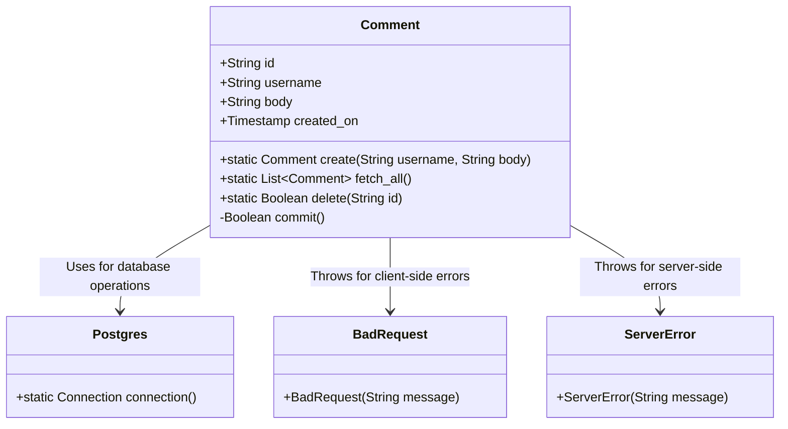
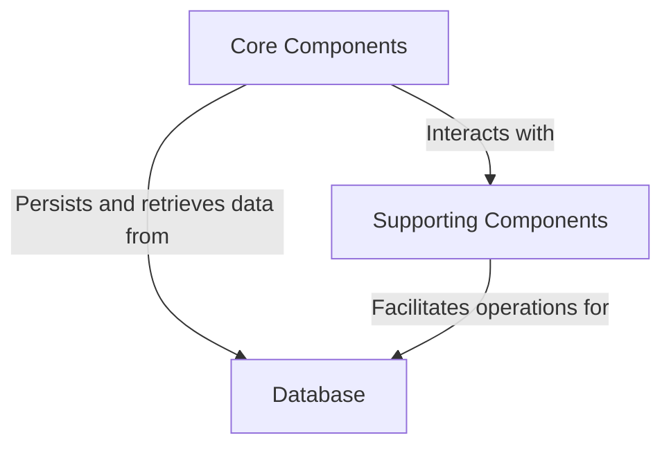
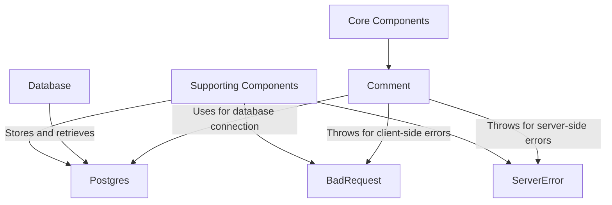
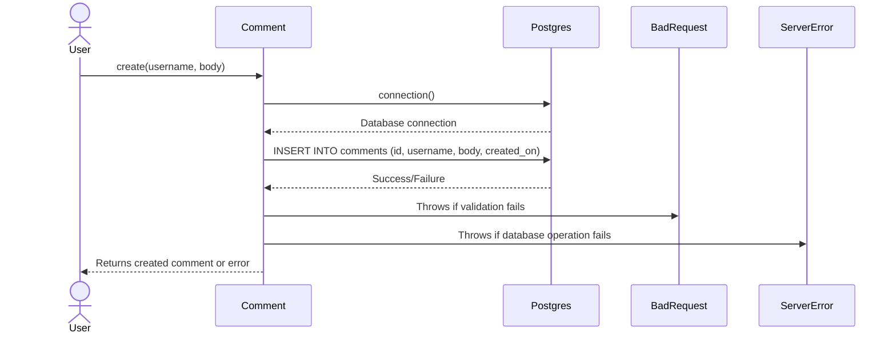
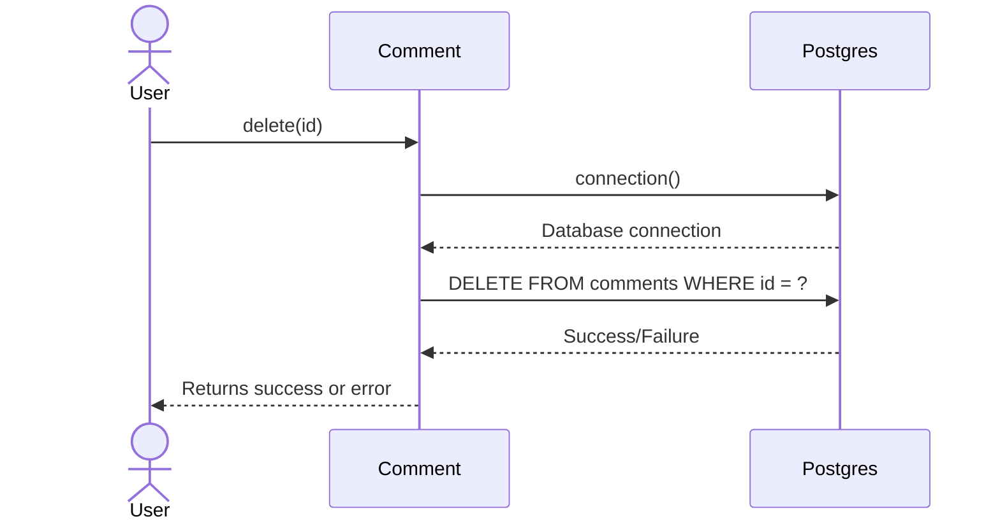

# High-Level Architecture Overview of the Comment Component

The `Comment` component is a central part of the system, responsible for managing user-generated comments. It provides functionality for creating, retrieving, and deleting comments, as well as persisting them in a PostgreSQL database. This component interacts with other parts of the system, such as the database connection utility (`Postgres`) and custom exception handling classes (`BadRequest` and `ServerError`), to ensure seamless operation and error management.

The `Comment` class encapsulates the logic for handling comment-related operations, including validation, persistence, and retrieval. It leverages its attributes and methods to maintain the integrity of the data and provide a consistent interface for interacting with comments.

## Key Components

### Core Components
- **Comment**: *Responsible for managing user comments, including creation, retrieval, and deletion. It interacts with the database to persist and fetch comment data.*
  - **Parents**: None
  - **Responsibilities**:
    - Encapsulates comment attributes (`id`, `username`, `body`, `created_on`).
    - Provides methods for creating (`create`), fetching all (`fetch_all`), and deleting (`delete`) comments.
    - Handles database interactions via the `Postgres` utility.
    - Manages error handling using custom exceptions (`BadRequest`, `ServerError`).

### Supporting Components
- **Postgres**: *Provides database connection functionality, enabling the `Comment` component to interact with the PostgreSQL database.*
  - **Parents**: None
  - **Responsibilities**:
    - Establishes and manages connections to the PostgreSQL database.
    - Serves as a utility for database operations required by the `Comment` component.

- **BadRequest**: *Represents client-side errors, such as invalid input or failed operations.*
  - **Parents**: None
  - **Responsibilities**:
    - Used by the `Comment` component to signal issues with comment creation.

- **ServerError**: *Represents server-side errors, such as unexpected exceptions during database operations.*
  - **Parents**: None
  - **Responsibilities**:
    - Used by the `Comment` component to handle and propagate server-side errors.

## Component Interaction Diagram

This diagram illustrates the relationships between the `Comment` component and its supporting components. The `Comment` class is the central entity, interacting with `Postgres` for database operations and using `BadRequest` and `ServerError` for error handling.
## Component Relationships

### Context Diagram

### Explanation of the Flowchart

- **Core Components**:
  - The `Comment` component is the central entity in the system, responsible for managing user comments. It interacts with the **Supporting Components** to handle errors and establish database connections.
  - It also directly interacts with the **Database** to persist, retrieve, and delete comment data.

- **Supporting Components**:
  - The `Postgres` utility provides the necessary database connection functionality, enabling the `Comment` component to perform its operations.
  - The `BadRequest` and `ServerError` components handle error scenarios, ensuring that the system can gracefully manage client-side and server-side issues.

- **Database**:
  - The PostgreSQL database serves as the storage layer for the `Comment` component, where all comment data is persisted and retrieved. The **Supporting Components** facilitate the connection and operations required for this interaction.
### Detailed Vision

### Explanation of the Flowchart

- **Core Components**:
  - The `Comment` component is the central entity within the **Core Components** category. It performs the primary duties of managing user comments, including creation, retrieval, and deletion. 
  - It interacts with the **Supporting Components** to handle database connections (`Postgres`) and error scenarios (`BadRequest` and `ServerError`).

- **Supporting Components**:
  - The `Postgres` component is responsible for establishing and managing connections to the PostgreSQL database. It facilitates the interaction between the `Comment` component and the **Database**.
  - The `BadRequest` component is used by the `Comment` component to signal client-side errors, such as invalid input or failed operations.
  - The `ServerError` component is used by the `Comment` component to handle server-side errors, such as unexpected exceptions during database operations.

- **Database**:
  - The PostgreSQL database serves as the storage layer for the system. It stores and retrieves comment data as requested by the `Comment` component, with the help of the `Postgres` utility.
## Integration Scenarios

### Creating a Comment

This scenario describes the process of creating a new comment in the system. The `Comment` component is responsible for generating a new comment, validating it, and persisting it in the PostgreSQL database. It interacts with the `Postgres` utility for database operations and uses the `BadRequest` and `ServerError` components for error handling.

#### Explanation of the Diagram

- **User**:
  - Initiates the process by calling the `create` method on the `Comment` component, providing the `username` and `body` of the comment.

- **Comment**:
  - Generates a new comment object with a unique ID and timestamp.
  - Requests a database connection from the `Postgres` utility.
  - Executes an `INSERT` operation to persist the comment in the PostgreSQL database.
  - Handles errors:
    - Throws a `BadRequest` exception if validation fails.
    - Throws a `ServerError` exception if the database operation encounters an issue.
  - Returns the created comment or an error message back to the user.

- **Postgres**:
  - Provides a database connection to the `Comment` component.
  - Executes the `INSERT` operation and returns the success or failure status.

- **BadRequest** and **ServerError**:
  - Used by the `Comment` component to handle client-side and server-side errors, respectively, ensuring robust error management.

---

### Fetching All Comments

This scenario describes the process of retrieving all comments from the system. The `Comment` component interacts with the `Postgres` utility to query the database and fetch all stored comments.

#### Explanation of the Diagram

- **User**:
  - Initiates the process by calling the `fetch_all` method on the `Comment` component.

- **Comment**:
  - Requests a database connection from the `Postgres` utility.
  - Executes a `SELECT` query to fetch all comments from the PostgreSQL database.
  - Processes the `ResultSet` returned by the database and converts it into a list of `Comment` objects.
  - Returns the list of comments back to the user.

- **Postgres**:
  - Provides a database connection to the `Comment` component.
  - Executes the `SELECT` query and returns the `ResultSet` containing all comments.

---

### Deleting a Comment

This scenario describes the process of deleting a specific comment from the system. The `Comment` component interacts with the `Postgres` utility to execute a `DELETE` operation in the database.

#### Explanation of the Diagram

- **User**:
  - Initiates the process by calling the `delete` method on the `Comment` component, providing the `id` of the comment to be deleted.

- **Comment**:
  - Requests a database connection from the `Postgres` utility.
  - Executes a `DELETE` query to remove the comment with the specified `id` from the PostgreSQL database.
  - Returns the success or failure status back to the user.

- **Postgres**:
  - Provides a database connection to the `Comment` component.
  - Executes the `DELETE` query and returns the success or failure status.
