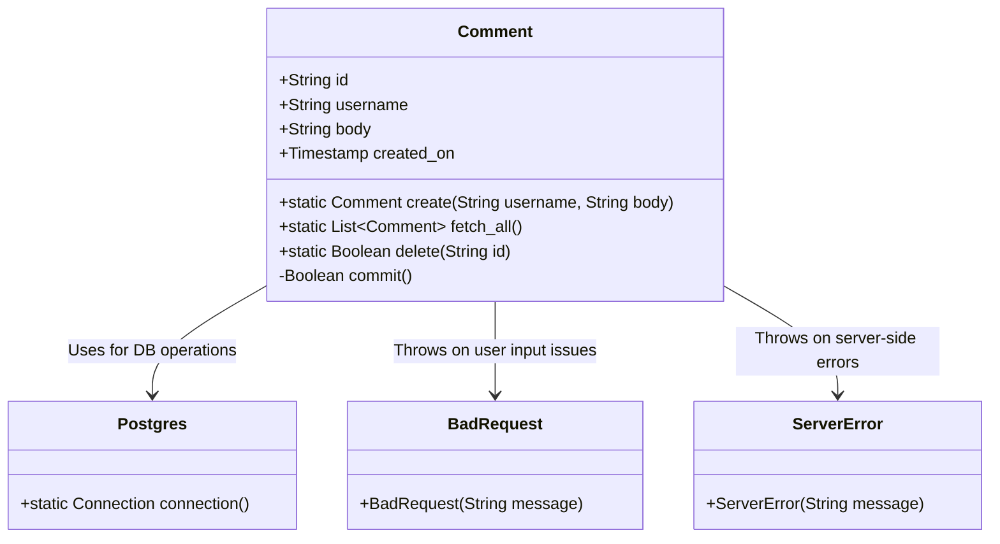
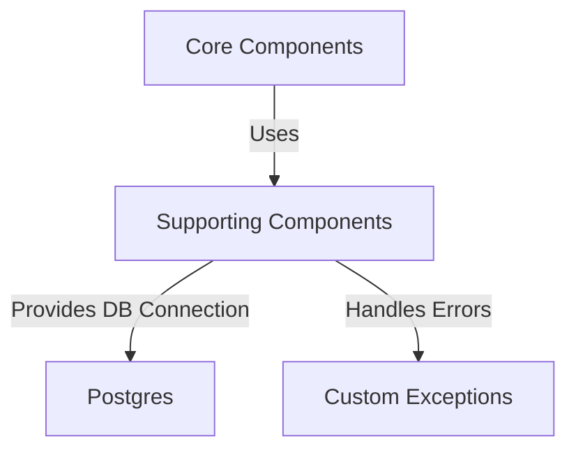
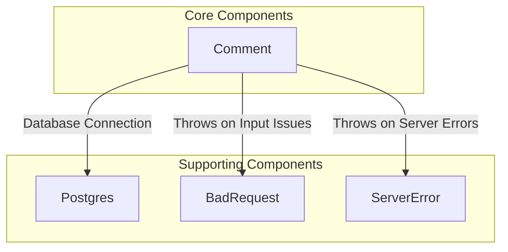
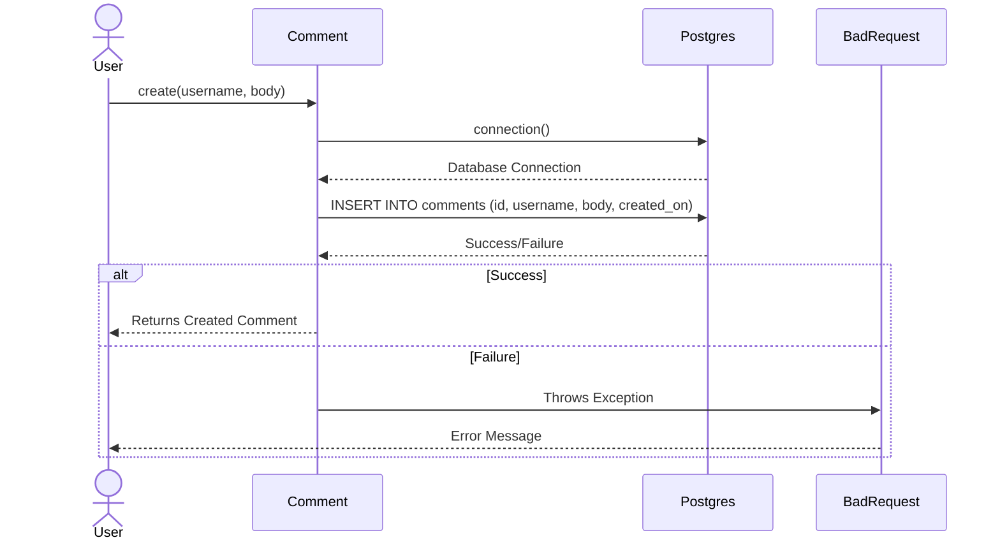
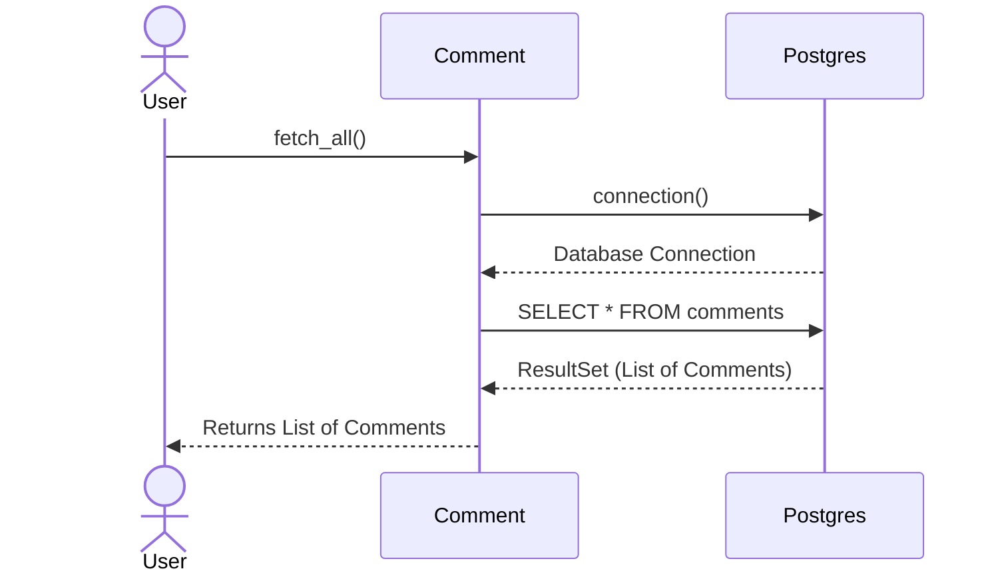
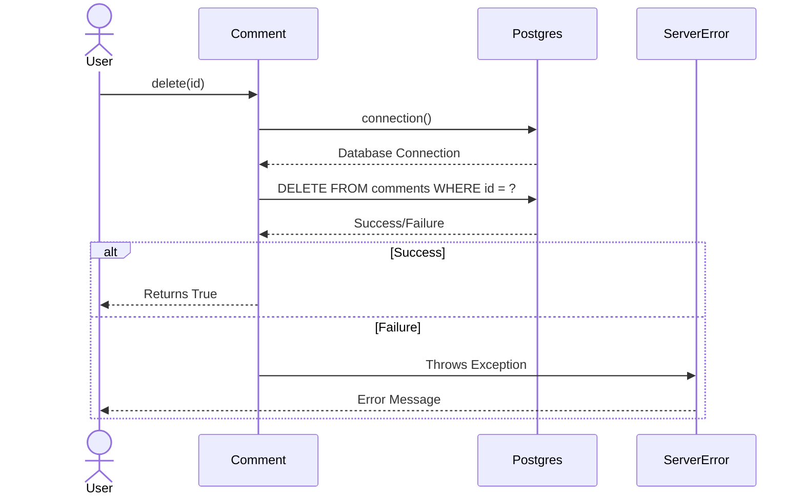

# High-Level Architecture Overview of the Comment Component

The `Comment` component is a central part of the system, responsible for managing user-generated comments. It provides functionality for creating, retrieving, and deleting comments, as well as persisting them in a PostgreSQL database. This component interacts with other parts of the system, such as the database connection utility (`Postgres`) and custom exception handling classes (`BadRequest`, `ServerError`). Its primary role is to encapsulate the logic for comment management while ensuring data integrity and error handling.

## Key Components

### Core Components
- **Comment**: *Responsible for representing individual comments and providing methods to create, fetch, delete, and persist comments in the database. It leverages the `Postgres` component for database interactions and uses custom exceptions for error handling.*

### Supporting Components
- **Postgres**: *Provides database connection functionality, enabling the `Comment` component to interact with the PostgreSQL database.*
- **BadRequest**: *Represents a custom exception used to signal issues with user input or failed operations.*
- **ServerError**: *Represents a custom exception used to signal server-side errors.*

## Component Relationships

The `Comment` component is tightly coupled with the `Postgres` component for database operations. It uses SQL queries to interact with the `comments` table, ensuring CRUD (Create, Read, Update, Delete) operations are performed efficiently. Additionally, it relies on custom exceptions (`BadRequest` and `ServerError`) to handle errors gracefully and provide meaningful feedback to the user.

### Interaction Diagram

### Summary of Responsibilities
- **Comment**: Encapsulates the logic for comment management, including creation, retrieval, deletion, and persistence. It ensures data integrity and handles errors using custom exceptions.
- **Postgres**: Provides the database connection required for the `Comment` component to perform SQL operations.
- **BadRequest**: Signals issues with user input or failed operations during comment creation.
- **ServerError**: Signals server-side errors encountered during comment operations.

This architecture ensures modularity and separation of concerns, with the `Comment` component focusing on business logic and delegating database operations to the `Postgres` component. Custom exceptions enhance error handling and improve system robustness.
## Component Relationships

### Context Diagram

### Explanation of the Flowchart

- **Core Components → Supporting Components**: The `Comment` component, categorized under Core Components, relies on Supporting Components to fulfill its responsibilities. It uses the Supporting Components to interact with the database and handle errors effectively.
  
- **Supporting Components → Postgres**: The `Postgres` component provides the database connection functionality required by the `Comment` component. This enables the `Comment` component to perform CRUD operations on the `comments` table in the PostgreSQL database.

- **Supporting Components → Custom Exceptions**: The `Comment` component uses custom exceptions (`BadRequest` and `ServerError`) to handle errors gracefully. These exceptions are categorized under Supporting Components and are essential for signaling issues with user input or server-side errors during comment operations.
### Detailed Vision

### Explanation of the Flowchart

- **Comment → Postgres**: The `Comment` component interacts with the `Postgres` component to establish a database connection. This connection is used to perform CRUD operations on the `comments` table, such as inserting new comments, retrieving all comments, and deleting comments by ID.

- **Comment → BadRequest**: The `Comment` component throws a `BadRequest` exception when user input is invalid or when a comment cannot be saved due to a failure in the commit operation. This ensures that issues related to user input are handled gracefully and communicated effectively.

- **Comment → ServerError**: The `Comment` component throws a `ServerError` exception when server-side issues occur, such as database connection failures or unexpected errors during comment operations. This helps in isolating server-related problems and providing meaningful feedback to the user.
## Integration Scenarios

### Creating a Comment

This scenario describes the process of creating a new comment in the system. The `Comment` component is responsible for generating a new comment object, persisting it in the database, and handling any errors that may arise during the operation. The integration involves interactions between the `Comment` component, the `Postgres` component for database operations, and custom exceptions (`BadRequest` and `ServerError`) for error handling.

#### Explanation of the Diagram

- **User → Comment**: The process begins when a user invokes the `create` method on the `Comment` component, providing the `username` and `body` of the comment.

- **Comment → Postgres**: The `Comment` component requests a database connection from the `Postgres` component to perform the necessary SQL operations.

- **Postgres → Comment**: The `Postgres` component provides the database connection, enabling the `Comment` component to execute SQL queries.

- **Comment → Postgres (INSERT)**: The `Comment` component executes an SQL `INSERT` query to persist the new comment in the `comments` table.

- **Postgres → Comment (Success/Failure)**: The `Postgres` component returns the result of the SQL operation. If successful, the comment is saved; otherwise, an error occurs.

- **Success Path**: If the operation is successful, the `Comment` component returns the newly created comment to the user.

- **Failure Path**: If the operation fails, the `Comment` component throws a `BadRequest` exception, which is propagated back to the user with an error message.

---

### Fetching All Comments

This scenario describes the process of retrieving all comments from the database. The `Comment` component interacts with the `Postgres` component to execute a SQL query and fetch all records from the `comments` table.

#### Explanation of the Diagram

- **User → Comment**: The process begins when a user invokes the `fetch_all` method on the `Comment` component to retrieve all comments.

- **Comment → Postgres**: The `Comment` component requests a database connection from the `Postgres` component to perform the SQL query.

- **Postgres → Comment**: The `Postgres` component provides the database connection, enabling the `Comment` component to execute the query.

- **Comment → Postgres (SELECT)**: The `Comment` component executes a SQL `SELECT` query to fetch all records from the `comments` table.

- **Postgres → Comment (ResultSet)**: The `Postgres` component returns the result set containing all comments.

- **Comment → User**: The `Comment` component processes the result set and returns the list of comments to the user.

---

### Deleting a Comment

This scenario describes the process of deleting a specific comment by its ID. The `Comment` component interacts with the `Postgres` component to execute a SQL `DELETE` query and handle any errors that may arise during the operation.

#### Explanation of the Diagram

- **User → Comment**: The process begins when a user invokes the `delete` method on the `Comment` component, providing the ID of the comment to be deleted.

- **Comment → Postgres**: The `Comment` component requests a database connection from the `Postgres` component to perform the SQL operation.

- **Postgres → Comment**: The `Postgres` component provides the database connection, enabling the `Comment` component to execute the query.

- **Comment → Postgres (DELETE)**: The `Comment` component executes a SQL `DELETE` query to remove the comment with the specified ID from the `comments` table.

- **Postgres → Comment (Success/Failure)**: The `Postgres` component returns the result of the SQL operation. If successful, the comment is deleted; otherwise, an error occurs.

- **Success Path**: If the operation is successful, the `Comment` component returns `True` to the user, indicating the comment was deleted.

- **Failure Path**: If the operation fails, the `Comment` component throws a `ServerError` exception, which is propagated back to the user with an error message.
