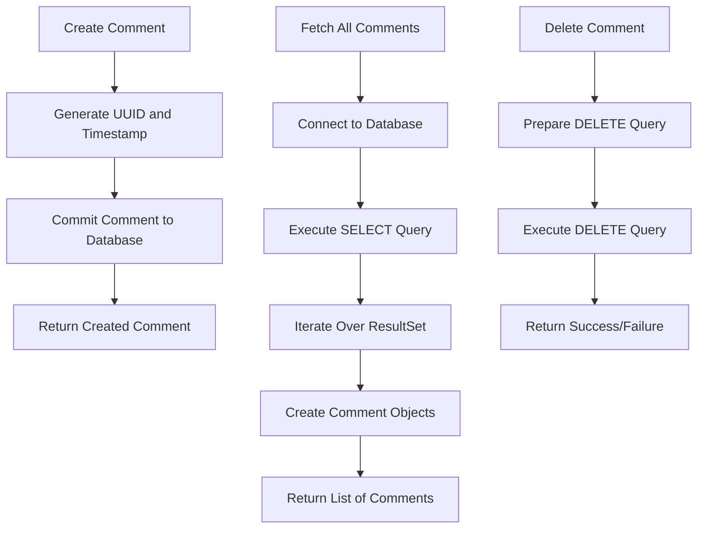
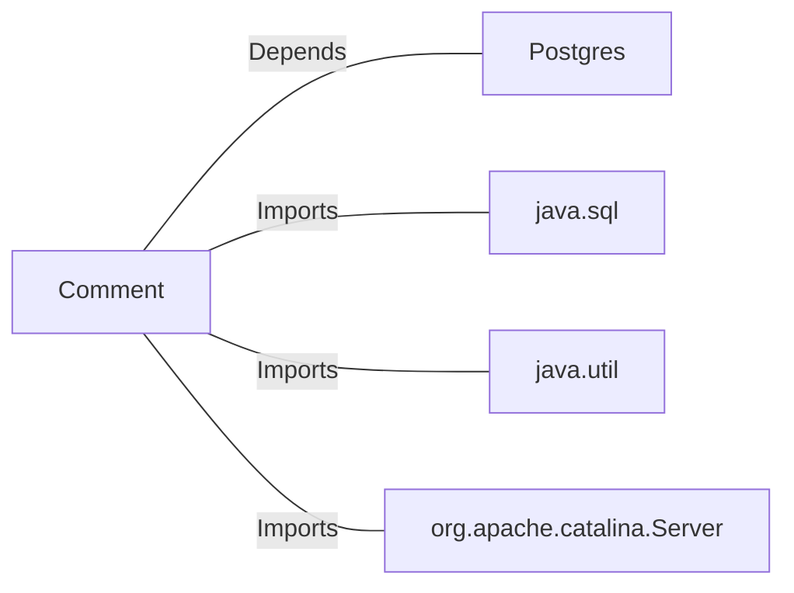

# Comment.java: Comment Management System

## Overview

This class provides functionality to manage comments in a system. It includes methods to create, fetch, and delete comments, as well as to persist them in a database. The `Comment` class interacts with a PostgreSQL database to store and retrieve comment data.

## Process Flow

## Insights

- The `Comment` class uses a PostgreSQL database to store and manage comments.
- The `create` method generates a unique ID and timestamp for each comment and persists it in the database.
- The `fetch_all` method retrieves all comments from the database and returns them as a list of `Comment` objects.
- The `delete` method removes a comment from the database based on its ID.
- The `commit` method is a private helper method used to insert a comment into the database.

## Dependencies

- `Postgres`: Provides the database connection for executing SQL queries.
- `java.sql`: Used for database operations such as `Connection`, `Statement`, `PreparedStatement`, and `ResultSet`.
- `java.util`: Used for utility classes like `Date`, `List`, and `ArrayList`.
- `org.apache.catalina.Server`: Imported but not used in the code.

## Data Manipulation (SQL)

### Table: `comments`

| Attribute    | Data Type   | Description                          |
|--------------|-------------|--------------------------------------|
| `id`         | `VARCHAR`   | Unique identifier for the comment.  |
| `username`   | `VARCHAR`   | Username of the comment author.     |
| `body`       | `TEXT`      | Content of the comment.             |
| `created_on` | `TIMESTAMP` | Timestamp when the comment was created. |

### SQL Operations

- **INSERT**: Adds a new comment to the `comments` table.
- **SELECT**: Retrieves all comments from the `comments` table.
- **DELETE**: Removes a comment from the `comments` table based on its ID.

## Vulnerabilities

1. **SQL Injection Risk**:
   - The `fetch_all` method uses a raw SQL query (`select * from comments;`) without parameterized queries, which could be exploited if the query is modified dynamically in the future.
   - The `delete` method uses a parameterized query, which is safer, but the `fetch_all` method does not follow the same practice.

2. **Improper Exception Handling**:
   - The `delete` method always returns `false` in the `finally` block, even if the operation succeeds. This can lead to incorrect behavior.
   - Exceptions are caught and printed but not properly logged or rethrown in some cases, which can make debugging difficult.

3. **Resource Management**:
   - Database connections (`Connection`, `Statement`, `PreparedStatement`) are not closed in `finally` blocks, leading to potential resource leaks.

4. **Unused Import**:
   - The `org.apache.catalina.Server` import is unused and should be removed to clean up the code.

5. **Error Propagation**:
   - The `create` method wraps exceptions in a custom `ServerError` but does not provide detailed context about the failure, which could hinder debugging.
