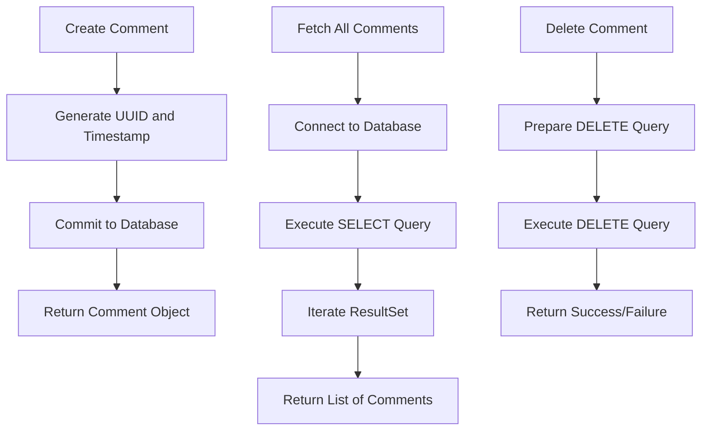
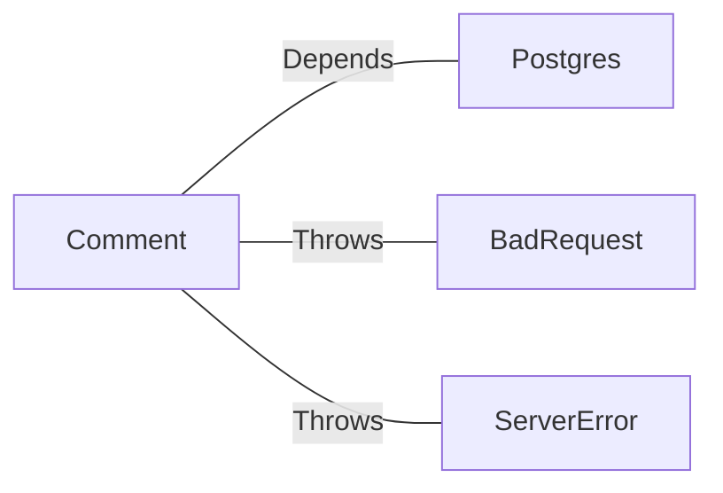

# Comment.java: Comment Management Class

## Overview

This class provides functionality for managing comments, including creating, fetching, and deleting comments. It interacts with a PostgreSQL database to persist and retrieve comment data. Each comment includes an ID, username, body, and timestamp of creation.

## Process Flow

## Insights

- The `Comment` class encapsulates the data and operations related to comments.
- The `create` method generates a unique ID and timestamp for a new comment and commits it to the database.
- The `fetch_all` method retrieves all comments from the database.
- The `delete` method removes a comment by its ID.
- The `commit` method is a private helper to insert a comment into the database.
- The class uses `Postgres.connection()` to establish database connections, indicating a dependency on a `Postgres` utility class.

## Dependencies

- `Postgres`: Provides database connection functionality.
- `BadRequest`: Custom exception thrown when a comment cannot be saved.
- `ServerError`: Custom exception thrown for server-side errors.

## Data Manipulation (SQL)

### Table: `comments`

| Attribute   | Data Type   | Description                          |
|-------------|-------------|--------------------------------------|
| `id`        | `VARCHAR`   | Unique identifier for the comment.  |
| `username`  | `VARCHAR`   | Username of the comment author.     |
| `body`      | `TEXT`      | Content of the comment.             |
| `created_on`| `TIMESTAMP` | Timestamp when the comment was created. |

### SQL Operations

- **INSERT**: Adds a new comment to the `comments` table.
- **SELECT**: Retrieves all comments from the `comments` table.
- **DELETE**: Removes a comment from the `comments` table by its ID.

## Vulnerabilities

1. **SQL Injection Risk**:
   - The `fetch_all` method uses raw SQL (`stmt.executeQuery(query)`), which is vulnerable to SQL injection. Prepared statements should be used instead.

2. **Improper Exception Handling**:
   - The `delete` method always returns `false` in the `finally` block, even if the operation succeeds. This can lead to incorrect behavior.
   - Exceptions are caught and printed but not properly logged or rethrown in some methods.

3. **Resource Management**:
   - Database connections and statements are not always closed properly, which can lead to resource leaks.

4. **Concurrency Issues**:
   - The class does not handle concurrent access to the database, which could lead to race conditions or data inconsistencies.

5. **Hardcoded SQL Queries**:
   - SQL queries are hardcoded, making the code less flexible and harder to maintain. Using a query builder or ORM could improve maintainability.
