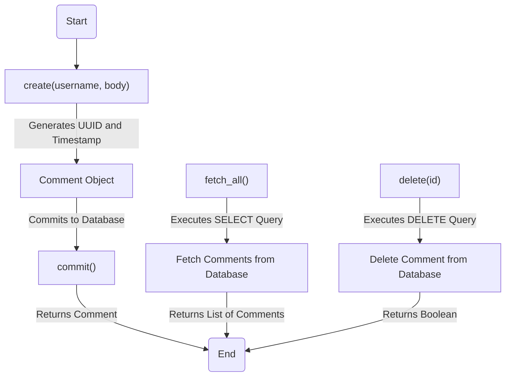
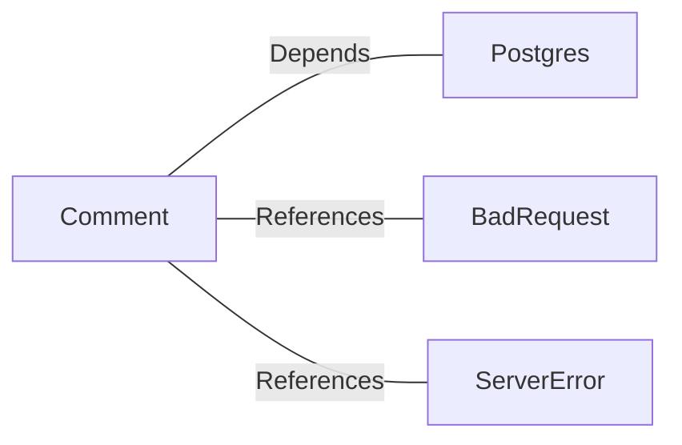

# Comment.java: Comment Management Class

## Overview
The `Comment` class is responsible for managing comments in a system. It provides functionality to create, fetch, and delete comments, as well as commit them to a database. The class interacts with a PostgreSQL database to store and retrieve comment data.

## Process Flow

```mermaid
flowchart TD
    Start("Start") --> CreateComment["create(username, body)"]
    CreateComment --> |"Generates UUID and Timestamp"| CommentObject["Comment Object"]
    CommentObject --> |"Commits to Database"| Commit["commit()"]
    Commit --> |"Returns Comment"| End("End")

    FetchAll["fetch_all()"] --> |"Executes SELECT Query"| FetchComments["Fetch Comments from Database"]
    FetchComments --> |"Returns List of Comments"| End

    DeleteComment["delete(id)"] --> |"Executes DELETE Query"| DeleteFromDB["Delete Comment from Database"]
    DeleteFromDB --> |"Returns Boolean"| End
```

## Insights
- **Comment Creation**:
  - Generates a unique identifier (`UUID`) and timestamp for each comment.
  - Commits the comment to the database using the `commit()` method.
  - Throws custom exceptions (`BadRequest`, `ServerError`) for error handling.

- **Fetching Comments**:
  - Retrieves all comments from the database using a `SELECT` query.
  - Constructs `Comment` objects for each record in the result set.

- **Deleting Comments**:
  - Deletes a comment by its `id` using a `DELETE` query.
  - Returns a boolean indicating success or failure.

- **Database Interaction**:
  - Uses `PreparedStatement` for `INSERT` and `DELETE` operations to prevent SQL injection.
  - The `fetch_all()` method uses a `Statement` object, which is vulnerable to SQL injection.

- **Error Handling**:
  - Exceptions are caught and printed, but the program does not propagate meaningful error messages to the caller in some cases (e.g., `delete()` method always returns `false` in the `finally` block).

## Dependencies

```mermaid
flowchart LR
    Comment --- |"Depends"| Postgres
    Comment --- |"References"| BadRequest
    Comment --- |"References"| ServerError
```

- `Postgres`: Provides the database connection for executing SQL queries.
- `BadRequest`: Custom exception thrown when a comment cannot be saved.
- `ServerError`: Custom exception thrown for server-related errors.

## Data Manipulation (SQL)
### Table: `comments`
| Attribute   | Data Type   | Description                          |
|-------------|-------------|--------------------------------------|
| `id`        | `VARCHAR`   | Unique identifier for the comment.  |
| `username`  | `VARCHAR`   | Username of the commenter.          |
| `body`      | `TEXT`      | Content of the comment.             |
| `created_on`| `TIMESTAMP` | Timestamp when the comment was created. |

### SQL Operations
- **INSERT**: Adds a new comment to the `comments` table.
- **SELECT**: Retrieves all comments from the `comments` table.
- **DELETE**: Removes a comment from the `comments` table by its `id`.

## Vulnerabilities
- **SQL Injection**:
  - The `fetch_all()` method uses a `Statement` object to execute the `SELECT` query, which is vulnerable to SQL injection. It should use a `PreparedStatement` instead.

- **Error Handling in `delete()`**:
  - The `delete()` method always returns `false` in the `finally` block, even if the operation succeeds. This is misleading and should be corrected.

- **Resource Management**:
  - The `fetch_all()` method does not properly close the `Statement` and `ResultSet` objects, which can lead to resource leaks.

- **Exception Handling**:
  - Exceptions are caught and printed but not propagated meaningfully in some cases, leading to potential debugging difficulties.
