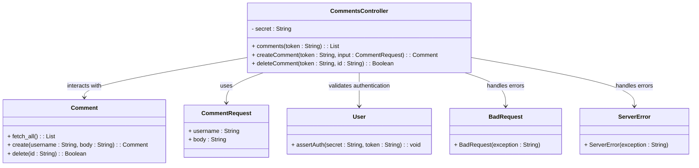
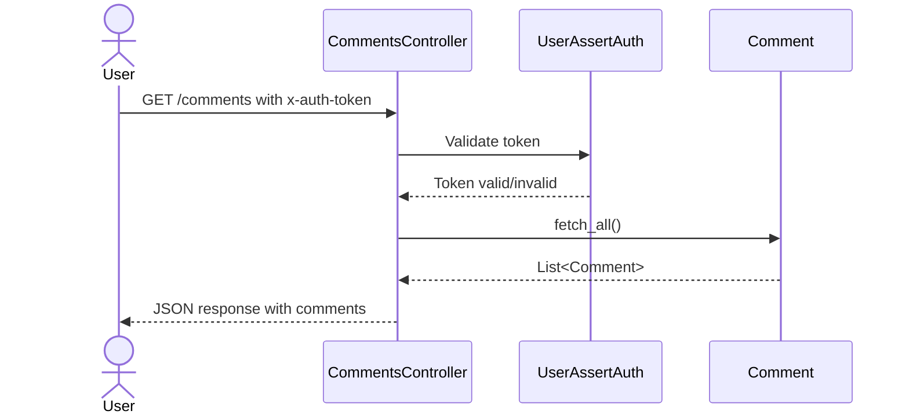
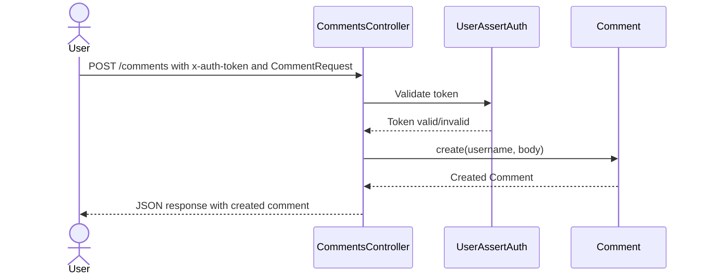
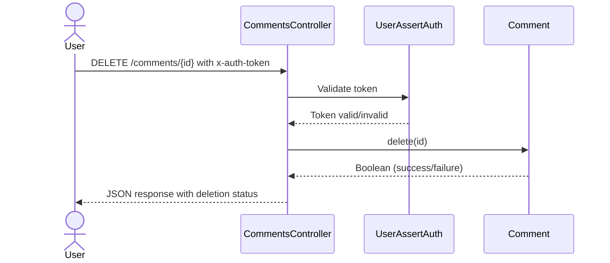

# High-Level Architecture Overview of the Comments Management System

The provided code represents a Comments Management System built using the Spring Boot framework. Its primary purpose is to handle operations related to comments, such as fetching, creating, and deleting comments. The system is designed to interact with users via RESTful APIs, ensuring secure access through token-based authentication. The architecture leverages Spring Boot's annotations for configuration, exception handling, and REST API definitions.

## Key Components

### Controllers
- **CommentsController**: *Handles HTTP requests related to comments. It provides endpoints for fetching all comments, creating a new comment, and deleting an existing comment. It ensures secure access by validating authentication tokens and interacts with the `Comment` model for data operations.*

### Models
- **Comment**: *Represents the core entity of the system, encapsulating the data and operations related to comments. It provides methods for fetching all comments, creating a new comment, and deleting a comment.*

### Request Objects
- **CommentRequest**: *Serves as a data transfer object (DTO) for creating new comments. It encapsulates the necessary input fields, such as `username` and `body`, for the creation process.*

### Exception Handling
- **BadRequest**: *Represents a custom exception for handling bad requests. It is annotated with `@ResponseStatus(HttpStatus.BAD_REQUEST)` to automatically return a 400 HTTP status code when thrown.*
- **ServerError**: *Represents a custom exception for handling server errors. It is annotated with `@ResponseStatus(HttpStatus.INTERNAL_SERVER_ERROR)` to automatically return a 500 HTTP status code when thrown.*

### Security
- **User.assertAuth**: *A utility method (presumably part of the `User` class) that validates the authentication token against a secret key. This ensures that only authorized users can access the endpoints.*

### Relationships and Interactions
- The `CommentsController` acts as the entry point for user interactions, delegating operations to the `Comment` model.
- The `CommentRequest` object is used to encapsulate input data for creating comments.
- Exception classes (`BadRequest` and `ServerError`) are used to handle errors gracefully and provide meaningful HTTP responses.
- The `User.assertAuth` method ensures secure access to the endpoints by validating authentication tokens.

### Diagram Representation



This diagram illustrates the relationships between the components, highlighting how the `CommentsController` orchestrates interactions with the `Comment` model, `CommentRequest` DTO, and security/authentication mechanisms. It also shows how exceptions are used for error handling.
## Component Relationships

### Context Diagram

```mermaid
flowchart TD
    Controllers["Controllers: Handle HTTP requests and orchestrate operations"]
    Models["Models: Represent and manage core entities"]
    RequestObjects["Request Objects: Encapsulate input data for operations"]
    ExceptionHandling["Exception Handling: Manage errors and provide meaningful responses"]
    Security["Security: Validate authentication and ensure secure access"]

    Controllers --> Models : "Interact with to perform data operations"
    Controllers --> RequestObjects : "Use to encapsulate input data"
    Controllers --> ExceptionHandling : "Leverage for error management"
    Controllers --> Security : "Validate authentication for secure access"
```

### Explanation of the Flowchart

- **Controllers → Models**: The `CommentsController` interacts with the `Comment` model to perform operations such as fetching all comments, creating a new comment, and deleting an existing comment. The `Comment` model encapsulates the core entity and its associated methods.

- **Controllers → Request Objects**: The `CommentsController` uses the `CommentRequest` object to encapsulate input data for creating new comments. This ensures that the necessary fields (`username` and `body`) are properly structured and passed to the model.

- **Controllers → Exception Handling**: The `CommentsController` leverages custom exceptions (`BadRequest` and `ServerError`) to handle errors gracefully. These exceptions provide meaningful HTTP responses, such as 400 for bad requests and 500 for server errors.

- **Controllers → Security**: The `CommentsController` uses the `User.assertAuth` method to validate authentication tokens against a secret key. This ensures that only authorized users can access the endpoints, maintaining the security of the system.
### Detailed Vision

```mermaid
flowchart TD
    subgraph Controllers
        CommentsController["CommentsController: Handles HTTP requests for comments"]
    end

    subgraph Models
        Comment["Comment: Represents and manages comment entities"]
    end

    subgraph RequestObjects
        CommentRequest["CommentRequest: Encapsulates input data for creating comments"]
    end

    subgraph ExceptionHandling
        BadRequest["BadRequest: Handles bad request errors"]
        ServerError["ServerError: Handles server errors"]
    end

    subgraph Security
        UserAssertAuth["User.assertAuth: Validates authentication tokens"]
    end

    CommentsController --> Comment : "Fetches, creates, and deletes comments"
    CommentsController --> CommentRequest : "Receives input data for creating comments"
    CommentsController --> BadRequest : "Throws for invalid requests"
    CommentsController --> ServerError : "Throws for server errors"
    CommentsController --> UserAssertAuth : "Validates authentication tokens"
```

### Explanation of the Flowchart

- **CommentsController → Comment**: The `CommentsController` interacts with the `Comment` model to perform core operations:
  - Fetching all comments using `Comment.fetch_all()`.
  - Creating a new comment using `Comment.create(username, body)`.
  - Deleting a comment using `Comment.delete(id)`.

- **CommentsController → CommentRequest**: The `CommentsController` uses the `CommentRequest` object to encapsulate input data for creating comments. This ensures that the necessary fields (`username` and `body`) are properly structured and passed to the `Comment.create()` method.

- **CommentsController → BadRequest**: The `CommentsController` throws the `BadRequest` exception when invalid input or requests are detected. This provides a meaningful HTTP 400 response to the client.

- **CommentsController → ServerError**: The `CommentsController` throws the `ServerError` exception when unexpected server-side issues occur. This provides a meaningful HTTP 500 response to the client.

- **CommentsController → User.assertAuth**: The `CommentsController` uses the `User.assertAuth` method to validate authentication tokens against a secret key. This ensures that only authorized users can access the endpoints, maintaining the security of the system.
## Integration Scenarios

### Fetching All Comments
This scenario describes the process of retrieving all comments from the system. It begins with a user making a GET request to the `/comments` endpoint, which triggers the `CommentsController` to validate the user's authentication token and interact with the `Comment` model to fetch all stored comments.



#### Explanation
- **User → CommentsController**: The user initiates the process by sending a GET request to the `/comments` endpoint, including the `x-auth-token` in the request header for authentication.
- **CommentsController → UserAssertAuth**: The `CommentsController` calls the `User.assertAuth` method to validate the provided authentication token against the secret key.
- **UserAssertAuth → CommentsController**: The `User.assertAuth` method returns whether the token is valid or invalid. If invalid, the process halts, and an appropriate error response is sent to the user.
- **CommentsController → Comment**: Upon successful authentication, the `CommentsController` calls the `Comment.fetch_all()` method to retrieve all comments from the system.
- **Comment → CommentsController**: The `Comment` model returns a list of comments to the `CommentsController`.
- **CommentsController → User**: The `CommentsController` sends the list of comments back to the user in JSON format.

---

### Creating a New Comment
This scenario describes the process of creating a new comment. It begins with a user making a POST request to the `/comments` endpoint, providing the necessary input data (`username` and `body`) in the request body. The `CommentsController` validates the user's authentication token and passes the input data to the `Comment` model to create the new comment.



#### Explanation
- **User → CommentsController**: The user initiates the process by sending a POST request to the `/comments` endpoint, including the `x-auth-token` in the request header and the `CommentRequest` object in the request body.
- **CommentsController → UserAssertAuth**: The `CommentsController` calls the `User.assertAuth` method to validate the provided authentication token against the secret key.
- **UserAssertAuth → CommentsController**: The `User.assertAuth` method returns whether the token is valid or invalid. If invalid, the process halts, and an appropriate error response is sent to the user.
- **CommentsController → Comment**: Upon successful authentication, the `CommentsController` calls the `Comment.create(username, body)` method, passing the input data from the `CommentRequest` object to create a new comment.
- **Comment → CommentsController**: The `Comment` model returns the newly created comment to the `CommentsController`.
- **CommentsController → User**: The `CommentsController` sends the created comment back to the user in JSON format.

---

### Deleting a Comment
This scenario describes the process of deleting an existing comment. It begins with a user making a DELETE request to the `/comments/{id}` endpoint, providing the comment ID in the URL path. The `CommentsController` validates the user's authentication token and interacts with the `Comment` model to delete the specified comment.



#### Explanation
- **User → CommentsController**: The user initiates the process by sending a DELETE request to the `/comments/{id}` endpoint, including the `x-auth-token` in the request header and the comment ID in the URL path.
- **CommentsController → UserAssertAuth**: The `CommentsController` calls the `User.assertAuth` method to validate the provided authentication token against the secret key.
- **UserAssertAuth → CommentsController**: The `User.assertAuth` method returns whether the token is valid or invalid. If invalid, the process halts, and an appropriate error response is sent to the user.
- **CommentsController → Comment**: Upon successful authentication, the `CommentsController` calls the `Comment.delete(id)` method to delete the specified comment.
- **Comment → CommentsController**: The `Comment` model returns a boolean indicating whether the deletion was successful or not.
- **CommentsController → User**: The `CommentsController` sends the deletion status back to the user in JSON format.
