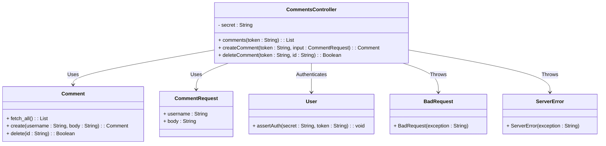
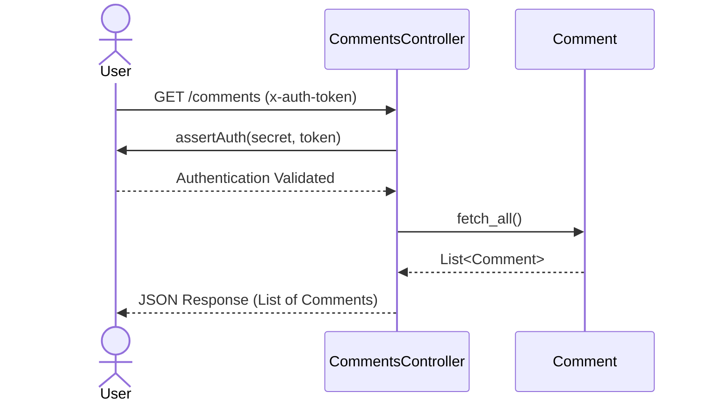
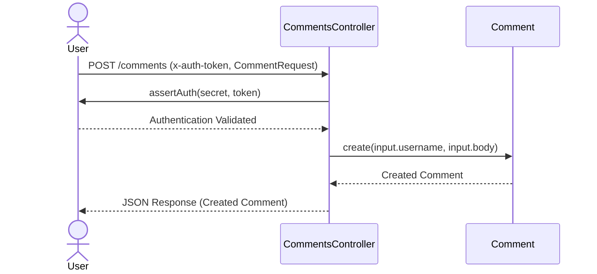
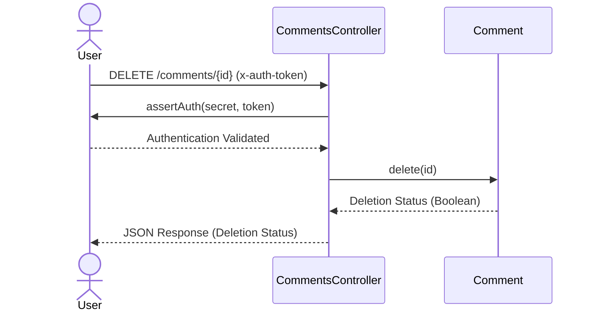

# High-Level Architecture Overview of the Comments Management System

The provided code represents a Comments Management System built using the Spring Boot framework. Its primary purpose is to handle operations related to comments, such as fetching, creating, and deleting comments. The system leverages RESTful APIs to expose these functionalities and includes mechanisms for authentication and error handling.

The architecture revolves around the **CommentsController**, which acts as the entry point for HTTP requests. It interacts with other components, such as **Comment**, **User**, and **CommentRequest**, to fulfill its responsibilities. Error handling is managed through custom exceptions, ensuring robust responses to invalid or unexpected inputs.

## Key Components

### Controllers
- **CommentsController**: *Handles HTTP requests related to comments. It provides endpoints for fetching all comments, creating a new comment, and deleting an existing comment. It ensures authentication by validating the `x-auth-token` header and interacts with the `Comment` and `User` components to perform its operations.*

### Models
- **Comment**: *Represents the core entity of the system, encapsulating the data and operations related to comments. It provides methods for fetching all comments, creating a new comment, and deleting a comment.*
- **CommentRequest**: *Serves as a data transfer object (DTO) for creating new comments. It encapsulates the `username` and `body` fields required for comment creation.*

### Authentication
- **User**: *Handles authentication logic by validating the provided token against the application's secret. This ensures that only authorized users can perform operations on comments.*

### Error Handling
- **BadRequest**: *Represents a custom exception for handling invalid requests. It maps to the HTTP 400 Bad Request status code.*
- **ServerError**: *Represents a custom exception for handling server-side errors. It maps to the HTTP 500 Internal Server Error status code.*

## Component Relationships



### Summary of Interactions
1. **CommentsController** acts as the central hub, orchestrating interactions between components.
2. **Comment** provides the core functionality for managing comments, including fetching, creating, and deleting.
3. **User** ensures secure access by validating authentication tokens.
4. **CommentRequest** serves as the input model for creating new comments.
5. **BadRequest** and **ServerError** handle error scenarios gracefully, ensuring meaningful responses to clients.

This architecture ensures modularity, security, and maintainability, making it suitable for scalable comment management systems.
## Component Relationships

### Context Diagram

```mermaid
flowchart TD
    Controllers["Controllers: Handle HTTP requests"]
    Models["Models: Represent and manage data"]
    Authentication["Authentication: Validate user access"]
    ErrorHandling["Error Handling: Manage exceptions"]

    Controllers --> Models : Interacts with
    Controllers --> Authentication : Validates access through
    Controllers --> ErrorHandling : Handles errors using
    Authentication --> Models : Secures access to
```

### Explanation of the Flowchart

- **Controllers → Models**: The `CommentsController` interacts with the `Comment` model to perform operations such as fetching, creating, and deleting comments. It also uses the `CommentRequest` model to process input data for creating new comments.

- **Controllers → Authentication**: The `CommentsController` relies on the `User` component to validate the `x-auth-token` header against the application's secret. This ensures that only authenticated users can access the endpoints.

- **Controllers → Error Handling**: The `CommentsController` uses custom exceptions (`BadRequest` and `ServerError`) to handle invalid requests and server-side errors, ensuring robust and meaningful responses to clients.

- **Authentication → Models**: The `User` component indirectly secures access to the `Comment` model by validating user authentication before allowing operations on comments. This ensures that unauthorized users cannot manipulate the data.
### Detailed Vision

```mermaid
flowchart TD
    subgraph Controllers
        CommentsController["CommentsController: Handles HTTP requests for comments"]
    end

    subgraph Models
        Comment["Comment: Represents and manages comment data"]
        CommentRequest["CommentRequest: DTO for creating new comments"]
    end

    subgraph Authentication
        User["User: Validates authentication tokens"]
    end

    subgraph ErrorHandling
        BadRequest["BadRequest: Handles invalid requests"]
        ServerError["ServerError: Handles server-side errors"]
    end

    CommentsController --> Comment : Fetches, creates, deletes
    CommentsController --> CommentRequest : Processes input data
    CommentsController --> User : Validates x-auth-token
    CommentsController --> BadRequest : Throws on invalid input
    CommentsController --> ServerError : Throws on server errors
    User --> Comment : Secures access
```

### Explanation of the Flowchart

- **CommentsController → Comment**: The `CommentsController` interacts with the `Comment` component to perform core operations such as fetching all comments, creating a new comment, and deleting an existing comment. These operations are exposed via RESTful endpoints.

- **CommentsController → CommentRequest**: The `CommentsController` uses the `CommentRequest` component as a data transfer object (DTO) to process input data for creating new comments. This ensures that the required fields (`username` and `body`) are encapsulated and passed correctly.

- **CommentsController → User**: The `CommentsController` relies on the `User` component to validate the `x-auth-token` header against the application's secret. This authentication step ensures that only authorized users can access the endpoints.

- **CommentsController → BadRequest**: The `CommentsController` throws the `BadRequest` exception when invalid input is detected, such as missing or malformed data. This maps to the HTTP 400 Bad Request status code.

- **CommentsController → ServerError**: The `CommentsController` throws the `ServerError` exception when server-side issues occur, such as unexpected errors during processing. This maps to the HTTP 500 Internal Server Error status code.

- **User → Comment**: The `User` component indirectly secures access to the `Comment` component by validating user authentication before allowing operations on comments. This ensures that unauthorized users cannot manipulate the data.
## Integration Scenarios

### Fetching All Comments
This scenario describes the process of fetching all comments from the system. It involves validating the user's authentication token and retrieving the list of comments from the database. The flow ensures that only authenticated users can access the comments.



#### Explanation
- **User → CommentsController**: The user initiates the process by sending a `GET /comments` request with the `x-auth-token` header for authentication.
- **CommentsController → User**: The `CommentsController` calls the `User.assertAuth` method to validate the provided token against the application's secret.
- **User → CommentsController**: If the token is valid, the `User` component confirms the authentication.
- **CommentsController → Comment**: The `CommentsController` calls the `Comment.fetch_all` method to retrieve all comments from the database.
- **Comment → CommentsController**: The `Comment` component returns the list of comments to the `CommentsController`.
- **CommentsController → User**: The `CommentsController` sends the list of comments as a JSON response back to the user.

---

### Creating a New Comment
This scenario describes the process of creating a new comment. It involves validating the user's authentication token, processing the input data, and storing the new comment in the system.



#### Explanation
- **User → CommentsController**: The user initiates the process by sending a `POST /comments` request with the `x-auth-token` header and a `CommentRequest` payload containing the `username` and `body` of the comment.
- **CommentsController → User**: The `CommentsController` calls the `User.assertAuth` method to validate the provided token against the application's secret.
- **User → CommentsController**: If the token is valid, the `User` component confirms the authentication.
- **CommentsController → Comment**: The `CommentsController` calls the `Comment.create` method, passing the `username` and `body` from the `CommentRequest` payload to create a new comment.
- **Comment → CommentsController**: The `Comment` component returns the newly created comment to the `CommentsController`.
- **CommentsController → User**: The `CommentsController` sends the created comment as a JSON response back to the user.

---

### Deleting a Comment
This scenario describes the process of deleting an existing comment. It involves validating the user's authentication token and removing the specified comment from the system.



#### Explanation
- **User → CommentsController**: The user initiates the process by sending a `DELETE /comments/{id}` request with the `x-auth-token` header and the ID of the comment to be deleted.
- **CommentsController → User**: The `CommentsController` calls the `User.assertAuth` method to validate the provided token against the application's secret.
- **User → CommentsController**: If the token is valid, the `User` component confirms the authentication.
- **CommentsController → Comment**: The `CommentsController` calls the `Comment.delete` method, passing the comment ID to delete the specified comment.
- **Comment → CommentsController**: The `Comment` component returns the deletion status (a boolean) to the `CommentsController`.
- **CommentsController → User**: The `CommentsController` sends the deletion status as a JSON response back to the user.
