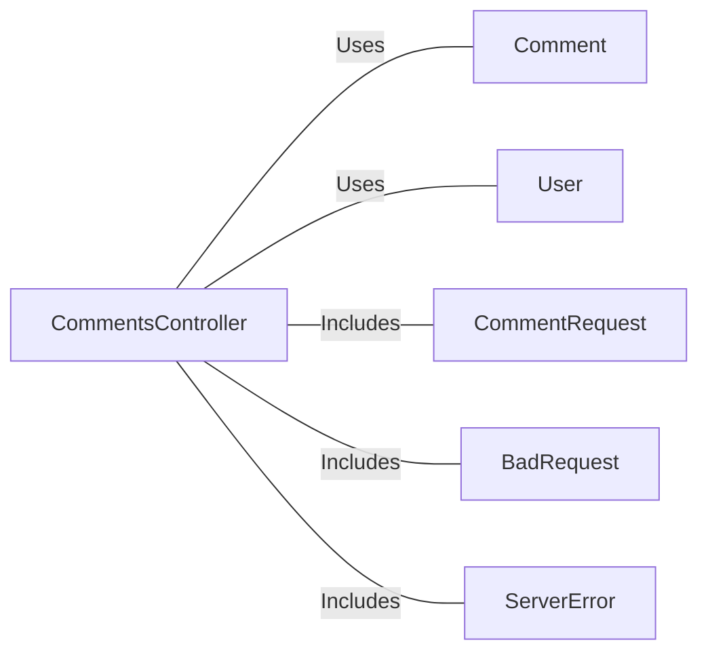

# CommentsController.java: REST API for Managing Comments

## Overview

This file defines a REST API controller for managing comments. It provides endpoints to fetch all comments, create a new comment, and delete an existing comment. The controller includes basic authentication using a token and handles cross-origin requests. It also defines custom exceptions for error handling.

## Process Flow

```mermaid
graph TD
    A[Start] --> B[GET /comments]
    B -->|x-auth-token validation| C[Fetch all comments]
    C --> D[Return comments list]

    A --> E[POST /comments]
    E -->|x-auth-token validation| F[Create new comment]
    F --> G[Return created comment]

    A --> H[DELETE /comments/{id}]
    H -->|x-auth-token validation| I[Delete comment by ID]
    I --> J[Return deletion status]
```

## Insights

- The controller uses Spring Boot annotations to define REST endpoints.
- Cross-Origin Resource Sharing (CORS) is enabled for all origins (`@CrossOrigin(origins = "*")`).
- Authentication is performed using a token passed in the `x-auth-token` header.
- The `Comment` class is assumed to handle database operations such as fetching, creating, and deleting comments.
- Custom exceptions (`BadRequest` and `ServerError`) are defined to handle specific error scenarios.
- The `CommentRequest` class is a simple data structure for deserializing the request body when creating a comment.

## Dependencies



- `Comment`: Handles operations like fetching, creating, and deleting comments.
- `User`: Provides the `assertAuth` method for token validation.
- `CommentRequest`: Represents the structure of the request body for creating a comment.
- `BadRequest`: Custom exception for handling bad requests.
- `ServerError`: Custom exception for handling server errors.

## Vulnerabilities

1. **Hardcoded Secret Exposure**:
   - The `secret` is injected from the application properties (`@Value("${app.secret}")`). If improperly secured, this could lead to sensitive data exposure.

2. **CORS Misconfiguration**:
   - Allowing all origins (`@CrossOrigin(origins = "*")`) can expose the API to Cross-Origin Resource Sharing (CORS) attacks.

3. **Authentication Bypass**:
   - The `User.assertAuth` method is used for token validation, but its implementation is not shown. If improperly implemented, it could lead to authentication bypass.

4. **Lack of Input Validation**:
   - The `CommentRequest` fields (`username` and `body`) are not validated, which could lead to injection attacks or invalid data being processed.

5. **Error Handling**:
   - The custom exceptions (`BadRequest` and `ServerError`) are defined but not used in the controller methods, leading to potential unhandled exceptions.

6. **Mass Assignment Vulnerability**:
   - The `CommentRequest` class directly maps request data to its fields, which could lead to unintended data being processed if additional fields are added to the request.

7. **No Rate Limiting**:
   - The API does not implement rate limiting, making it vulnerable to brute force or denial-of-service attacks.
