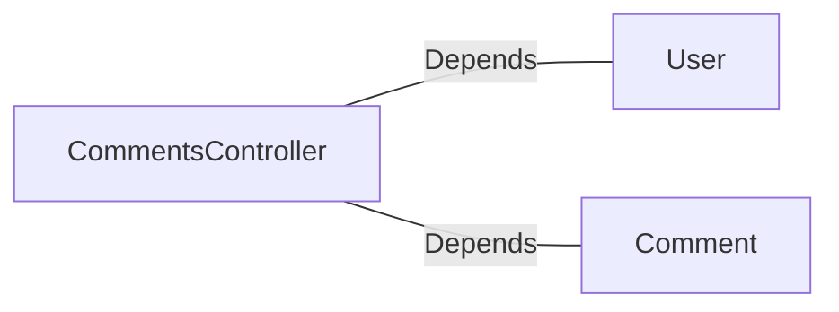

# CommentsController.java: REST API for Managing Comments

## Overview

This file defines a REST API for managing comments. It includes endpoints for retrieving, creating, and deleting comments. The API uses Spring Boot annotations and provides cross-origin support for all origins. Authentication is enforced via a custom token-based mechanism.

## Process Flow

```mermaid
graph TD
    A[Start] --> B[GET /comments]
    B -->|x-auth-token validation| C[Fetch all comments]
    C --> D[Return comments list]

    A --> E[POST /comments]
    E -->|x-auth-token validation| F[Create comment]
    F --> G[Return created comment]

    A --> H[DELETE /comments/{id}]
    H -->|x-auth-token validation| I[Delete comment by ID]
    I --> J[Return deletion status]
```

## Insights

- **Authentication**: The `x-auth-token` header is used for authentication, validated against a secret value.
- **Cross-Origin Support**: All endpoints allow requests from any origin (`@CrossOrigin(origins = "*")`).
- **Error Handling**: Custom exceptions (`BadRequest` and `ServerError`) are defined with appropriate HTTP status codes.
- **Serialization**: The `CommentRequest` class is used to deserialize JSON request bodies for creating comments.
- **Endpoints**:
  - `GET /comments`: Fetches all comments.
  - `POST /comments`: Creates a new comment.
  - `DELETE /comments/{id}`: Deletes a comment by its ID.

## Dependencies



- `User`: Used for authentication via the `assertAuth` method.
- `Comment`: Provides methods for fetching, creating, and deleting comments.

### External References

- `User`: Validates the `x-auth-token` against the secret.
- `Comment`: 
  - `fetch_all()`: Retrieves all comments.
  - `create(username, body)`: Creates a new comment with the given username and body.
  - `delete(id)`: Deletes a comment by its ID.

## Vulnerabilities

1. **Hardcoded Secret Exposure**:
   - The `secret` value is injected from the application properties (`@Value("${app.secret}")`). If improperly secured, this could expose sensitive information.

2. **Cross-Origin Resource Sharing (CORS)**:
   - Allowing all origins (`@CrossOrigin(origins = "*")`) can expose the API to potential abuse from malicious domains.

3. **Authentication Bypass**:
   - The `User.assertAuth` method is used for token validation, but its implementation is not shown. If improperly implemented, it could lead to authentication bypass.

4. **Lack of Input Validation**:
   - The `CommentRequest` fields (`username` and `body`) are not validated, which could lead to injection attacks or invalid data being processed.

5. **Error Handling**:
   - The custom exceptions (`BadRequest` and `ServerError`) do not log the errors, which could make debugging and monitoring difficult.

6. **Mass Assignment**:
   - The `CommentRequest` class directly maps JSON input to its fields, which could lead to unintended data being processed if additional fields are added to the class.

7. **No Rate Limiting**:
   - The API does not implement rate limiting, making it vulnerable to abuse through brute force or denial-of-service attacks.
