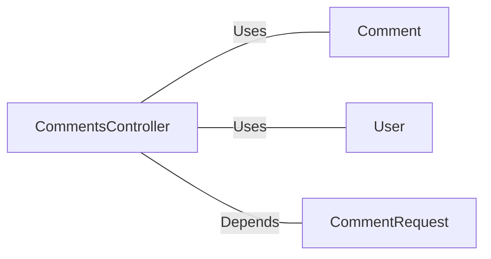

# CommentsController.java: REST API for Managing Comments

## Overview

This file defines a REST API for managing comments. It includes endpoints for retrieving, creating, and deleting comments. The API uses Spring Boot annotations and includes basic authentication via a token. It also defines custom exceptions for handling errors.

## Process Flow

```mermaid
graph TD
    A[Start] --> B[GET /comments]
    B -->|x-auth-token validation| C[Fetch all comments]
    C --> D[Return comments list]

    A --> E[POST /comments]
    E -->|x-auth-token validation| F[Create comment]
    F --> G[Return created comment]

    A --> H[DELETE /comments/{id}]
    H -->|x-auth-token validation| I[Delete comment by ID]
    I --> J[Return deletion status]
```

## Insights

- **Authentication**: The `x-auth-token` header is used for authentication, validated using the `User.assertAuth` method.
- **Endpoints**:
  - `GET /comments`: Fetches all comments.
  - `POST /comments`: Creates a new comment.
  - `DELETE /comments/{id}`: Deletes a comment by its ID.
- **CORS**: Cross-Origin Resource Sharing (CORS) is enabled for all origins (`*`).
- **Custom Exceptions**:
  - `BadRequest`: Returns a `400 BAD REQUEST` status.
  - `ServerError`: Returns a `500 INTERNAL SERVER ERROR` status.
- **Data Structure**:
  - `CommentRequest`: Represents the request body for creating a comment, containing `username` and `body`.

## Dependencies



- `Comment`: Handles operations related to comments, such as fetching, creating, and deleting.
- `User`: Provides the `assertAuth` method for token validation.
- `CommentRequest`: Represents the input data structure for creating a comment.

## Vulnerabilities

1. **Hardcoded Secret**:
   - The `secret` is injected via the `@Value` annotation, which could lead to security issues if not properly secured in the environment configuration.

2. **CORS Policy**:
   - Allowing all origins (`*`) can expose the API to Cross-Origin Resource Sharing (CORS) attacks.

3. **Authentication Bypass**:
   - The `User.assertAuth` method is used for token validation, but its implementation is not shown. If improperly implemented, it could lead to authentication bypass.

4. **Lack of Input Validation**:
   - The `CommentRequest` fields (`username` and `body`) are not validated, which could lead to injection attacks or invalid data being processed.

5. **Error Handling**:
   - The API does not handle exceptions for all possible failure scenarios, such as database errors or invalid token formats.

6. **Mass Assignment**:
   - The `CommentRequest` object directly maps input fields without validation, which could lead to unintended data manipulation.

## Data Manipulation (SQL)

- **Comment**:
  - `fetch_all`: Likely performs a `SELECT` operation to retrieve all comments.
  - `create`: Likely performs an `INSERT` operation to add a new comment.
  - `delete`: Likely performs a `DELETE` operation to remove a comment by ID.
