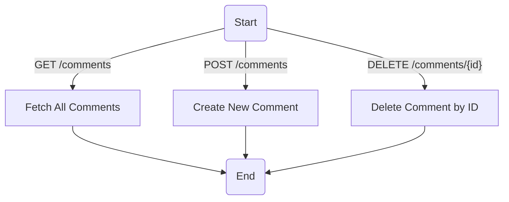
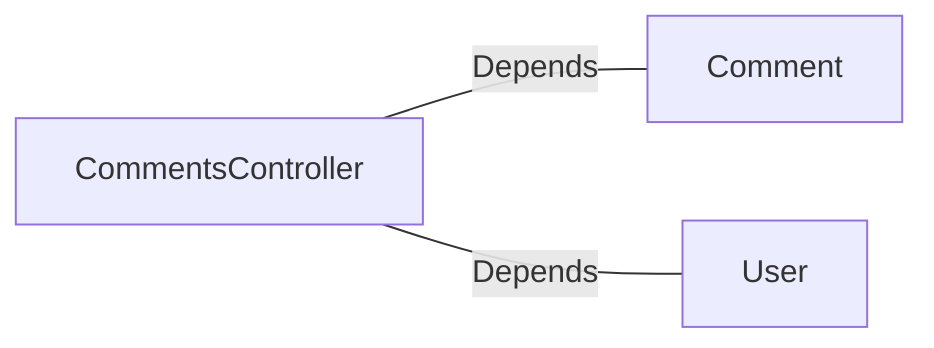

# CommentsController.java: REST API for Comment Management

## Overview
This file defines a REST API controller for managing comments. It provides endpoints to fetch all comments, create a new comment, and delete an existing comment. The controller uses Spring Boot annotations for configuration and routing, and includes basic authentication via a custom token mechanism.

## Process Flow

```mermaid
flowchart TD
    Start("Start") --> |"GET /comments"| FetchComments["Fetch All Comments"]
    FetchComments --> End("End")
    
    Start --> |"POST /comments"| CreateComment["Create New Comment"]
    CreateComment --> End
    
    Start --> |"DELETE /comments/{id}"| DeleteComment["Delete Comment by ID"]
    DeleteComment --> End
```

## Insights
- **Authentication**: The controller uses a custom authentication mechanism (`User.assertAuth`) to validate requests based on a secret and token.
- **Cross-Origin Resource Sharing (CORS)**: All endpoints allow requests from any origin (`@CrossOrigin(origins = "*")`), which may pose security risks.
- **Error Handling**: Custom exceptions (`BadRequest`, `ServerError`) are defined with specific HTTP status codes (`400` and `500` respectively).
- **Serialization**: The `CommentRequest` class implements `Serializable` for handling request payloads.
- **Endpoints**:
  - `GET /comments`: Fetches all comments.
  - `POST /comments`: Creates a new comment.
  - `DELETE /comments/{id}`: Deletes a comment by ID.

## Dependencies

```mermaid
flowchart LR
    CommentsController --- |"Depends"| Comment
    CommentsController --- |"Depends"| User
```

- `Comment`: Used for fetching, creating, and deleting comments.
- `User`: Used for authentication via the `assertAuth` method.

## Vulnerabilities
1. **CORS Misconfiguration**:
   - Allowing requests from all origins (`@CrossOrigin(origins = "*")`) can expose the API to Cross-Site Request Forgery (CSRF) attacks.
   - Recommendation: Restrict origins to trusted domains.

2. **Authentication Token Exposure**:
   - The `x-auth-token` is passed in the header without encryption or additional security measures.
   - Recommendation: Use HTTPS for secure transmission and consider implementing token expiration and refresh mechanisms.

3. **Error Handling**:
   - The custom exceptions (`BadRequest`, `ServerError`) do not provide detailed error messages or logging, which can hinder debugging.
   - Recommendation: Enhance error handling with detailed logs and user-friendly messages.

4. **Lack of Input Validation**:
   - The `CommentRequest` class does not validate `username` or `body` fields, which can lead to injection attacks or invalid data.
   - Recommendation: Implement input validation and sanitization.

5. **Hardcoded Secret**:
   - The `secret` is injected via `@Value("${app.secret}")`, but its security depends on proper environment configuration.
   - Recommendation: Use a secure vault or key management system for sensitive data.

## Data Manipulation (SQL)
- **Comment**:
  - `fetch_all()`: Retrieves all comments (likely a SELECT operation).
  - `create(username, body)`: Inserts a new comment (likely an INSERT operation).
  - `delete(id)`: Deletes a comment by ID (likely a DELETE operation).
