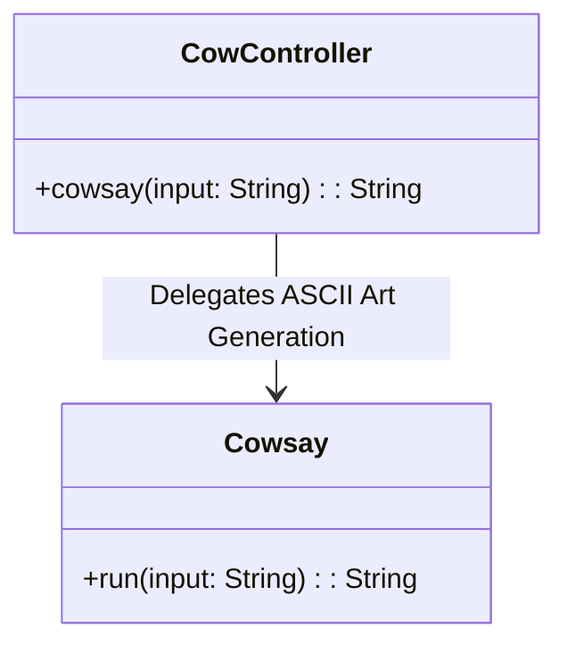
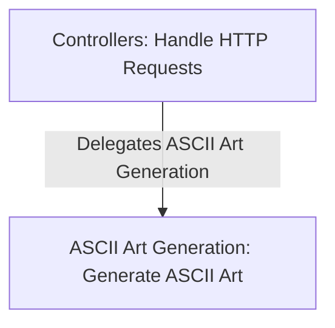
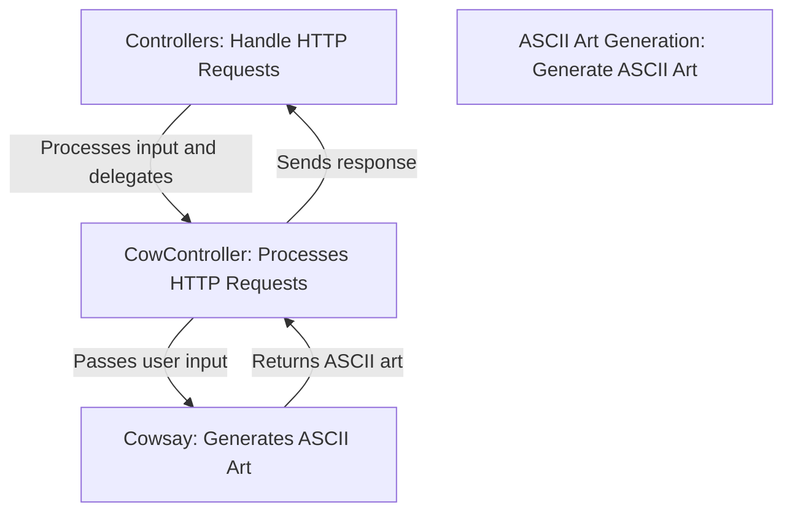
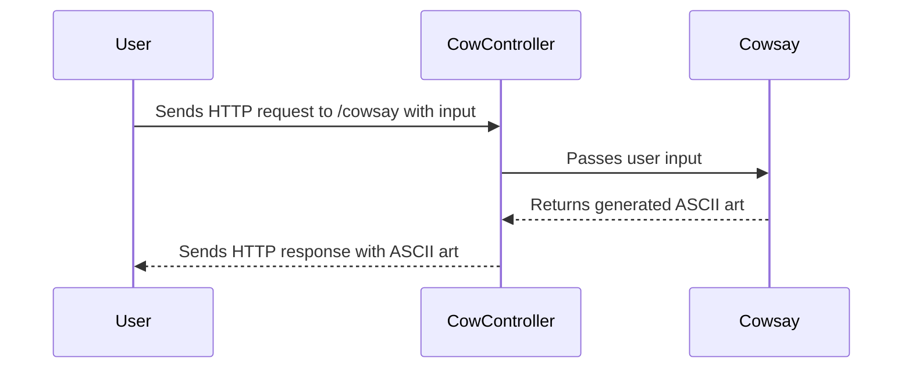

# High-Level Architecture Overview: CowController and Related Components

The provided context revolves around a Spring Boot-based web application, specifically focusing on the `CowController` component. This controller is responsible for handling HTTP requests and invoking the `Cowsay` functionality, which generates text-based ASCII art responses. The system appears to be designed to provide a lightweight and interactive API for generating ASCII art responses based on user input.

The architecture is centered around the `CowController` and its interaction with the `Cowsay` component. The `CowController` acts as the entry point for user requests, while the `Cowsay` component encapsulates the logic for generating ASCII art. Together, these components form the backbone of the application's functionality.

## Key Components

### Controllers
- **CowController**: *Handles HTTP requests to the `/cowsay` endpoint and delegates the ASCII art generation task to the `Cowsay` component. It leverages Spring Boot's `@RestController` and `@EnableAutoConfiguration` annotations to simplify configuration and routing.*

### ASCII Art Generation
- **Cowsay**: *Responsible for generating ASCII art based on the input provided by the user. This component encapsulates the logic for creating text-based art and serves as the core functionality of the application.*

## Component Interaction Diagram

### Explanation of Interaction
1. **CowController**: Acts as the entry point for user requests. When a request is made to the `/cowsay` endpoint, it extracts the `input` parameter and passes it to the `Cowsay` component.
2. **Cowsay**: Processes the input and generates ASCII art, which is then returned to the `CowController` and subsequently sent back to the user as the HTTP response.

This architecture is simple yet effective for its purpose, ensuring clear separation of concerns between request handling and ASCII art generation.
## Component Relationships

### Context Diagram

### Explanation of Flowchart

- **Controllers**: This category represents components like `CowController`, which are responsible for handling HTTP requests. Specifically, the `CowController` processes requests to the `/cowsay` endpoint and extracts user input. It then delegates the task of generating ASCII art to the `ASCII Art Generation` category.

- **ASCII Art Generation**: This category encapsulates components like `Cowsay`, which are responsible for generating ASCII art based on the input provided by the user. The `Cowsay` component fulfills this responsibility by processing the input and returning the generated ASCII art to the `Controllers` category.

The flowchart illustrates the clear separation of concerns between request handling and ASCII art generation, emphasizing the delegation of responsibilities from the `Controllers` category to the `ASCII Art Generation` category.
### Detailed Vision

### Explanation of Flowchart

- **Controllers**:
  - Represents the overarching category responsible for handling HTTP requests. Within this category, the `CowController` is the specific component that processes requests to the `/cowsay` endpoint.
  - The `CowController` extracts the user-provided input and delegates the ASCII art generation task to the `Cowsay` component.

- **CowController**:
  - Acts as the intermediary between the user and the ASCII art generation logic. It receives the input from the user, passes it to the `Cowsay` component, and then returns the generated ASCII art as the HTTP response.

- **ASCII Art Generation**:
  - Represents the category responsible for generating ASCII art. Within this category, the `Cowsay` component is the specific implementation that processes the input and generates the ASCII art.

- **Cowsay**:
  - Fulfills the core functionality of the application by generating ASCII art based on the input provided by the `CowController`. It returns the generated art back to the `CowController`, which then sends it as the HTTP response.

This detailed vision highlights the flow of data and responsibilities between the components, emphasizing the delegation of tasks and the separation of concerns within the system.
## Integration Scenarios

### ASCII Art Generation via HTTP Request

This scenario describes the process of generating ASCII art when a user sends an HTTP request to the `/cowsay` endpoint. The integration involves the `CowController` handling the request and delegating the ASCII art generation task to the `Cowsay` component. The flow demonstrates how user input is processed and transformed into ASCII art, which is then returned as the HTTP response.

### Explanation of Diagram

- **User**:
  - Initiates the process by sending an HTTP request to the `/cowsay` endpoint, including the input text to be transformed into ASCII art.

- **CowController**:
  - Acts as the entry point for the request. It receives the input from the user, processes it, and delegates the ASCII art generation task to the `Cowsay` component.

- **Cowsay**:
  - Processes the input received from the `CowController` and generates the ASCII art. It then returns the generated art back to the `CowController`.

- **CowController (Response)**:
  - After receiving the ASCII art from the `Cowsay` component, the `CowController` sends the generated art back to the user as the HTTP response.

This integration scenario highlights the seamless collaboration between the `CowController` and `Cowsay` components to fulfill the application's primary functionality of generating ASCII art based on user input. It demonstrates the clear separation of concerns and the efficient delegation of tasks within the system.
