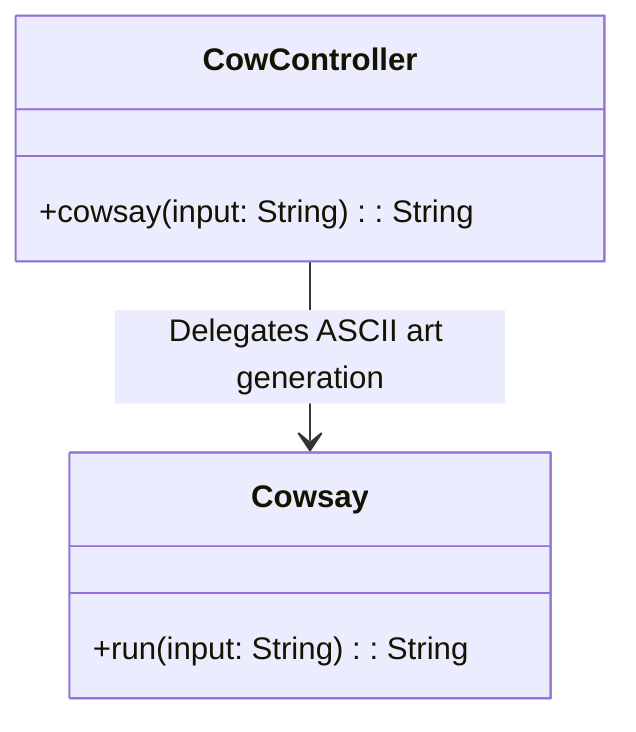
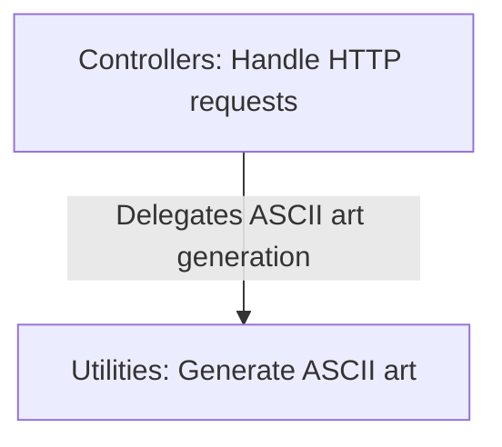
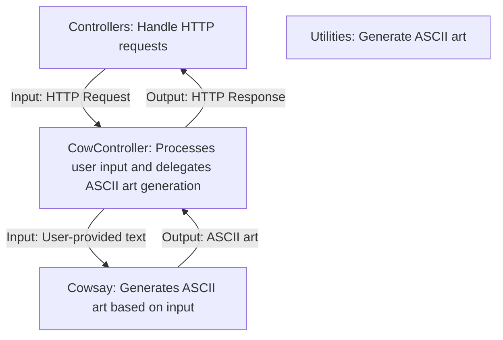
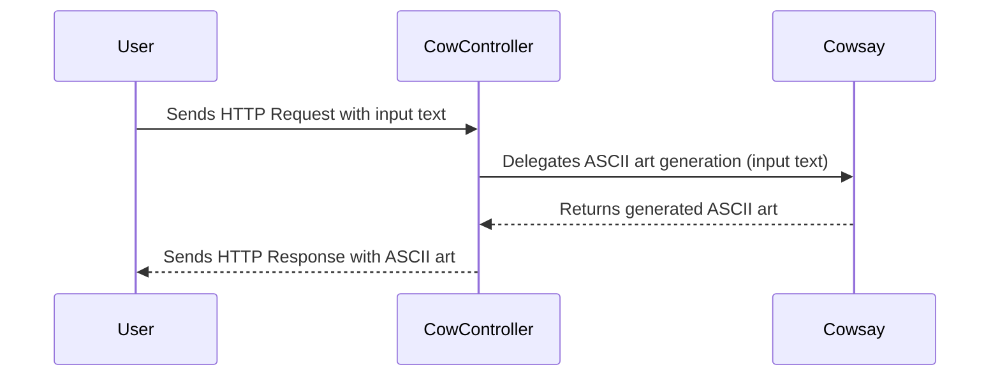

# High-Level Architecture Overview: CowController and Related Components

The provided context revolves around a Spring Boot-based web application, specifically focusing on the `CowController` component. This controller is responsible for handling HTTP requests and invoking the `Cowsay` functionality, which generates text-based ASCII art responses. The system appears to be designed to provide a lightweight and interactive API for generating ASCII art messages, leveraging the `Cowsay` utility.

## Key Components

### Controllers
- **CowController**: *Handles HTTP requests to the `/cowsay` endpoint, processes user input, and delegates the ASCII art generation to the `Cowsay` component. It serves as the entry point for user interaction with the system.*

### Utilities
- **Cowsay**: *Generates ASCII art based on the input provided by the user. This component encapsulates the logic for creating the text-based art and is invoked by the `CowController`.*

## Component Relationships

The `CowController` acts as the bridge between the user and the `Cowsay` utility. It receives input via HTTP requests, validates or processes the input, and then delegates the ASCII art generation task to `Cowsay`. The `Cowsay` component is a utility that performs the core functionality of the system, which is creating ASCII art.

### Interaction Diagram

This diagram illustrates the interaction between the `CowController` and the `Cowsay` utility. The `CowController` receives user input and passes it to `Cowsay`, which processes the input and returns the generated ASCII art.

## Summary

The architecture is straightforward and modular, with clear separation of concerns:
- The `CowController` handles HTTP requests and acts as the entry point for user interaction.
- The `Cowsay` utility encapsulates the ASCII art generation logic, ensuring that the core functionality is reusable and independent of the controller logic.

This design promotes simplicity and maintainability, making it easy to extend or modify the system in the future. For example, additional endpoints or ASCII art styles could be added without significant changes to the existing components.
## Component Relationships

### Context Diagram

### Explanation

- **Controllers**: This category represents components like `CowController`, which are responsible for handling HTTP requests. In this case, the `CowController` processes user input from the `/cowsay` endpoint and delegates the ASCII art generation task to the utilities.
  
- **Utilities**: This category includes components like `Cowsay`, which encapsulate the logic for generating ASCII art. The `Cowsay` utility takes the input provided by the controller and produces the desired ASCII art output.

The flowchart illustrates the clear separation of responsibilities:
- Controllers focus on user interaction and request handling.
- Utilities focus on the core functionality of ASCII art generation.
### Detailed Vision

### Explanation

- **Controllers**:
  - The `Controllers` category includes the `CowController`, which is responsible for handling HTTP requests to the `/cowsay` endpoint. It processes user input and delegates the ASCII art generation task to the `Cowsay` utility.
  - The `CowController` receives input from the user via an HTTP request, validates or processes the input, and passes it to the `Cowsay` utility for ASCII art generation.

- **Utilities**:
  - The `Utilities` category includes the `Cowsay` component, which encapsulates the logic for generating ASCII art. It takes the user-provided text from the `CowController` and produces the ASCII art output.
  - Once the ASCII art is generated, it is returned to the `CowController`, which then sends it back to the user as part of the HTTP response.

The flowchart provides a detailed view of the interactions:
- The `CowController` acts as the intermediary between the user and the `Cowsay` utility, ensuring that user input is processed and the generated ASCII art is returned as an HTTP response.
- The `Cowsay` utility performs the core functionality of the system, which is generating ASCII art based on the input provided by the user.
## Integration Scenarios

### ASCII Art Generation via HTTP Request

This scenario describes the process of generating ASCII art when a user interacts with the `/cowsay` endpoint. The integration involves the `CowController` and the `Cowsay` utility, showcasing how user input is processed and transformed into ASCII art, which is then returned as an HTTP response.

#### Sequence Diagram

#### Explanation

- **User**:
  - The process begins when the user sends an HTTP request to the `/cowsay` endpoint, providing input text (e.g., "I love Linux!").
  
- **CowController**:
  - The `CowController` receives the HTTP request and extracts the input text from the request parameters.
  - It delegates the ASCII art generation task to the `Cowsay` utility by passing the user-provided text.

- **Cowsay**:
  - The `Cowsay` utility processes the input text and generates the corresponding ASCII art.
  - It returns the generated ASCII art back to the `CowController`.

- **CowController**:
  - The `CowController` receives the ASCII art from the `Cowsay` utility and prepares an HTTP response.
  - It sends the HTTP response containing the ASCII art back to the user.

This scenario highlights the seamless interaction between the `CowController` and the `Cowsay` utility, ensuring that user input is processed efficiently and the desired output is returned. The sequence diagram provides a clear visualization of the data flow and responsibilities of each component in fulfilling the ASCII art generation use case.
