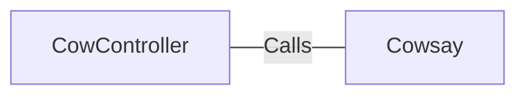

# CowController.java: REST Controller for Cowsay Functionality

## Overview
This Java class defines a REST controller that provides an endpoint for generating "cowsay" ASCII art based on user input. It uses Spring Boot annotations to configure and expose the endpoint.

## Process Flow
```mermaid
graph TD
    A[Client Request to /cowsay] --> B[Extract 'input' Parameter]
    B --> C[Default to 'I love Linux!' if 'input' is not provided]
    C --> D[Call Cowsay.run(input)]
    D --> E[Return ASCII Art Response]
```

## Insights
- The class is annotated with `@RestController` and `@EnableAutoConfiguration`, making it a Spring Boot REST controller.
- The `/cowsay` endpoint accepts a query parameter `input` and defaults to "I love Linux!" if no value is provided.
- The `Cowsay.run(input)` method is invoked to generate the ASCII art, but the implementation of `Cowsay` is not provided in this snippet.

## Dependencies


- `Cowsay`: The `run` method of this class is called with the `input` parameter to generate the ASCII art. The exact implementation of `Cowsay` is not provided in this snippet.

## Vulnerabilities
- **Potential Command Injection**: If the `Cowsay.run(input)` method executes system commands or interacts with external processes without sanitizing the `input` parameter, it could be vulnerable to command injection attacks. Proper input validation and sanitization are necessary to mitigate this risk.
- **Denial of Service (DoS)**: If the `Cowsay.run(input)` method processes large or malformed inputs without limits, it could lead to resource exhaustion.
- **Lack of Input Validation**: The `input` parameter is directly passed to `Cowsay.run(input)` without any validation or sanitization, which could lead to unexpected behavior or security vulnerabilities depending on the implementation of `Cowsay`.
