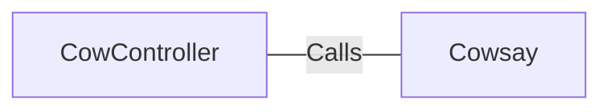

# CowController.java: REST Controller for Cowsay Functionality

## Overview
This Java class defines a REST controller that provides an endpoint for generating "cowsay" ASCII art based on user input. It uses Spring Boot annotations to configure the controller and handle HTTP requests.

## Process Flow
```mermaid
graph TD
    A[Start] --> B[Receive HTTP GET/POST Request at /cowsay]
    B --> C[Extract 'input' Parameter with Default Value]
    C --> D[Call Cowsay.run(input)]
    D --> E[Return ASCII Art Response]
```

## Insights
- The `/cowsay` endpoint accepts a query parameter `input` and generates ASCII art using the `Cowsay.run` method.
- A default value of `"I love Linux!"` is used if the `input` parameter is not provided.
- The class is annotated with `@RestController` and `@EnableAutoConfiguration`, making it a Spring Boot REST controller.
- The `Cowsay.run` method is assumed to handle the ASCII art generation.

## Dependencies


- `Cowsay`: The `run` method of this class is called to generate ASCII art. The exact implementation of `Cowsay` is not provided in this code snippet.

## Vulnerabilities
- **Potential Command Injection**: If the `Cowsay.run` method executes system commands or interacts with external processes, the `input` parameter could be exploited for command injection. Proper sanitization and validation of the `input` parameter are necessary.
- **Denial of Service (DoS)**: If `Cowsay.run` performs resource-intensive operations, an attacker could exploit this by sending numerous or large requests, potentially leading to a denial of service.
- **Lack of Input Validation**: The `input` parameter is directly passed to `Cowsay.run` without validation. This could lead to unexpected behavior or security vulnerabilities depending on the implementation of `Cowsay.run`.
