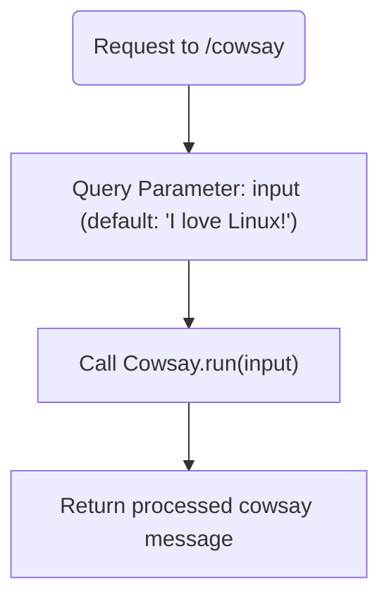
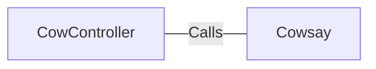

# CowController.java: REST Controller for CowSay Functionality

## Overview
The `CowController` class is a Spring Boot REST controller that provides an endpoint for generating "cowsay" messages. It accepts user input via a query parameter and processes it using the `Cowsay.run()` method.

## Process Flow

```mermaid
flowchart TD
    Start("Request to /cowsay")
    Input["Query Parameter: input (default: 'I love Linux!')"]
    Process["Call Cowsay.run(input)"]
    Response["Return processed cowsay message"]

    Start --> Input
    Input --> Process
    Process --> Response
```

## Insights
- The class is annotated with `@RestController` and `@EnableAutoConfiguration`, making it a Spring Boot REST controller with auto-configuration enabled.
- The `/cowsay` endpoint accepts a query parameter `input` with a default value of `"I love Linux!"`.
- The `Cowsay.run(input)` method is responsible for processing the input and generating the cowsay message.
- The code does not validate or sanitize the `input` parameter, which could lead to potential security vulnerabilities.

## Vulnerabilities
1. **Potential Command Injection**:
   - If the `Cowsay.run(input)` method executes system commands or interacts with external processes, unsanitized user input could lead to command injection vulnerabilities.
   - Mitigation: Validate and sanitize the `input` parameter to ensure it does not contain malicious content.

2. **Denial of Service (DoS)**:
   - If the `Cowsay.run(input)` method performs resource-intensive operations, an attacker could exploit this by sending large or complex inputs repeatedly.
   - Mitigation: Implement input size limits and rate limiting on the endpoint.

3. **Cross-Site Scripting (XSS)**:
   - If the `Cowsay.run(input)` method generates output that is rendered in a web application without proper escaping, it could lead to XSS vulnerabilities.
   - Mitigation: Ensure the output is properly escaped before rendering in any web context.

## Dependencies

```mermaid
flowchart LR
    CowController --- |"Calls"| Cowsay
```

- `Cowsay`: Processes the input parameter and generates the cowsay message.

## Data Manipulation (SQL) (Optional)
No SQL-related operations or data structures are detected in this code.
