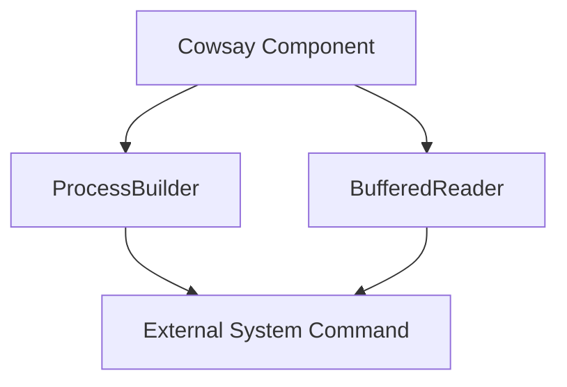
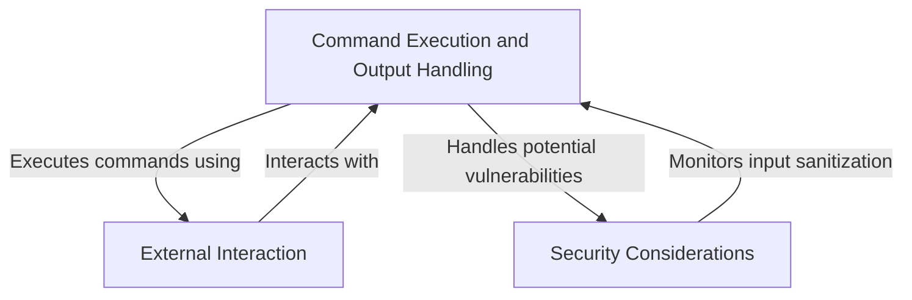
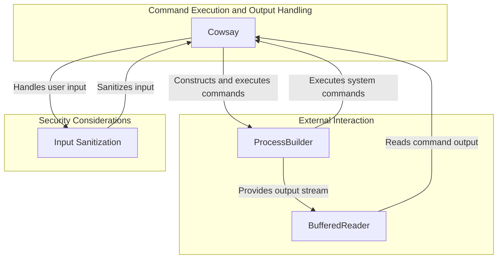
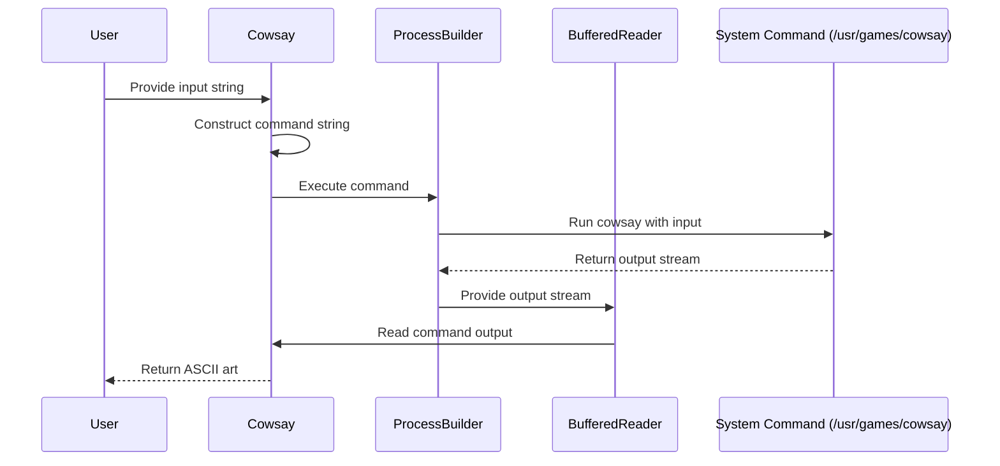

# High-Level Architecture Overview: Cowsay Component

The provided context revolves around the `Cowsay` component, which is part of the `com.scalesec.vulnado` package. This component is responsible for executing a system command to generate ASCII art using the `cowsay` program. It leverages Java's `ProcessBuilder` to execute the command and capture its output. The primary focus of this component is to interact with external system utilities and return their output as a string.

## Key Components

### Command Execution and Output Handling
- **Cowsay**: *Responsible for executing the `cowsay` command-line utility and returning its output. It uses Java's `ProcessBuilder` to construct and execute the command, and `BufferedReader` to read the output stream.*

### External Interaction
- **ProcessBuilder**: *A Java utility used by the `Cowsay` component to execute system commands. It provides the mechanism to run the `cowsay` program in a controlled environment.*
- **BufferedReader**: *Used to read the output of the executed command from the input stream.*

### Security Considerations
- **Potential Vulnerabilities**: *The `Cowsay` component constructs the command string by directly concatenating user input, which may lead to command injection vulnerabilities if the input is not properly sanitized.*

## Component Relationships

### Explanation of Relationships
1. **Cowsay** acts as the central component, orchestrating the execution of the `cowsay` command and handling its output.
2. **ProcessBuilder** is utilized by `Cowsay` to execute the system command in a controlled manner.
3. **BufferedReader** is used to read the output of the executed command, ensuring the result is captured and returned as a string.
4. **External System Command** (`/usr/games/cowsay`) is the utility being invoked, and its output is processed by the `Cowsay` component.

This architecture highlights the interaction between the `Cowsay` component and external system utilities, emphasizing the need for careful input handling to mitigate potential security risks.
## Component Relationships

### Context Diagram

### Explanation of the Flowchart

- **Command Execution and Output Handling**: This category, represented by the `Cowsay` component, is responsible for orchestrating the execution of system commands and processing their output. It interacts with the `External Interaction` category to execute commands and retrieve results.
  
- **External Interaction**: This category, represented by `ProcessBuilder` and `BufferedReader`, facilitates the execution of system commands and the reading of their output. It works closely with the `Command Execution and Output Handling` category to fulfill its responsibilities.

- **Security Considerations**: This category highlights the importance of input sanitization and monitoring to prevent vulnerabilities such as command injection. It is directly tied to the `Command Execution and Output Handling` category, ensuring that user input is handled securely.
### Detailed Vision

### Explanation of the Flowchart

- **Command Execution and Output Handling**:
  - The `Cowsay` component is the central orchestrator. It constructs the command string and uses the `ProcessBuilder` to execute the `cowsay` system command.
  - It also interacts with `BufferedReader` to read the output stream of the executed command and return the result as a string.

- **External Interaction**:
  - The `ProcessBuilder` component is responsible for executing the constructed system command. It provides the output stream that is read by `BufferedReader`.
  - The `BufferedReader` component reads the output of the executed command and passes it back to `Cowsay` for further processing.

- **Security Considerations**:
  - The `Input Sanitization` component ensures that user input is properly handled to prevent vulnerabilities such as command injection. It interacts with `Cowsay` to sanitize the input before constructing the command string.
## Integration Scenarios

### Executing a System Command to Generate ASCII Art

This scenario describes the process of executing the `cowsay` system command to generate ASCII art based on user input. The integration involves the `Cowsay` component orchestrating the command execution, interacting with external utilities (`ProcessBuilder` and `BufferedReader`), and handling the output. The focus is on how the components collaborate to fulfill the responsibility of generating and returning the ASCII art.

### Explanation of the Diagram

- **User**: Initiates the process by providing an input string to the `Cowsay` component. This input is the text that will be displayed in the ASCII art generated by the `cowsay` command.

- **Cowsay**:
  - Constructs the command string using the user input.
  - Delegates the execution of the command to the `ProcessBuilder` component.
  - Receives the output from `BufferedReader` after the command execution and returns the ASCII art to the user.

- **ProcessBuilder**:
  - Executes the constructed command by interacting with the external system command (`/usr/games/cowsay`).
  - Provides the output stream of the executed command to `BufferedReader`.

- **BufferedReader**:
  - Reads the output stream provided by `ProcessBuilder`.
  - Passes the processed output back to the `Cowsay` component.

- **System Command**:
  - The external utility (`/usr/games/cowsay`) generates the ASCII art based on the input provided by the user and returns the output stream to `ProcessBuilder`.

This integration scenario highlights the collaboration between components to fulfill the responsibility of generating ASCII art, emphasizing the flow of data from user input to the final output.
