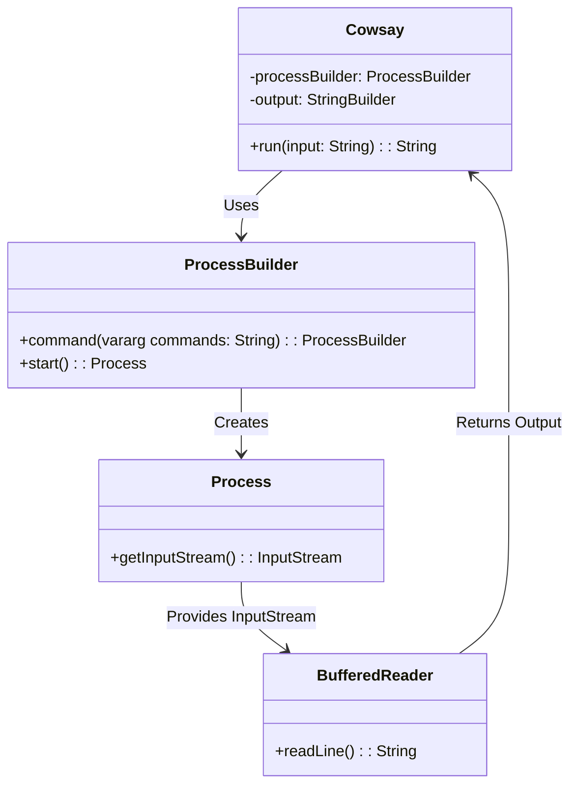
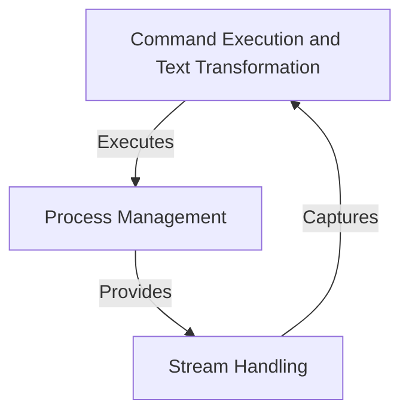
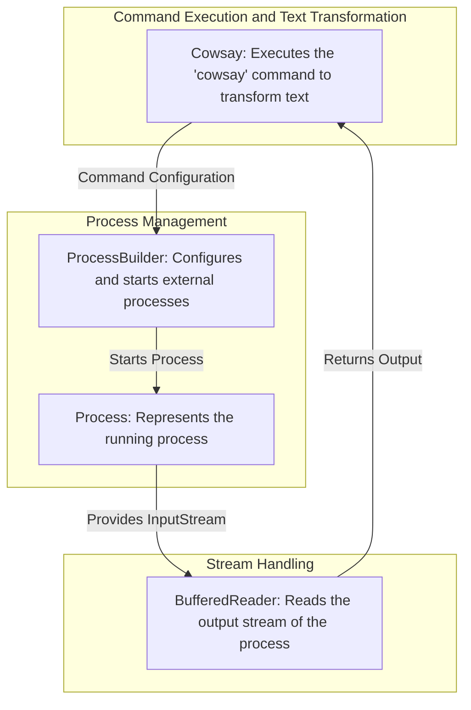
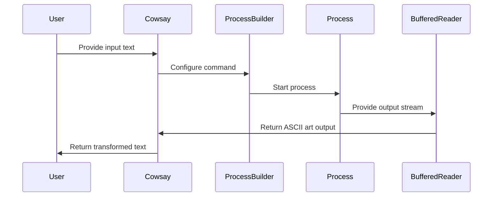

# Command Execution and Text Transformation Component Overview

The provided context and code analysis focus on a component responsible for executing system commands and transforming text input into a stylized output using the `cowsay` command-line tool. This component is part of a broader system that likely deals with user input processing, command execution, and output generation. The primary responsibility of the component is to securely and effectively execute external commands while handling input and output streams.

## Key Components

### Command Execution and Text Transformation
- **Cowsay**: *Responsible for executing the `cowsay` command-line tool to transform text input into a stylized ASCII art output. It leverages Java's `ProcessBuilder` to execute system commands and handles input/output streams for capturing the command's result.*

### Supporting Concepts
- **ProcessBuilder**: *Used internally by the `Cowsay` component to execute system commands. It provides a flexible way to configure and start processes.*
- **BufferedReader**: *Handles the reading of the output stream from the executed process, ensuring the result is captured and returned as a string.*

## Component Interaction Diagram

## Summary of Responsibilities
The `Cowsay` component is designed to execute external commands securely and efficiently. It uses `ProcessBuilder` to configure and start the process, and `BufferedReader` to capture the output stream. The primary goal is to transform user-provided text into ASCII art using the `cowsay` tool, which is a playful and stylized way to display text. This component is likely part of a larger system that processes user input and generates dynamic outputs.
## Component Relationships

### Context Diagram

### Explanation of the Flowchart

- **Command Execution and Text Transformation**: This category, represented by the `Cowsay` component, is responsible for executing the `cowsay` command-line tool to transform user-provided text into ASCII art. It initiates the process execution and handles the overall workflow.

- **Process Management**: This category, represented by the `ProcessBuilder` component, is responsible for configuring and starting external processes. It provides the necessary infrastructure for executing system commands securely and efficiently.

- **Stream Handling**: This category, represented by the `BufferedReader` and `Process` components, is responsible for capturing the output stream of the executed process. It ensures that the result of the command execution is read and returned to the `Command Execution and Text Transformation` category for further use.
### Detailed Vision

### Explanation of the Flowchart

- **Command Execution and Text Transformation**:
  - The `Cowsay` component initiates the workflow by configuring the command to be executed (`cowsay`) and passing it to the `ProcessBuilder`. Its primary responsibility is to transform user-provided text into ASCII art using the external `cowsay` tool.

- **Process Management**:
  - The `ProcessBuilder` component, under the `Process Management` category, receives the command configuration from `Cowsay`. It is responsible for securely starting the external process (`cowsay`) and managing its lifecycle.
  - The `Process` component represents the running instance of the external command. It provides access to the input and output streams necessary for capturing the command's result.

- **Stream Handling**:
  - The `BufferedReader` component, under the `Stream Handling` category, reads the output stream provided by the `Process` component. It ensures that the ASCII art generated by the `cowsay` command is captured and returned to the `Cowsay` component for further use or display.
## Integration Scenarios

### Executing the `cowsay` Command to Transform Text

This scenario describes the process of transforming user-provided text into ASCII art using the `cowsay` command-line tool. The flow begins with the `Cowsay` component receiving the input text, configuring the command, and executing it. The output of the command is captured and returned to the caller.

#### Sequence Diagram

#### Explanation

- **User Interaction**:
  - The process begins with the **User** providing input text to the `Cowsay` component. This input is the text that will be transformed into ASCII art.

- **Command Configuration**:
  - The `Cowsay` component configures the `cowsay` command using the `ProcessBuilder` component. This involves setting up the command string and preparing it for execution.

- **Process Execution**:
  - The `ProcessBuilder` component starts the external process (`cowsay`) and creates a `Process` instance to represent the running command.

- **Stream Handling**:
  - The `Process` component provides an output stream containing the ASCII art generated by the `cowsay` command. This stream is passed to the `BufferedReader` component.

- **Output Capture**:
  - The `BufferedReader` component reads the output stream line by line and returns the complete ASCII art output to the `Cowsay` component.

- **Result Delivery**:
  - Finally, the `Cowsay` component returns the transformed text (ASCII art) back to the **User**, completing the process.
