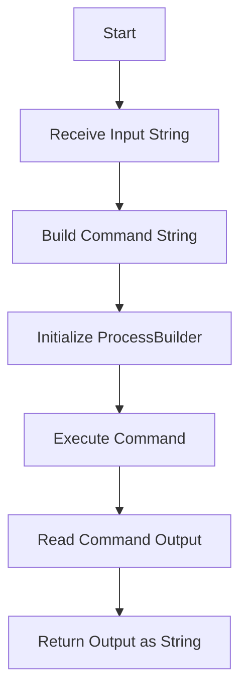
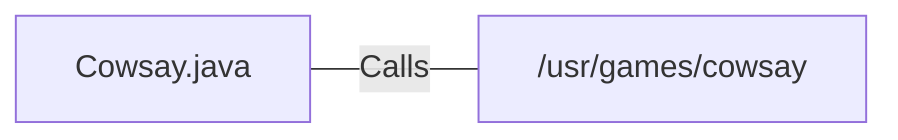

# Cowsay.java: Command Execution Wrapper for Cowsay

## Overview

This program provides a wrapper for executing the `cowsay` command-line utility, which generates ASCII art of a cow saying a given input message. The program uses Java's `ProcessBuilder` to execute the command and capture its output.

## Process Flow

## Insights

- The program dynamically constructs and executes a shell command using `ProcessBuilder`.
- The output of the `cowsay` command is captured and returned as a string.
- The program does not validate or sanitize the input, which could lead to potential security vulnerabilities.

## Vulnerabilities

1. **Command Injection**:
   - The input string is directly concatenated into the command string without any sanitization or escaping. This allows an attacker to inject arbitrary shell commands, potentially leading to unauthorized command execution.
   - Example: If the input is `"; rm -rf / #"`, the resulting command would execute `rm -rf /`, which could delete critical system files.

2. **Error Handling**:
   - The program catches exceptions but only prints the stack trace. It does not provide meaningful error messages or handle errors gracefully.

3. **Dependency on External Command**:
   - The program relies on the presence of the `cowsay` utility at `/usr/games/cowsay`. If the utility is not installed or located at a different path, the program will fail.

## Dependencies

- `/usr/games/cowsay`: Executes the `cowsay` command-line utility with the provided input string.

## Data Manipulation (SQL)

No SQL data manipulation is present in this program.
