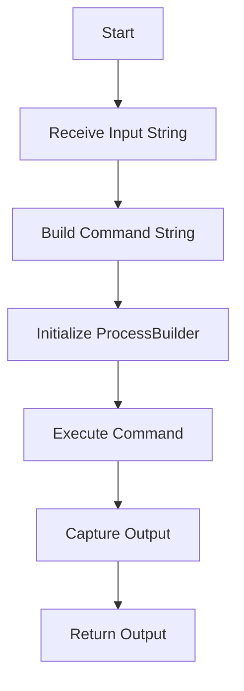
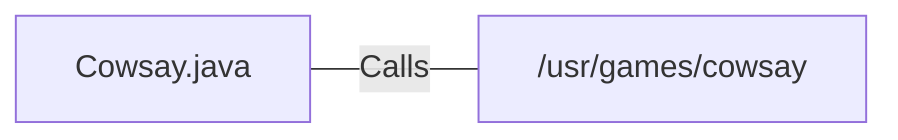

# Cowsay.java: Command Execution Wrapper for Cowsay

## Overview

This program provides a wrapper for executing the `cowsay` command-line utility, which generates ASCII art of a cow saying a given input message. The program uses Java's `ProcessBuilder` to execute the command and capture its output.

## Process Flow

## Insights

- The program dynamically constructs a shell command to execute the `cowsay` utility.
- It uses `ProcessBuilder` to execute the command and capture its output.
- The program does not sanitize the input, which could lead to command injection vulnerabilities.
- The output of the `cowsay` command is captured line by line and returned as a single string.

## Vulnerabilities

1. **Command Injection**:
   - The input string is directly concatenated into the command without sanitization.
   - An attacker could inject malicious shell commands by providing specially crafted input.
   - Example: If the input is `"; rm -rf / #"`, it could execute unintended commands on the system.

2. **Error Handling**:
   - The program catches exceptions but only prints the stack trace. It does not provide meaningful error handling or feedback to the caller.

3. **Dependency on External Command**:
   - The program assumes the `cowsay` utility is installed at `/usr/games/cowsay`. If it is not present, the program will fail.

## Dependencies

- `/usr/games/cowsay`: Executes the `cowsay` command-line utility with the provided input string.

## Data Manipulation (SQL)

No SQL data manipulation is present in this program.
