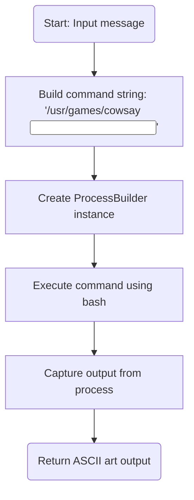
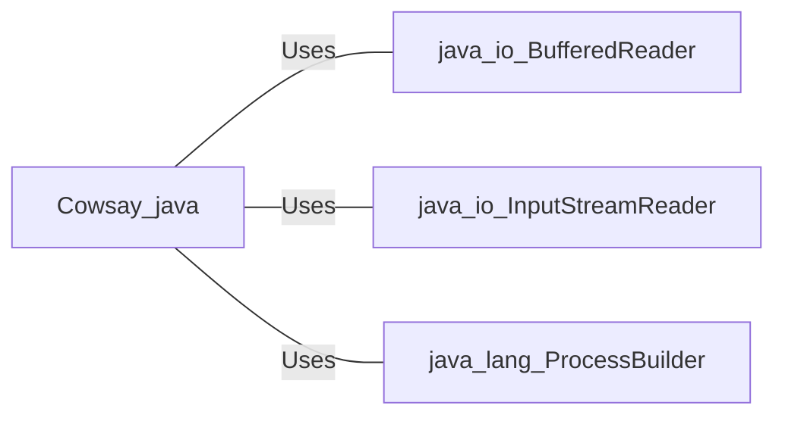

# Cowsay.java: Command Execution Wrapper for Cowsay

## Overview
The `Cowsay` class provides functionality to execute the `cowsay` command-line tool, which generates ASCII art of a cow saying a given input message. It uses Java's `ProcessBuilder` to execute the command and captures the output.

## Process Flow

```mermaid
flowchart TD
    Start("Start: Input message")
    BuildCommand["Build command string: '/usr/games/cowsay <input>'"]
    CreateProcessBuilder["Create ProcessBuilder instance"]
    ExecuteCommand["Execute command using bash"]
    CaptureOutput["Capture output from process"]
    ReturnOutput("Return ASCII art output")
    
    Start --> BuildCommand
    BuildCommand --> CreateProcessBuilder
    CreateProcessBuilder --> ExecuteCommand
    ExecuteCommand --> CaptureOutput
    CaptureOutput --> ReturnOutput
```

## Insights
- **Command Injection Vulnerability**: The code concatenates user input directly into the command string without sanitization, making it vulnerable to command injection attacks. Malicious input could execute arbitrary commands on the system.
- **Error Handling**: The code catches exceptions but only prints the stack trace, which may not be sufficient for robust error handling in production environments.
- **Hardcoded Command Path**: The path to the `cowsay` executable (`/usr/games/cowsay`) is hardcoded, which may cause issues if the executable is located elsewhere on the system.
- **Resource Management**: The `BufferedReader` is not closed explicitly, which could lead to resource leaks.

## Vulnerabilities
1. **Command Injection**:
   - The input is directly concatenated into the command string without validation or escaping.
   - Example of exploitation: Passing `"; rm -rf /"` as input could execute destructive commands.

2. **Hardcoded Path**:
   - The hardcoded path to `cowsay` may not work on systems where the executable is located in a different directory.

3. **Resource Leak**:
   - The `BufferedReader` is not closed explicitly, which could lead to resource leaks.

4. **Insufficient Error Handling**:
   - The exception handling only prints the stack trace, which may not provide sufficient feedback or recovery mechanisms in production.

## Dependencies

```mermaid
flowchart LR
    Cowsay_java --- |"Uses"| java_io_BufferedReader
    Cowsay_java --- |"Uses"| java_io_InputStreamReader
    Cowsay_java --- |"Uses"| java_lang_ProcessBuilder
```

- `java.io.BufferedReader`: Used to read the output of the executed command.
- `java.io.InputStreamReader`: Wraps the input stream of the process for reading.
- `java.lang.ProcessBuilder`: Used to create and execute the external process.

## Recommendations
- **Input Sanitization**: Validate and sanitize user input to prevent command injection.
- **Use Safer APIs**: Consider using APIs that allow passing arguments separately instead of concatenating them into a single command string.
- **Dynamic Path Resolution**: Use environment variables or configuration files to determine the path to the `cowsay` executable.
- **Close Resources**: Ensure `BufferedReader` is closed explicitly using a `try-with-resources` block.
- **Enhanced Error Handling**: Implement better error handling mechanisms, such as logging errors and providing meaningful feedback to the user.
