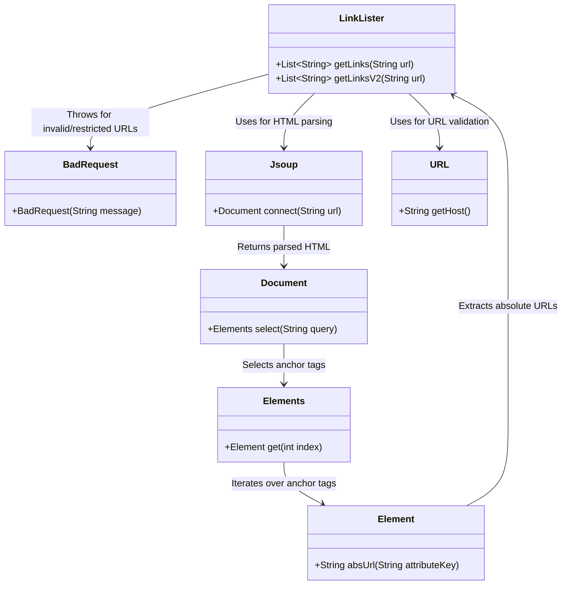
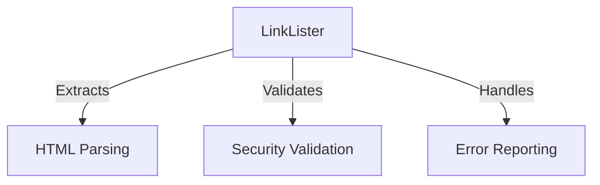
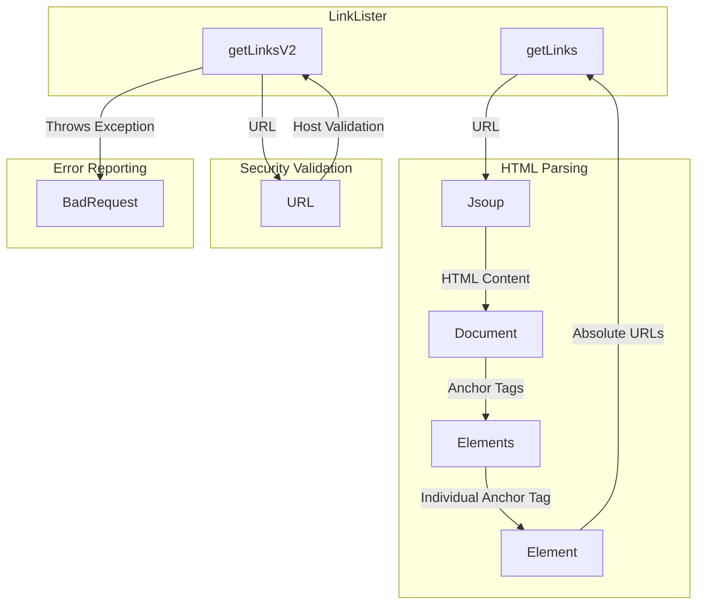
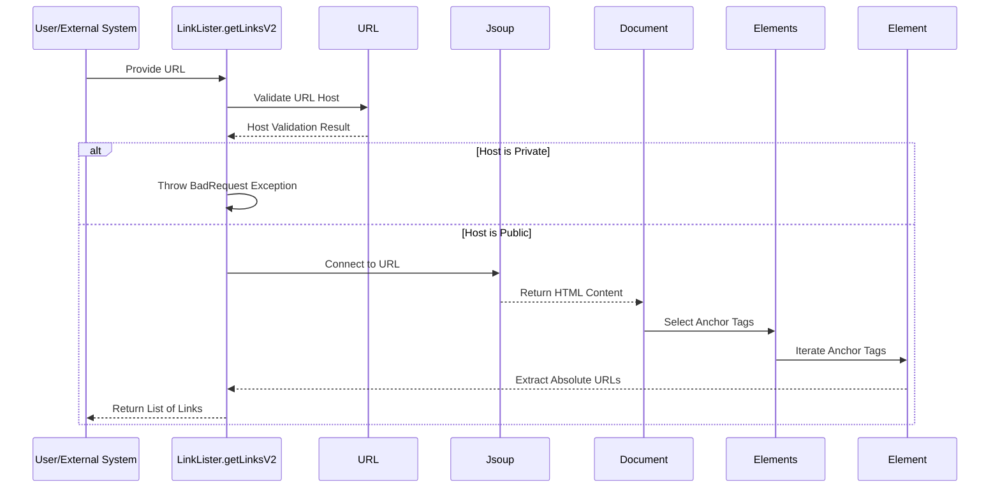

# High-Level Architecture Overview: LinkLister Component

The `LinkLister` component is designed to extract hyperlinks from a given URL. It provides functionality to retrieve all links from a webpage while ensuring security measures to prevent misuse of private IP addresses. This component is part of a broader system that likely deals with web scraping, data extraction, or URL validation. Its primary focus is on parsing HTML content and filtering links based on specific criteria.

## Key Components

### **LinkLister**: *Responsible for extracting hyperlinks from a webpage and ensuring security by validating the URL against private IP ranges.*
- **Responsibilities**:
  - **HTML Parsing**: Leverages the `Jsoup` library to parse HTML content and extract anchor tags (`<a>`).
  - **Link Extraction**: Retrieves absolute URLs from anchor tags and compiles them into a list.
  - **Security Validation**: Implements a mechanism to prevent the use of private IP addresses in URLs, ensuring that only public URLs are processed.
  - **Error Handling**: Provides structured error handling through custom exceptions (`BadRequest`) to manage invalid or restricted URLs.

### **BadRequest**: *Represents a custom exception used to handle invalid or restricted URL inputs.*
- **Responsibilities**:
  - **Error Reporting**: Facilitates clear communication of issues related to invalid URLs or restricted IP ranges.
  - **Integration**: Used within the `LinkLister` component to enforce security and validation rules.

## Component Relationships

The `LinkLister` component interacts with external libraries (`Jsoup`) for HTML parsing and utilizes Java's built-in `URL` class for URL validation. It also integrates with the custom `BadRequest` exception to enforce security measures and handle errors gracefully.

This diagram illustrates the relationships between the `LinkLister` component, its dependencies, and the flow of data during the link extraction process. The `LinkLister` component serves as the central piece, orchestrating interactions with external libraries and custom exceptions to fulfill its responsibilities.
## Component Relationships

### Context Diagram

### Explanation
- **LinkLister → HTML Parsing**: The `LinkLister` component uses the `Jsoup` library to parse HTML content and extract anchor tags (`<a>`). This fulfills its responsibility of retrieving hyperlinks from a webpage.
- **LinkLister → Security Validation**: The `LinkLister` component validates URLs to ensure they do not belong to private IP ranges. This is critical for enforcing security measures and preventing misuse of the system.
- **LinkLister → Error Reporting**: The `LinkLister` component integrates with the `BadRequest` exception to handle invalid or restricted URLs gracefully. This ensures that errors are communicated effectively and the system remains robust.
### Detailed Vision

### Explanation
- **LinkLister → HTML Parsing**:
  - The `getLinks` method in `LinkLister` calls the `Jsoup` library (`B1`) to connect to the provided URL and retrieve the HTML content.
  - The `Document` object (`B2`) is used to parse the HTML and select anchor tags (`B3`).
  - Each anchor tag (`B4`) is processed to extract its absolute URL, which is returned to the `getLinks` method.

- **LinkLister → Security Validation**:
  - The `getLinksV2` method in `LinkLister` uses the `URL` class (`C1`) to validate the host of the provided URL.
  - If the host belongs to a private IP range, the method prevents further processing and throws a `BadRequest` exception.

- **LinkLister → Error Reporting**:
  - The `getLinksV2` method integrates with the `BadRequest` exception (`D1`) to handle invalid or restricted URLs.
  - When an error occurs, the exception is thrown, ensuring that the system communicates the issue effectively and halts further processing.
## Integration Scenarios

### Extracting Links from a Public URL
This scenario demonstrates how the `LinkLister` component interacts with its dependencies to extract hyperlinks from a public URL. The process begins with a user or external system providing a URL, which is validated and parsed to retrieve all absolute links from the webpage.

#### Explanation
- **User → LinkLister**: The process begins when a user or external system provides a URL to the `getLinksV2` method in the `LinkLister` component.
- **LinkLister → URL**: The `LinkLister` component validates the host of the URL using the `URL` class to ensure it does not belong to a private IP range.
- **URL → LinkLister**: The validation result is returned to the `LinkLister` component.
  - If the host belongs to a private IP range, the `LinkLister` throws a `BadRequest` exception, halting further processing.
  - If the host is public, the process continues.
- **LinkLister → Jsoup**: The `LinkLister` connects to the URL using the `Jsoup` library to retrieve the HTML content of the webpage.
- **Jsoup → Document**: The `Jsoup` library returns a `Document` object containing the parsed HTML content.
- **Document → Elements**: The `Document` object selects all anchor tags (`<a>`) from the HTML content.
- **Elements → Element**: The `Elements` object iterates over each anchor tag to process individual links.
- **Element → LinkLister**: The `Element` object extracts the absolute URLs from the anchor tags and returns them to the `LinkLister`.
- **LinkLister → User**: Finally, the `LinkLister` returns the list of extracted links to the user or external system.
