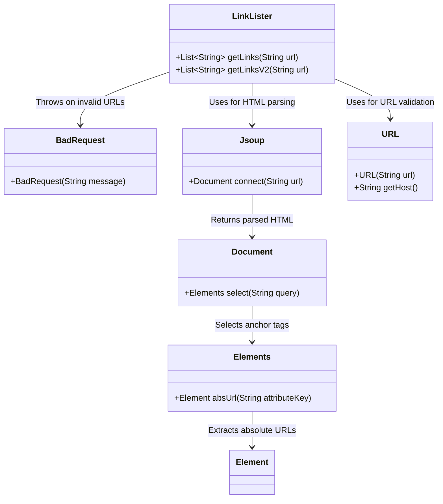
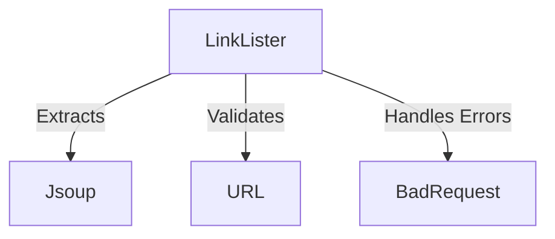
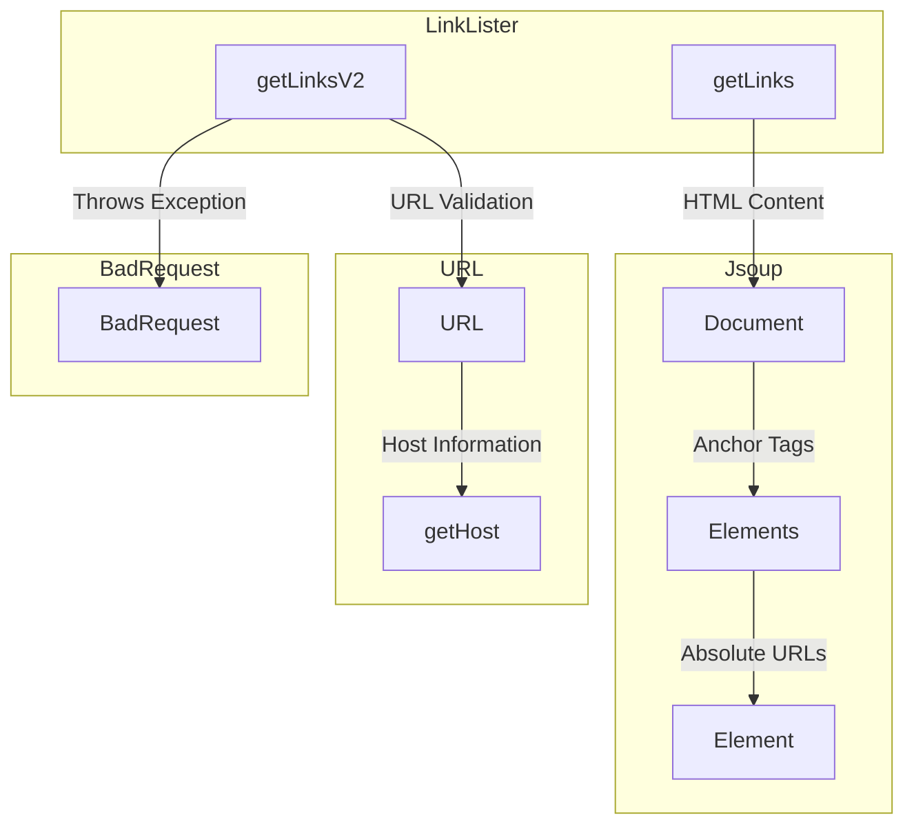
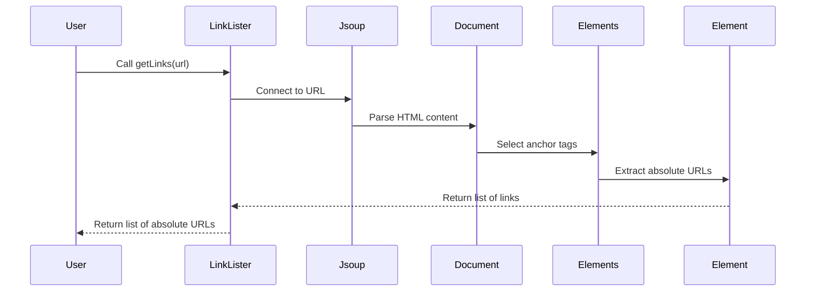
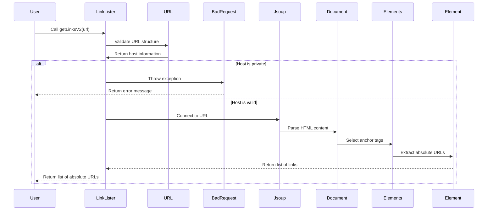

# High-Level Architecture Overview: LinkLister Component

The `LinkLister` component is designed to extract hyperlinks from a given URL. It provides functionality to retrieve all links from a webpage while ensuring security by validating the URL against private IP ranges. This component is part of a broader system that likely deals with web scraping, data extraction, or URL validation. Its primary responsibilities include parsing HTML content, extracting links, and enforcing security measures to prevent misuse of private IP addresses.

## Key Components

### **LinkLister**
- *Responsibility*: The `LinkLister` class is responsible for extracting hyperlinks from a webpage. It leverages the Jsoup library to parse HTML content and retrieve all anchor tags (`<a>`). Additionally, it provides a security mechanism to validate URLs and prevent access to private IP ranges.
- *Relation to Other Components*: This component interacts with external libraries such as Jsoup for HTML parsing and Java's `URL` class for URL validation. It also uses a custom exception (`BadRequest`) to handle invalid or restricted URLs.

### **BadRequest**
- *Responsibility*: The `BadRequest` class is a custom exception used to signal invalid or restricted URLs. It encapsulates error messages related to URL validation failures, such as attempts to access private IP ranges.
- *Relation to Other Components*: This exception is thrown by the `LinkLister` class when a URL fails validation, ensuring that the system can handle such errors gracefully.

## Interaction Diagram

This diagram illustrates the interaction between the `LinkLister` component and its dependencies, highlighting how it processes URLs and handles errors. The `LinkLister` class is central to the system, orchestrating the parsing and validation of URLs while ensuring security through the use of the `BadRequest` exception.
## Component Relationships

### Context Diagram

### Explanation of the Flowchart

- **LinkLister → Jsoup**: The `LinkLister` component uses the Jsoup library to parse HTML content from a given URL. This allows it to extract all hyperlinks (`<a>` tags) from the webpage efficiently.

- **LinkLister → URL**: The `LinkLister` component leverages Java's `URL` class to validate the structure and host of the provided URL. This ensures that the URL is properly formatted and checks whether it belongs to a private IP range.

- **LinkLister → BadRequest**: The `LinkLister` component throws the `BadRequest` exception when a URL fails validation, such as when it attempts to access private IP ranges. This mechanism ensures that invalid or restricted URLs are handled gracefully and securely.
### Detailed Vision

### Explanation of the Flowchart

- **LinkLister → Jsoup**:
  - The `getLinks` method in the `LinkLister` component uses the `Document` class from Jsoup to parse the HTML content of the provided URL.
  - The `Document` class selects anchor tags (`<a>`) using the `Elements` class, which further extracts absolute URLs using the `Element` class.

- **LinkLister → URL**:
  - The `getLinksV2` method in the `LinkLister` component uses the `URL` class to validate the structure of the provided URL.
  - The `getHost` method of the `URL` class retrieves the host information, which is then checked against private IP ranges to ensure security.

- **LinkLister → BadRequest**:
  - The `getLinksV2` method throws the `BadRequest` exception when the URL fails validation, such as when it belongs to a private IP range. This ensures that invalid or restricted URLs are handled securely and appropriately.
## Integration Scenarios

### Extracting Links from a Webpage

This scenario demonstrates how the `LinkLister` component interacts with its dependencies to extract hyperlinks from a webpage. The process begins with a URL being provided to the `getLinks` method, which then uses Jsoup to parse the HTML content and retrieve all anchor tags (`<a>`). The extracted links are returned as a list of absolute URLs.

#### Sequence Diagram

#### Explanation

- **User → LinkLister**: The process starts when a user or external system calls the `getLinks` method of the `LinkLister` component, providing a URL as input.

- **LinkLister → Jsoup**: The `LinkLister` component uses Jsoup to connect to the provided URL and retrieve the HTML content of the webpage.

- **Jsoup → Document**: Jsoup parses the HTML content and returns a `Document` object representing the structure of the webpage.

- **Document → Elements**: The `Document` object selects all anchor tags (`<a>`) using the `Elements` class.

- **Elements → Element**: The `Elements` class iterates through the anchor tags and extracts their absolute URLs using the `Element` class.

- **Element → LinkLister**: The extracted list of absolute URLs is returned to the `LinkLister` component.

- **LinkLister → User**: Finally, the `LinkLister` component returns the list of absolute URLs to the user or external system that initiated the process.

---

### Validating and Extracting Links with Security Measures

This scenario illustrates how the `LinkLister` component validates a URL to ensure it does not belong to a private IP range before extracting links. The process begins with the `getLinksV2` method, which uses the `URL` class to validate the host of the provided URL. If the URL passes validation, the `getLinks` method is called to extract links. If validation fails, a `BadRequest` exception is thrown.

#### Sequence Diagram

#### Explanation

- **User → LinkLister**: The process starts when a user or external system calls the `getLinksV2` method of the `LinkLister` component, providing a URL as input.

- **LinkLister → URL**: The `LinkLister` component uses the `URL` class to validate the structure of the provided URL and retrieve its host information.

- **URL → LinkLister**: The `URL` class returns the host information to the `LinkLister` component.

- **Host Validation**:
  - If the host belongs to a private IP range (e.g., `172.*`, `192.168.*`, or `10.*`), the `LinkLister` component throws a `BadRequest` exception.
  - The `BadRequest` exception returns an error message to the user or external system.

- **Host is Valid**:
  - If the host is valid, the `LinkLister` component calls the `getLinks` method to extract links from the webpage.
  - The process follows the same steps as described in the "Extracting Links from a Webpage" scenario, using Jsoup to parse HTML content and retrieve absolute URLs.

- **LinkLister → User**: Finally, the `LinkLister` component returns the list of absolute URLs to the user or external system that initiated the process.
