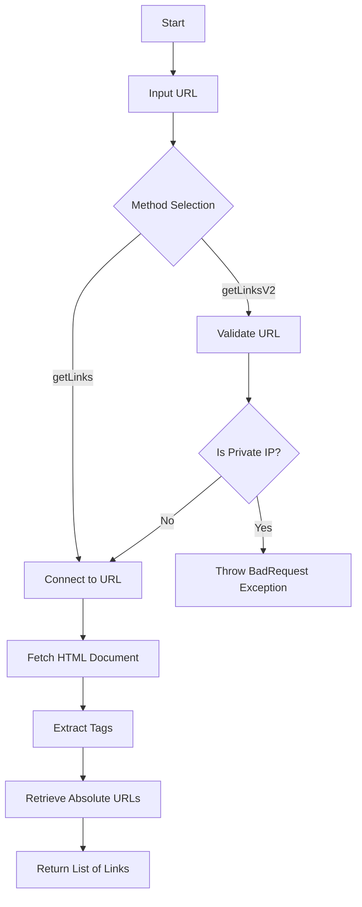
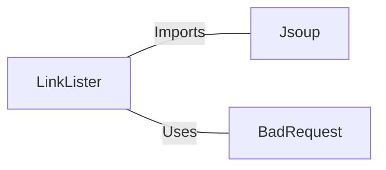

# LinkLister.java: Webpage Link Extractor with IP Validation

## Overview

The `LinkLister` class provides functionality to extract all hyperlinks (`<a>` tags) from a given webpage URL. It includes two methods:
1. `getLinks`: Extracts all hyperlinks from a webpage.
2. `getLinksV2`: Adds validation to prevent the use of private IP addresses in the URL before extracting hyperlinks.

## Process Flow

## Insights

- **HTML Parsing**: The class uses the `Jsoup` library to parse HTML and extract hyperlinks.
- **Private IP Validation**: The `getLinksV2` method ensures that URLs pointing to private IP ranges are rejected for security reasons.
- **Exception Handling**: The `getLinksV2` method wraps exceptions in a custom `BadRequest` exception for better error reporting.
- **URL Validation**: The `getLinksV2` method validates the host of the URL to ensure it does not belong to private IP ranges (`172.*`, `192.168.*`, `10.*`).

## Dependencies

- `Jsoup`: Used for connecting to the URL, fetching the HTML document, and parsing it to extract hyperlinks.
- `BadRequest`: Custom exception class used to handle invalid URL inputs.

### List of Identified External References

- `Jsoup`: Used for connecting to the URL and parsing the HTML document.
- `BadRequest`: Thrown when the URL is invalid or points to a private IP address.

## Vulnerabilities

1. **Unvalidated URL Input**:
   - The `getLinks` method directly connects to the provided URL without any validation, which could lead to SSRF (Server-Side Request Forgery) attacks.
   - Mitigation: Validate the URL to ensure it does not point to internal or sensitive resources.

2. **Private IP Validation Bypass**:
   - The `getLinksV2` method only checks for specific private IP ranges (`172.*`, `192.168.*`, `10.*`). It does not account for other potential internal IP ranges or obfuscated IPs (e.g., hexadecimal or octal representations).
   - Mitigation: Use a comprehensive library or method to validate IP addresses against all private and reserved ranges.

3. **Lack of HTTPS Enforcement**:
   - The methods do not enforce HTTPS, which could lead to insecure connections and potential man-in-the-middle (MITM) attacks.
   - Mitigation: Enforce HTTPS or provide an option to validate the security of the connection.

4. **Potential Denial of Service (DoS)**:
   - The `Jsoup.connect(url).get()` call could be exploited to make the application connect to slow or malicious servers, leading to resource exhaustion.
   - Mitigation: Implement connection timeouts and rate-limiting.

5. **Error Disclosure**:
   - The `getLinksV2` method exposes exception messages directly, which could leak sensitive information about the application.
   - Mitigation: Log detailed errors internally and return generic error messages to the user.
