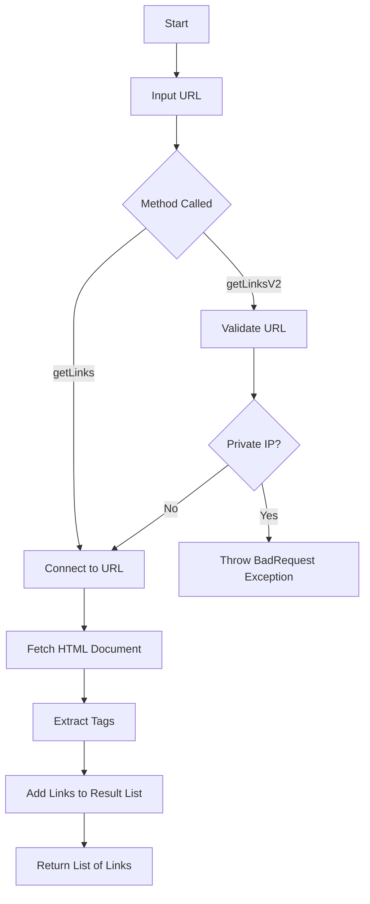
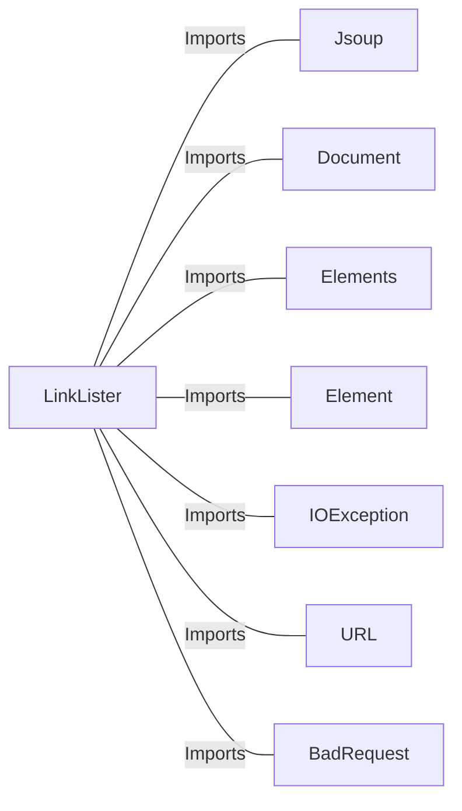

# LinkLister.java: Webpage Link Extractor with IP Validation

## Overview

The `LinkLister` class provides functionality to extract all hyperlinks (`<a>` tags) from a given webpage URL. It includes two methods:
1. `getLinks`: Extracts all hyperlinks from a webpage.
2. `getLinksV2`: Adds validation to prevent the use of private IP addresses in the URL before extracting hyperlinks.

## Process Flow

## Insights

- **Private IP Validation**: The `getLinksV2` method ensures that URLs pointing to private IP ranges (e.g., `172.*`, `192.168.*`, `10.*`) are rejected to prevent potential misuse or security risks.
- **HTML Parsing**: The class uses the `Jsoup` library to parse HTML and extract hyperlinks.
- **Error Handling**: The `getLinksV2` method wraps exceptions in a custom `BadRequest` exception for better error reporting.
- **Absolute URLs**: Extracted links are converted to absolute URLs using `link.absUrl("href")`.

## Dependencies

- `Jsoup`: Used for HTML parsing and hyperlink extraction.
- `Document`: Represents the HTML document fetched from the URL.
- `Elements`: Represents a collection of HTML elements (e.g., `<a>` tags).
- `Element`: Represents a single HTML element.
- `IOException`: Handles input/output exceptions during URL connection.
- `URL`: Used for URL validation and parsing.
- `BadRequest`: Custom exception for handling invalid requests.

## Vulnerabilities

1. **Unvalidated URL Input**:
   - The `getLinks` method directly connects to the provided URL without any validation, which could lead to security risks such as Server-Side Request Forgery (SSRF).

2. **Private IP Validation Bypass**:
   - The `getLinksV2` method only checks for private IP ranges in the hostname. It does not account for:
     - DNS rebinding attacks.
     - URLs that resolve to private IPs after DNS resolution.

3. **Potential Denial of Service (DoS)**:
   - The `Jsoup.connect(url).get()` call could be exploited to connect to slow or malicious servers, potentially causing resource exhaustion.

4. **Lack of HTTPS Enforcement**:
   - The methods do not enforce HTTPS, which could lead to insecure connections and potential man-in-the-middle (MITM) attacks.

5. **Error Disclosure**:
   - The `getLinksV2` method exposes exception messages via `BadRequest`, which could leak sensitive information about the system.

## Data Manipulation (SQL)

No SQL or database-related operations are present in this code.
