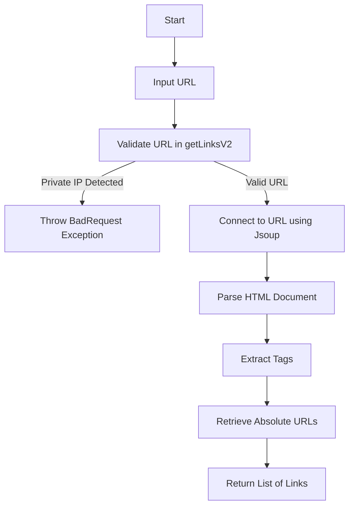
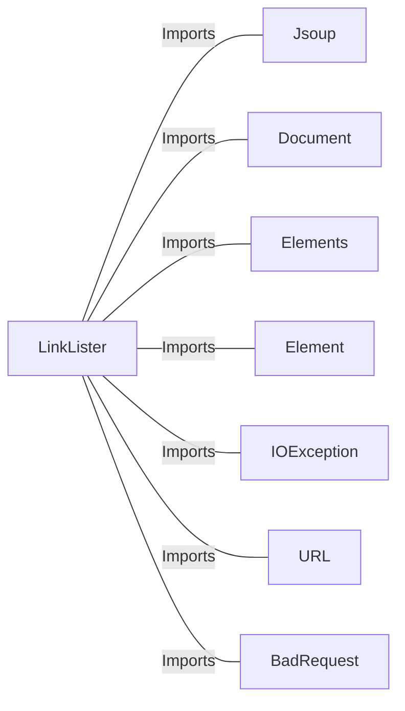

# LinkLister.java: Webpage Link Extractor with IP Validation

## Overview

The `LinkLister` class provides functionality to extract all hyperlinks (`<a>` tags) from a given webpage URL. It includes two methods: one for general link extraction and another with additional validation to prevent the use of private IP addresses.

## Process Flow

## Insights

- **HTML Parsing**: The class uses the `Jsoup` library to parse HTML documents and extract `<a>` tags.
- **Private IP Validation**: The `getLinksV2` method ensures that URLs pointing to private IP ranges (e.g., `172.x.x.x`, `192.168.x.x`, `10.x.x.x`) are rejected to prevent potential misuse.
- **Error Handling**: The `getLinksV2` method wraps exceptions in a custom `BadRequest` exception for better error reporting.
- **Absolute URLs**: The `absUrl` method ensures that extracted links are returned as absolute URLs.

## Dependencies

- `Jsoup`: Used for connecting to the URL and parsing the HTML document.
- `Document`: Represents the parsed HTML document.
- `Elements`: Represents a collection of HTML elements (e.g., `<a>` tags).
- `Element`: Represents a single HTML element.
- `IOException`: Handles input/output exceptions during URL connection.
- `URL`: Used for parsing and validating the URL.
- `BadRequest`: Custom exception class for handling invalid requests.

## Vulnerabilities

1. **Open Redirects**:
   - The `getLinks` method does not validate the URLs it extracts. This could lead to open redirect vulnerabilities if the extracted links are used without further validation.

2. **Server-Side Request Forgery (SSRF)**:
   - The `getLinks` method directly connects to the provided URL without restrictions. This could allow attackers to exploit SSRF vulnerabilities by providing malicious URLs.
   - Although `getLinksV2` adds private IP validation, it does not account for other potentially dangerous IP ranges (e.g., `localhost`, `127.0.0.1`, or IPv6 loopback).

3. **Unvalidated Input**:
   - The `url` parameter is not sanitized or validated beyond the private IP check in `getLinksV2`. This could lead to unexpected behavior or vulnerabilities.

4. **Error Disclosure**:
   - The `getLinksV2` method exposes exception messages via the `BadRequest` exception. This could leak sensitive information about the application's internal workings.

## Data Manipulation (SQL)

No SQL operations or database interactions are present in this code.
