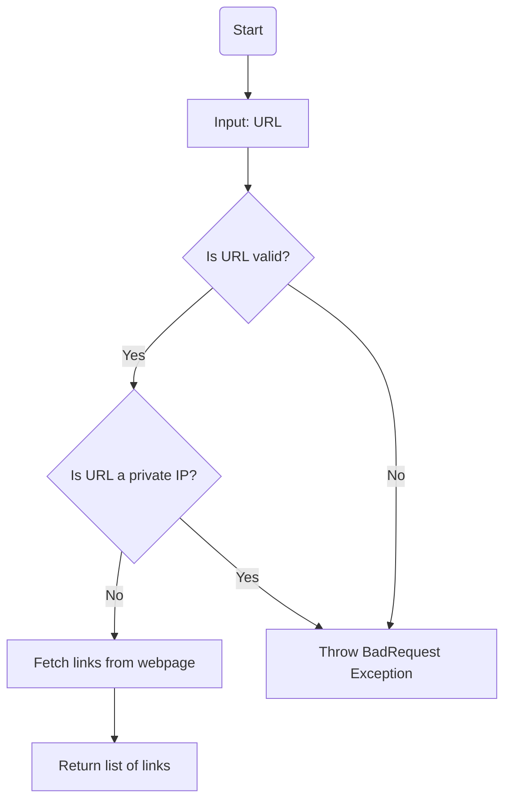
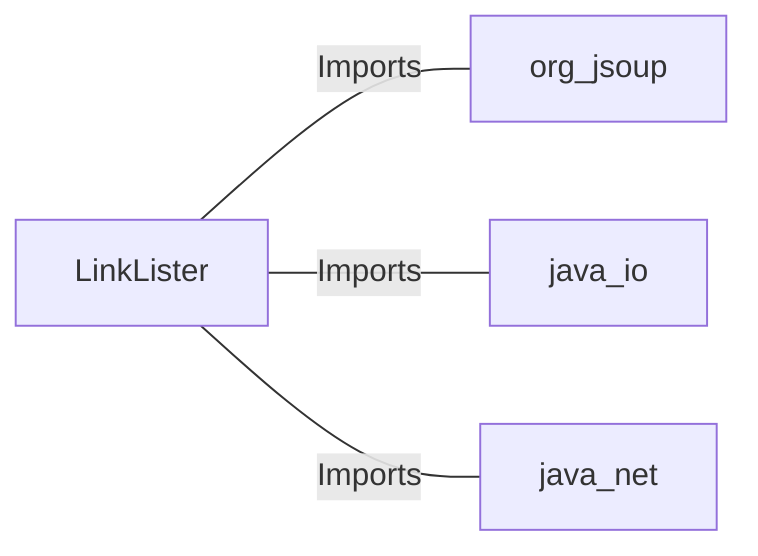

# LinkLister.java: Web Link Extraction Utility

## Overview
The `LinkLister` class is designed to extract hyperlinks from a given webpage URL. It provides two methods for link extraction:
1. `getLinks`: Extracts all hyperlinks from the provided URL.
2. `getLinksV2`: Adds validation to ensure the URL does not point to a private IP address before extracting links.

## Process Flow

```mermaid
flowchart TD
    Start("Start")
    InputURL["Input: URL"]
    ValidateURL{"Is URL valid?"}
    CheckPrivateIP{"Is URL a private IP?"}
    FetchLinks["Fetch links from webpage"]
    ReturnLinks["Return list of links"]
    ErrorHandling["Throw BadRequest Exception"]

    Start --> InputURL
    InputURL --> ValidateURL
    ValidateURL --> |"Yes"| CheckPrivateIP
    ValidateURL --> |"No"| ErrorHandling
    CheckPrivateIP --> |"Yes"| ErrorHandling
    CheckPrivateIP --> |"No"| FetchLinks
    FetchLinks --> ReturnLinks
```

## Insights
- **HTML Parsing**: The class uses the `Jsoup` library to parse HTML and extract hyperlinks.
- **Private IP Validation**: `getLinksV2` ensures that the URL does not point to private IP ranges (`172.*`, `192.168.*`, `10.*`) for security reasons.
- **Exception Handling**: `getLinksV2` throws a custom `BadRequest` exception for invalid URLs or private IPs.
- **Potential Vulnerabilities**:
  - **Unvalidated Input**: The `getLinks` method does not validate the URL, which could lead to security risks such as SSRF (Server-Side Request Forgery).
  - **Private IP Check**: The private IP validation in `getLinksV2` is limited to specific ranges and may not cover all private or reserved IP ranges (e.g., `127.0.0.1`, `0.0.0.0`, or other reserved blocks).
  - **Error Disclosure**: The exception message in `getLinksV2` directly exposes the underlying error, which could reveal sensitive information.

## Dependencies

```mermaid
flowchart LR
    LinkLister --- |"Imports"| org_jsoup
    LinkLister --- |"Imports"| java_io
    LinkLister --- |"Imports"| java_net
```

- `org.jsoup`: Used for HTML parsing and link extraction.
- `java.io`: Handles input/output operations, such as exceptions.
- `java.net`: Provides utilities for URL validation and manipulation.

## Vulnerabilities
1. **SSRF (Server-Side Request Forgery)**:
   - The `getLinks` method directly connects to the provided URL without validation, making it susceptible to SSRF attacks.
   - Attackers could exploit this to access internal services or sensitive data.

2. **Incomplete Private IP Validation**:
   - The private IP check in `getLinksV2` does not cover all reserved IP ranges (e.g., `127.0.0.1`, `0.0.0.0`, `169.254.*`, etc.).
   - This could allow bypassing the validation and accessing restricted resources.

3. **Error Disclosure**:
   - The exception handling in `getLinksV2` exposes the underlying error message, which could leak sensitive information about the system or the URL being processed.

## Recommendations
- **Input Validation**: Implement stricter validation for URLs in both methods to prevent SSRF and other attacks.
- **Comprehensive IP Validation**: Extend the private IP check to cover all reserved IP ranges.
- **Error Handling**: Avoid exposing raw exception messages; use generic error messages instead.
- **Timeouts and Limits**: Set connection timeouts and limits for the `Jsoup.connect` method to prevent resource exhaustion.
