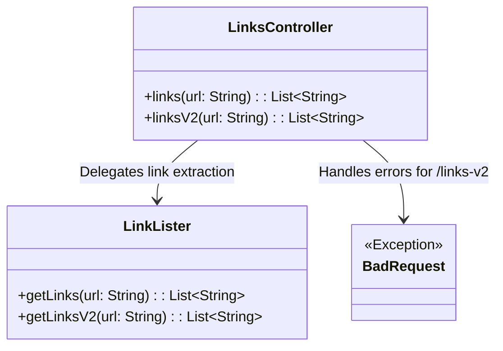
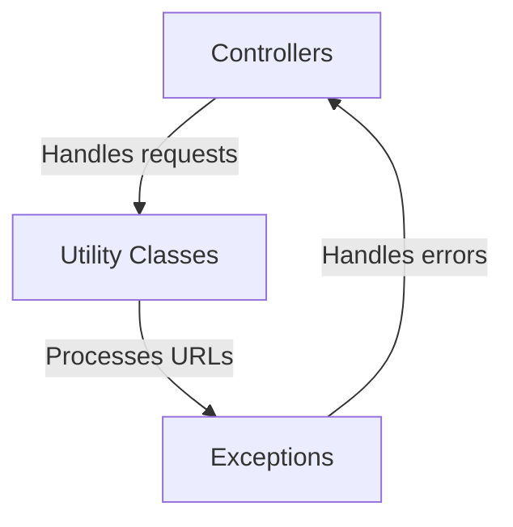
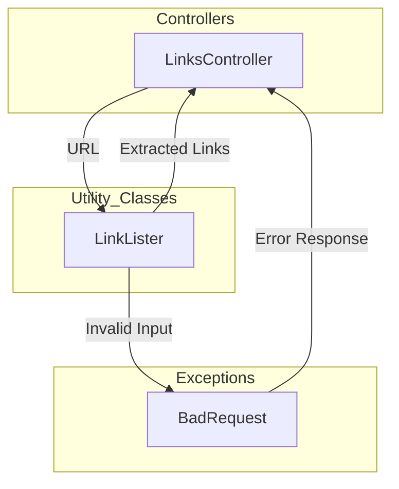
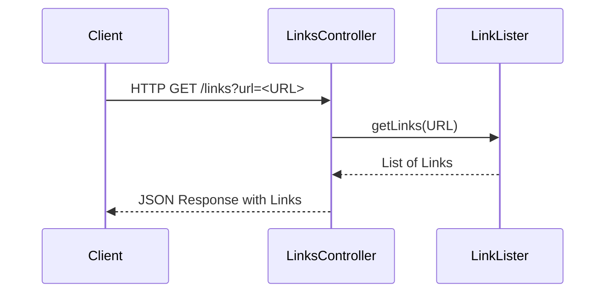
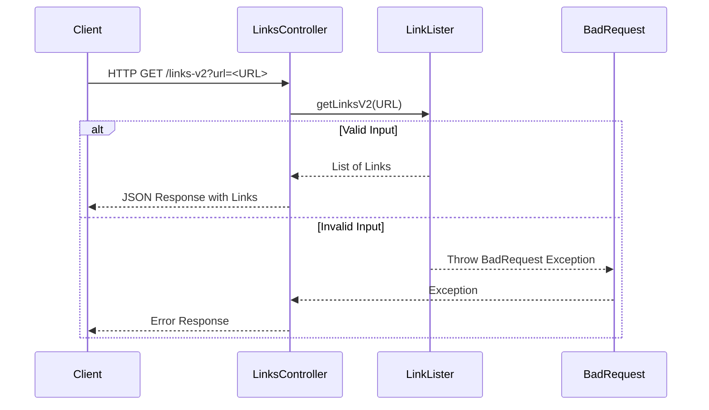

# High-Level Architecture Overview of LinksController and Related Components

The provided context revolves around the `LinksController` class, which serves as a REST API controller for handling HTTP requests related to extracting links from a given URL. This controller leverages external utility methods to perform its core functionality, delegating the actual link extraction logic to the `LinkLister` class. The architecture is designed to provide two endpoints (`/links` and `/links-v2`) for link extraction, with the second endpoint introducing enhanced error handling via a custom exception (`BadRequest`).

The system is structured to handle user input, process URLs, and return extracted links in JSON format. The `LinksController` acts as the entry point for client interactions, while the `LinkLister` encapsulates the business logic for link extraction. This separation of concerns ensures modularity and maintainability.

## Key Components

### Controllers
- **LinksController**: *Handles HTTP requests for link extraction. It provides two endpoints (`/links` and `/links-v2`) for extracting links from a given URL. The controller delegates the actual link extraction logic to the `LinkLister` class.*

### Utility Classes
- **LinkLister**: *Encapsulates the business logic for extracting links from a given URL. It provides methods (`getLinks` and `getLinksV2`) that are invoked by the `LinksController`. The `getLinksV2` method introduces enhanced error handling.*

### Exceptions
- **BadRequest**: *Represents a custom exception used for error handling in the `/links-v2` endpoint. It is thrown when invalid input is provided to the `getLinksV2` method.*

## Component Relationships

### Summary of Relationships
- The `LinksController` serves as the entry point for client requests and delegates the link extraction logic to the `LinkLister` class.
- The `LinkLister` provides the core functionality for extracting links from URLs.
- The `BadRequest` exception is used to handle invalid input scenarios in the `/links-v2` endpoint, ensuring robust error handling.
## Component Relationships

### Context Diagram

### Explanation of the Flowchart

- **Controllers**: The `LinksController` is responsible for handling HTTP requests from clients. It acts as the entry point for the system, providing endpoints for link extraction (`/links` and `/links-v2`).
  
- **Utility Classes**: The `LinkLister` is the utility class that processes URLs and extracts links. It encapsulates the business logic for link extraction, ensuring modularity and separation of concerns. The `LinksController` delegates the link extraction task to this component.

- **Exceptions**: The `BadRequest` exception is used to handle errors when invalid input is provided to the `/links-v2` endpoint. This ensures robust error handling and provides meaningful feedback to the client. The exception is triggered by the `LinkLister` and handled by the `LinksController`.
### Detailed Vision

### Explanation of the Flowchart

- **LinksController**:
  - Acts as the entry point for client requests. It receives a URL as input from the client and delegates the link extraction task to the `LinkLister`.
  - It interacts with the `LinkLister` by passing the URL for processing and receives the extracted links as a response.
  - In the `/links-v2` endpoint, it handles errors by catching the `BadRequest` exception and returning an appropriate error response to the client.

- **LinkLister**:
  - Encapsulates the business logic for extracting links from a given URL. It processes the URL received from the `LinksController` and returns a list of extracted links.
  - In the `/links-v2` endpoint, it validates the input URL and throws a `BadRequest` exception if the input is invalid.

- **BadRequest**:
  - Represents a custom exception used for error handling in the `/links-v2` endpoint. It is triggered by the `LinkLister` when invalid input is detected.
  - The exception is caught by the `LinksController`, which then returns an error response to the client, ensuring robust error handling and meaningful feedback.
## Integration Scenarios

### Link Extraction via `/links` Endpoint

This scenario describes the process of extracting links from a given URL using the `/links` endpoint. The flow begins with a client sending a request to the `LinksController`, which delegates the link extraction task to the `LinkLister`. The `LinkLister` processes the URL and returns the extracted links back to the `LinksController`, which then sends the response to the client.

#### Explanation
- **Client**: Initiates the process by sending an HTTP GET request to the `/links` endpoint with a URL as a query parameter.
- **LinksController**: Receives the request and delegates the link extraction task to the `LinkLister` by calling its `getLinks` method.
- **LinkLister**: Processes the URL, extracts the links, and returns a list of links to the `LinksController`.
- **LinksController**: Sends the extracted links back to the client in JSON format as the response.

---

### Enhanced Link Extraction via `/links-v2` Endpoint with Error Handling

This scenario describes the enhanced link extraction process using the `/links-v2` endpoint. The flow begins with a client sending a request to the `LinksController`, which delegates the task to the `LinkLister`. The `LinkLister` validates the input URL and either extracts links or throws a `BadRequest` exception if the input is invalid. The `LinksController` handles the exception and sends an appropriate error response to the client.

#### Explanation
- **Client**: Initiates the process by sending an HTTP GET request to the `/links-v2` endpoint with a URL as a query parameter.
- **LinksController**: Receives the request and delegates the link extraction task to the `LinkLister` by calling its `getLinksV2` method.
- **LinkLister**:
  - Validates the input URL.
  - If the input is valid, it extracts the links and returns a list of links to the `LinksController`.
  - If the input is invalid, it throws a `BadRequest` exception.
- **BadRequest**: Represents the exception thrown by the `LinkLister` when invalid input is detected.
- **LinksController**:
  - Handles the exception by catching the `BadRequest` and sending an appropriate error response to the client.
  - If no exception occurs, it sends the extracted links back to the client in JSON format.
