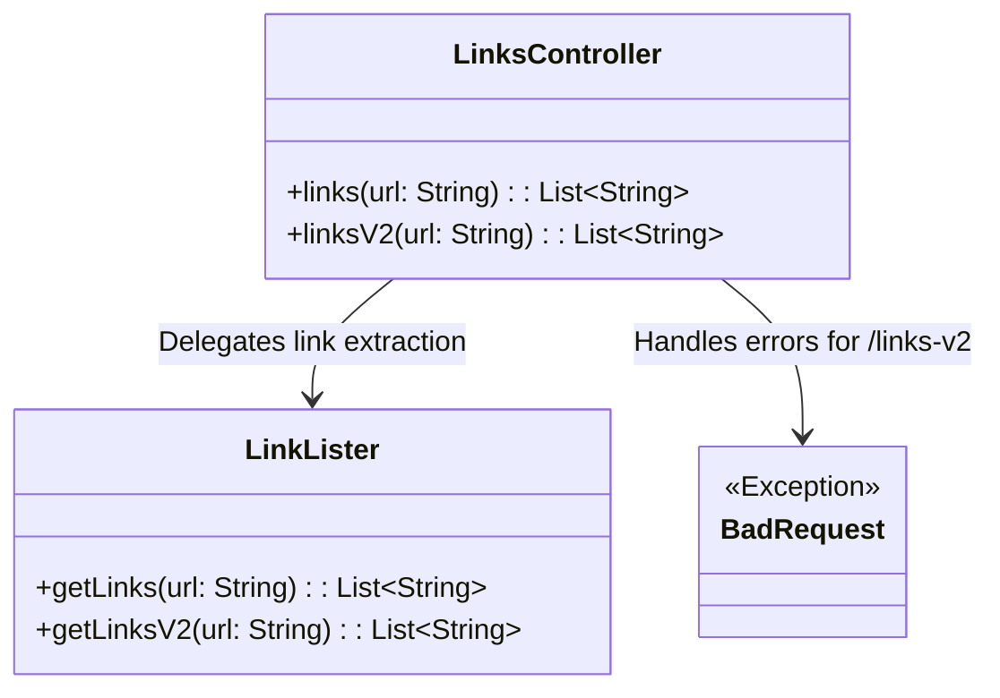
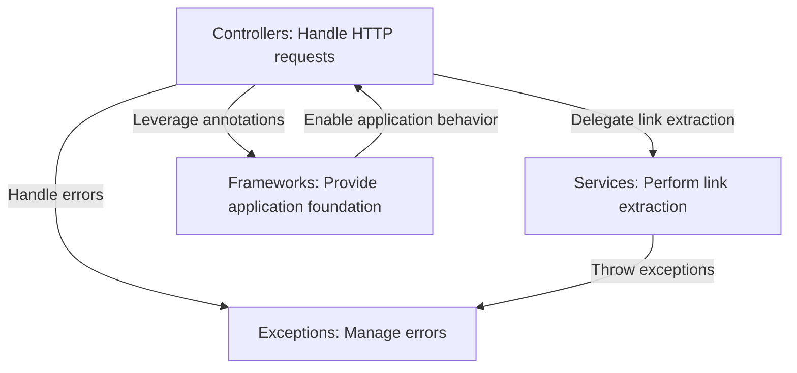
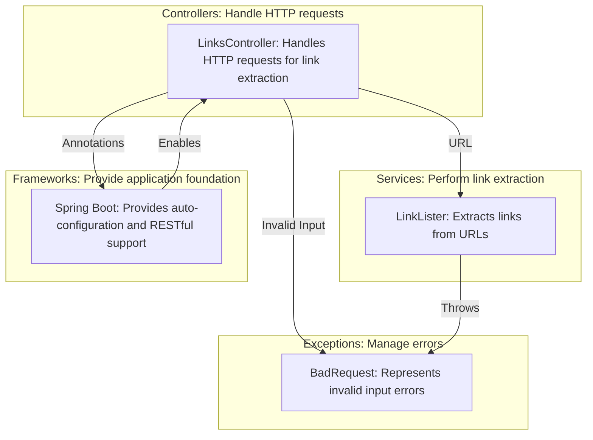
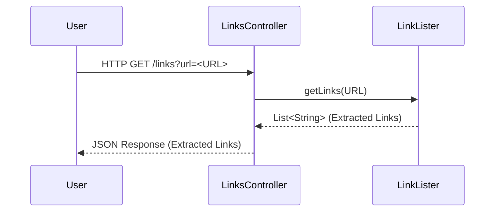
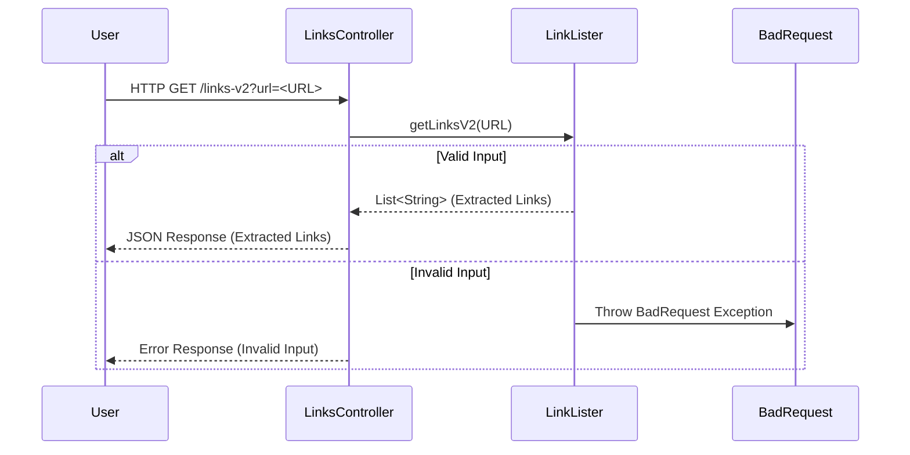

# High-Level Architecture Overview: LinksController and Related Components

The provided code snippet and context describe a `LinksController` class, which is part of a Spring Boot application. This controller is responsible for handling HTTP requests related to extracting links from a given URL. It interacts with other components, such as `LinkLister`, to perform its operations. The architecture revolves around enabling efficient and secure link extraction while adhering to RESTful principles.

## Key Components

### Controllers
- **LinksController**: *Handles HTTP requests for extracting links from a given URL. It provides two endpoints (`/links` and `/links-v2`) for link extraction, leveraging the `LinkLister` component for the actual processing. The controller ensures proper request handling and response formatting.*

### Services
- **LinkLister**: *Responsible for the core functionality of extracting links from a given URL. It provides methods (`getLinks` and `getLinksV2`) to perform link extraction, with `getLinksV2` potentially offering enhanced functionality or stricter validation compared to `getLinks`. This component encapsulates the business logic for link extraction.*

### Exceptions
- **BadRequest**: *Represents a custom exception that is thrown when invalid input is provided to the `/links-v2` endpoint. This ensures robust error handling and communicates issues effectively to the client.*

### Frameworks and Annotations
- **Spring Boot Framework**: *Provides the foundation for building the application, including dependency injection, auto-configuration, and RESTful web services.*
- **Annotations**: *Annotations like `@RestController`, `@EnableAutoConfiguration`, and `@RequestMapping` are used to define the controller behavior and configure the application.*

## Component Relationships

The `LinksController` acts as the entry point for HTTP requests. It delegates the link extraction logic to the `LinkLister` component, which encapsulates the business logic. The `BadRequest` exception is used to handle errors gracefully for the `/links-v2` endpoint. The overall architecture is designed to separate concerns, with the controller focusing on request handling and the service focusing on business logic.

## Component Relationships

### Context Diagram

### Explanation of the Flowchart
- **Controllers → Services**: The `LinksController` delegates the core link extraction logic to the `LinkLister` service, ensuring separation of concerns between request handling and business logic.
- **Controllers → Exceptions**: The `LinksController` uses the `BadRequest` exception to handle invalid input for the `/links-v2` endpoint, ensuring robust error management.
- **Controllers → Frameworks**: The `LinksController` leverages Spring Boot annotations (e.g., `@RestController`, `@RequestMapping`) to define its behavior and integrate seamlessly into the application.
- **Services → Exceptions**: The `LinkLister` service may throw exceptions like `BadRequest` when encountering invalid input, ensuring proper error propagation.
- **Frameworks → Controllers**: The Spring Boot framework provides the foundation for the `LinksController`, enabling features like auto-configuration and dependency injection.
### Detailed Vision

### Explanation of the Flowchart
- **LinksController → LinkLister**: The `LinksController` passes the URL received from the HTTP request to the `LinkLister` component, which performs the actual link extraction. This delegation ensures that the controller focuses on request handling while the service encapsulates the business logic.
- **LinksController → BadRequest**: When invalid input is detected for the `/links-v2` endpoint, the `LinksController` uses the `BadRequest` exception to signal the error, ensuring proper error handling and communication to the client.
- **LinksController → SpringBoot**: The `LinksController` leverages Spring Boot annotations (e.g., `@RestController`, `@RequestMapping`) to define its behavior and integrate seamlessly into the application framework.
- **LinkLister → BadRequest**: The `LinkLister` service may throw the `BadRequest` exception when encountering invalid input during link extraction, ensuring that errors are propagated correctly.
- **SpringBoot → LinksController**: The Spring Boot framework provides the foundation for the `LinksController`, enabling features like auto-configuration, dependency injection, and RESTful web service support.
## Integration Scenarios

### Link Extraction via `/links` Endpoint
This scenario describes the process of extracting links from a given URL using the `/links` endpoint. The flow begins with a user making an HTTP request to the `LinksController`, which delegates the link extraction logic to the `LinkLister` component. The extracted links are then returned to the user as a JSON response.

#### Explanation
- **User → LinksController**: The process starts with the user making an HTTP GET request to the `/links` endpoint, providing a URL as a query parameter.
- **LinksController → LinkLister**: The `LinksController` receives the request and delegates the link extraction logic to the `LinkLister` component by calling its `getLinks` method with the provided URL.
- **LinkLister → LinksController**: The `LinkLister` processes the URL, extracts the links, and returns a list of strings containing the extracted links to the `LinksController`.
- **LinksController → User**: The `LinksController` formats the extracted links into a JSON response and sends it back to the user.

---

### Enhanced Link Extraction via `/links-v2` Endpoint
This scenario describes the enhanced link extraction process using the `/links-v2` endpoint. The flow begins with a user making an HTTP request to the `LinksController`, which delegates the enhanced link extraction logic to the `LinkLister`. If invalid input is detected, a `BadRequest` exception is thrown, and an error response is returned to the user.

#### Explanation
- **User → LinksController**: The process starts with the user making an HTTP GET request to the `/links-v2` endpoint, providing a URL as a query parameter.
- **LinksController → LinkLister**: The `LinksController` receives the request and delegates the enhanced link extraction logic to the `LinkLister` component by calling its `getLinksV2` method with the provided URL.
- **Valid Input Path**:
  - **LinkLister → LinksController**: If the input is valid, the `LinkLister` processes the URL, extracts the links, and returns a list of strings containing the extracted links to the `LinksController`.
  - **LinksController → User**: The `LinksController` formats the extracted links into a JSON response and sends it back to the user.
- **Invalid Input Path**:
  - **LinkLister → BadRequest**: If the input is invalid, the `LinkLister` throws a `BadRequest` exception to signal the error.
  - **LinksController → User**: The `LinksController` catches the exception and sends an error response to the user, indicating the invalid input.
