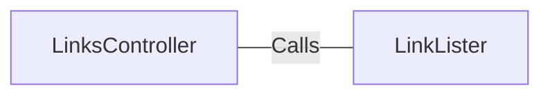

# LinksController.java: REST Controller for Link Extraction

## Overview

This file defines a REST controller for handling HTTP requests related to extracting links from a given URL. It provides two endpoints (`/links` and `/links-v2`) that process a URL parameter and return a list of links extracted from the provided URL.

## Process Flow

```mermaid
graph TD
    A[Start] --> B[Receive HTTP Request]
    B --> C{Endpoint?}
    C -->|/links| D[Call LinkLister.getLinks(url)]
    C -->|/links-v2| E[Call LinkLister.getLinksV2(url)]
    D --> F[Return List of Links]
    E --> F[Return List of Links]
    F --> G[End]
```

## Insights

- The controller defines two endpoints:
  - `/links`: Uses the `LinkLister.getLinks` method to extract links.
  - `/links-v2`: Uses the `LinkLister.getLinksV2` method to extract links.
- The `/links-v2` endpoint throws a custom `BadRequest` exception, indicating additional validation or error handling in `getLinksV2`.
- The `@RequestParam` annotation is used to capture the `url` parameter from the HTTP request.
- The `produces = "application/json"` ensures that the response is returned in JSON format.

## Dependencies



- `LinkLister`: Provides the methods `getLinks` and `getLinksV2` for extracting links from a given URL.

### External References

- `LinkLister`: 
  - `getLinks(url)`: Processes the provided URL and returns a list of links. Nature: Calls.
  - `getLinksV2(url)`: Processes the provided URL with additional validation or logic and returns a list of links. Nature: Calls.

## Vulnerabilities

- **Potential Security Risk**: The `url` parameter is directly passed to the `LinkLister` methods without any validation or sanitization. This could lead to:
  - **Server-Side Request Forgery (SSRF)**: If the `url` parameter is not validated, an attacker could use this endpoint to make requests to internal or external systems.
  - **Denial of Service (DoS)**: If the `url` points to a resource that takes a long time to respond or consumes significant resources, it could lead to service disruption.
- **Error Handling**: The `/links` endpoint does not handle exceptions explicitly, which could expose stack traces or sensitive information in the response.
- **Custom Exception Usage**: The `/links-v2` endpoint uses a `BadRequest` exception, but its implementation is not provided. If not properly implemented, it could lead to inconsistent error handling.

## Recommendations

- Validate and sanitize the `url` parameter to prevent SSRF and other injection attacks.
- Implement proper exception handling for the `/links` endpoint to avoid exposing sensitive information.
- Ensure the `BadRequest` exception is well-defined and consistently used.
- Consider rate-limiting or other mechanisms to prevent abuse of the endpoints.
