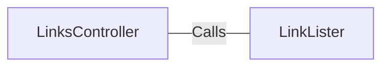

# LinksController.java: REST Controller for Link Extraction

## Overview

This file defines a REST controller for handling HTTP requests related to extracting links from a given URL. It provides two endpoints (`/links` and `/links-v2`) that process a URL parameter and return a list of links extracted from the provided URL.

## Process Flow

```mermaid
graph TD
    A[Start] --> B[Receive HTTP Request]
    B --> C{Endpoint?}
    C -->|/links| D[Call LinkLister.getLinks(url)]
    C -->|/links-v2| E[Call LinkLister.getLinksV2(url)]
    D --> F[Return List of Links]
    E --> F[Return List of Links]
    F --> G[End]
```

## Insights

- The controller defines two endpoints:
  - `/links`: Calls `LinkLister.getLinks(url)` to extract links.
  - `/links-v2`: Calls `LinkLister.getLinksV2(url)` to extract links.
- Both endpoints expect a `url` parameter as input.
- The `/links-v2` endpoint throws a custom `BadRequest` exception, while `/links` throws an `IOException`.
- The `LinkLister` class is a dependency that performs the actual link extraction logic.

## Dependencies



- `LinkLister`: Provides the methods `getLinks(url)` and `getLinksV2(url)` for extracting links from the given URL.

## Vulnerabilities

- **Potential for URL Injection**: The `url` parameter is directly passed to the `LinkLister` methods without validation or sanitization. This could lead to security vulnerabilities such as SSRF (Server-Side Request Forgery) if the `LinkLister` implementation does not handle malicious URLs properly.
- **Error Handling**: The `/links` endpoint throws a generic `IOException`, which may expose internal details of the application if not handled properly.
- **Lack of Input Validation**: There is no validation of the `url` parameter to ensure it is a valid and safe URL.
- **Custom Exception Usage**: The `/links-v2` endpoint uses a custom `BadRequest` exception, but its implementation is not provided. If not properly implemented, it could lead to inconsistent error handling.

## Data Manipulation (SQL)

No SQL data manipulation is detected in this code.
