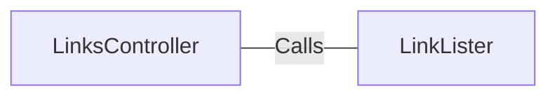

# LinksController.java: REST Controller for Link Extraction

## Overview

This file defines a REST controller for handling HTTP requests related to extracting links from a given URL. It provides two endpoints (`/links` and `/links-v2`) that process a URL parameter and return a list of links extracted from the provided URL.

## Process Flow

```mermaid
graph TD
    A[Start] --> B[Receive HTTP Request]
    B --> C{Endpoint?}
    C -->|/links| D[Call LinkLister.getLinks(url)]
    C -->|/links-v2| E[Call LinkLister.getLinksV2(url)]
    D --> F[Return List of Links]
    E --> F[Return List of Links]
    F --> G[End]
```

## Insights

- The controller defines two endpoints:
  - `/links`: Calls `LinkLister.getLinks(url)` to extract links.
  - `/links-v2`: Calls `LinkLister.getLinksV2(url)` to extract links.
- The `/links-v2` endpoint throws a custom `BadRequest` exception, indicating additional validation or error handling in `LinkLister.getLinksV2(url)`.
- The `@RequestParam` annotation ensures that the `url` parameter is mandatory for both endpoints.
- The `produces = "application/json"` ensures that the response is returned in JSON format.

## Dependencies



- `LinkLister`: Provides the methods `getLinks(url)` and `getLinksV2(url)` for extracting links from the given URL.

## Vulnerabilities

- **Potential for Unvalidated Input**: The `url` parameter is directly passed to the `LinkLister` methods without any validation or sanitization. This could lead to security vulnerabilities such as:
  - **Server-Side Request Forgery (SSRF)**: If the `url` parameter is not validated, an attacker could use this endpoint to make requests to internal or unauthorized resources.
  - **Denial of Service (DoS)**: Maliciously crafted URLs could cause the `LinkLister` methods to consume excessive resources.
- **Exception Handling**: The `/links` endpoint does not handle exceptions explicitly, which could result in exposing stack traces or sensitive information in the response.
- **Error Propagation**: The `/links-v2` endpoint throws a `BadRequest` exception, but the implementation of this exception is not shown. If not properly handled, it could lead to inconsistent error responses.

## Data Manipulation (SQL)

No SQL operations or database interactions are present in this code.
