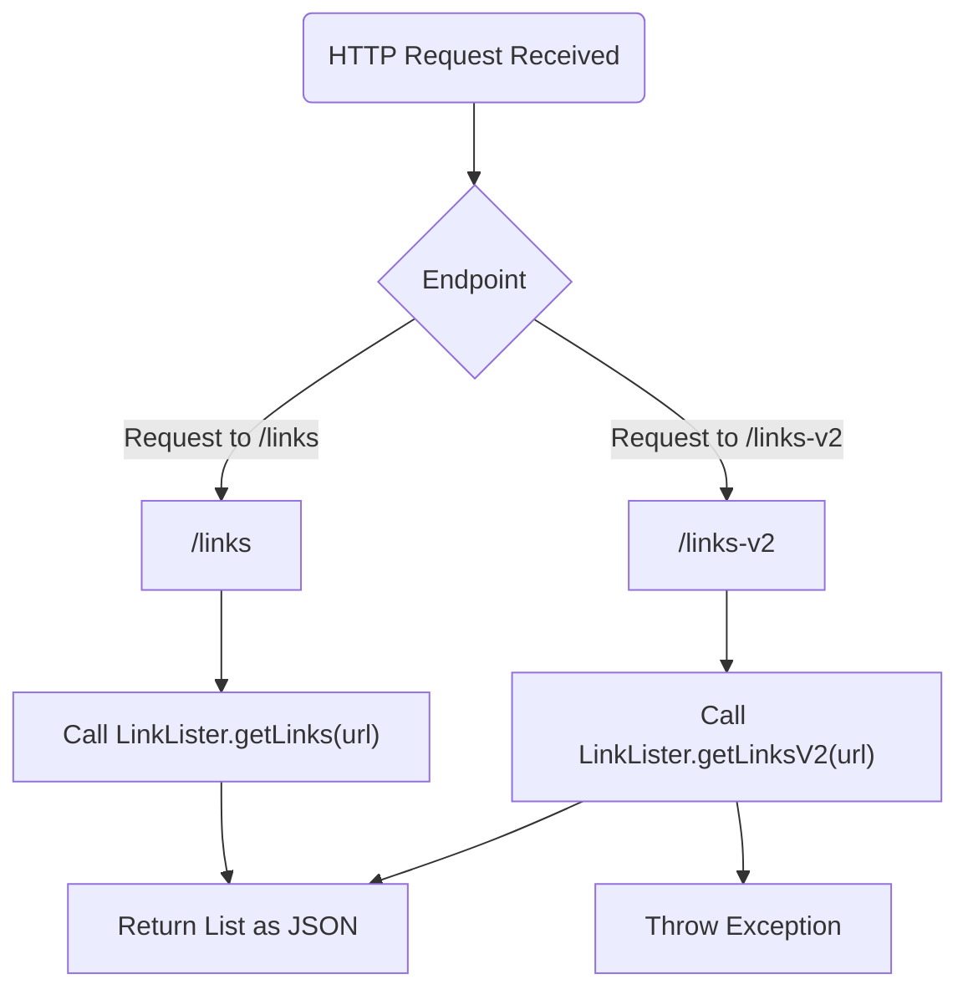
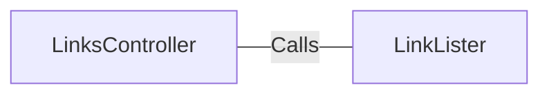

# LinksController.java: REST API for Extracting Links from URLs

## Overview
The `LinksController` class is a REST API controller designed to handle HTTP requests for extracting links from a given URL. It provides two endpoints (`/links` and `/links-v2`) that process URLs and return a list of links in JSON format. The class leverages the `LinkLister` utility for the actual link extraction logic.

## Process Flow

```mermaid
flowchart TD
    Start("HTTP Request Received")
    Decision{"Endpoint"}
    LinksEndpoint["/links"]
    LinksV2Endpoint["/links-v2"]
    ExtractLinks["Call LinkLister.getLinks(url)"]
    ExtractLinksV2["Call LinkLister.getLinksV2(url)"]
    Response["Return List<String> as JSON"]
    Error["Throw Exception"]

    Start --> Decision
    Decision --> |"Request to /links"| LinksEndpoint
    Decision --> |"Request to /links-v2"| LinksV2Endpoint
    LinksEndpoint --> ExtractLinks
    LinksV2Endpoint --> ExtractLinksV2
    ExtractLinks --> Response
    ExtractLinksV2 --> Response
    ExtractLinksV2 --> Error
```

## Insights
- The class is annotated with `@RestController` and `@EnableAutoConfiguration`, making it a Spring Boot REST controller with auto-configuration enabled.
- Two endpoints are defined:
  - `/links`: Calls `LinkLister.getLinks(url)` to extract links from the provided URL.
  - `/links-v2`: Calls `LinkLister.getLinksV2(url)` to extract links, but may throw a `BadRequest` exception.
- Both endpoints return a list of links in JSON format.
- The `LinkLister` class is assumed to contain the actual logic for extracting links from URLs.
- The `/links-v2` endpoint introduces error handling with a custom `BadRequest` exception.

## Dependencies

```mermaid
flowchart LR
    LinksController --- |"Calls"| LinkLister
```

- `LinkLister`: Provides methods `getLinks(url)` and `getLinksV2(url)` for extracting links from URLs.

## Vulnerabilities
- **Potential Security Risks with URL Input**:
  - The `url` parameter is directly passed to the `LinkLister` methods without validation or sanitization. This could lead to security vulnerabilities such as Server-Side Request Forgery (SSRF) or injection attacks.
  - It is recommended to validate and sanitize the `url` parameter to ensure it adheres to expected formats and does not contain malicious content.

- **Error Handling in `/links-v2`**:
  - The `BadRequest` exception is thrown but not explicitly handled within the controller. This could result in unstructured error responses to the client. Implementing a global exception handler or specific error handling for `BadRequest` is advised.

- **Lack of Authentication and Authorization**:
  - The endpoints are publicly accessible without any authentication or authorization checks. This could expose the service to unauthorized access. Adding security measures such as token-based authentication is recommended.

- **No Rate Limiting**:
  - The endpoints do not implement rate limiting, which could make the service vulnerable to abuse or denial-of-service (DoS) attacks. Consider adding rate limiting to prevent excessive requests.

## Data Manipulation (SQL) (Optional)
No SQL operations or database interactions are detected in the code.
