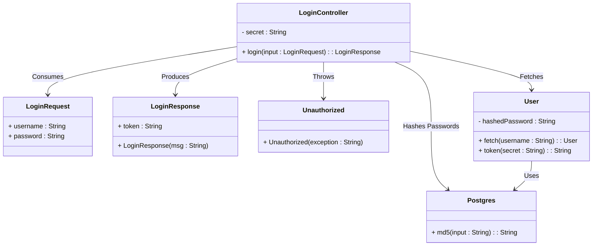
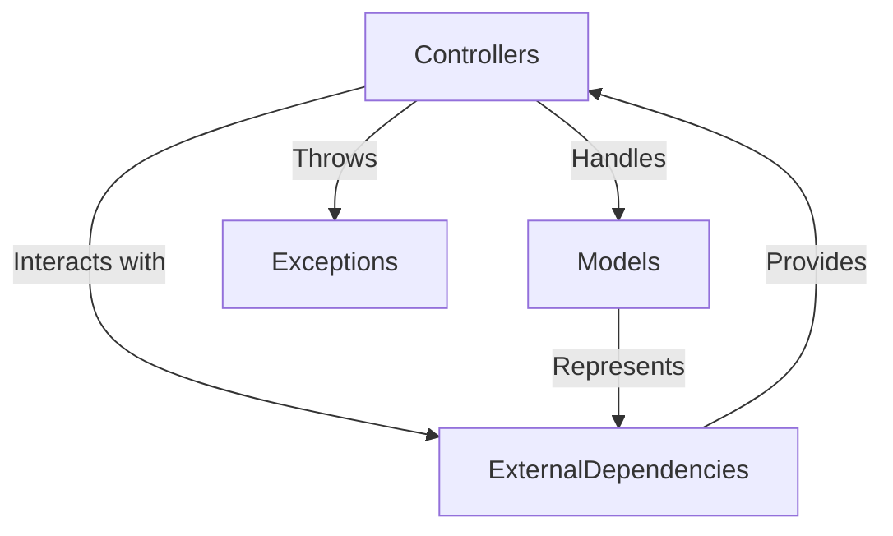
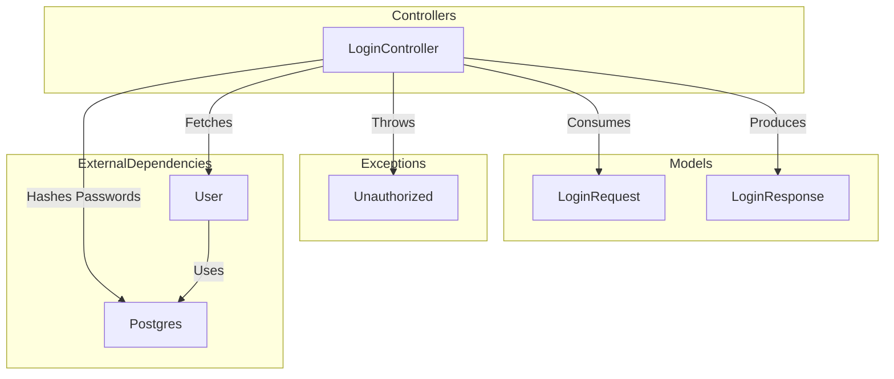
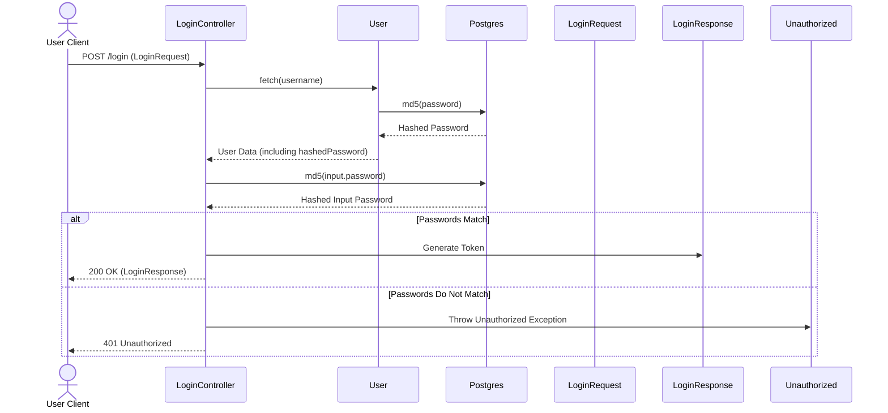

# Login System Architecture Overview

The provided code represents a login system implemented in Java using the Spring Boot framework. Its primary responsibility is to authenticate users based on their credentials and return a token for authorized access. The system leverages components such as `LoginController`, `LoginRequest`, `LoginResponse`, `Unauthorized`, and external dependencies like `Postgres` and `User`. This document provides a high-level architectural overview of the login system, focusing on its components, their responsibilities, and interactions.

## Key Components

### Controllers
- **LoginController**: *Handles user login requests by validating credentials and generating authentication tokens. It interacts with the `User` component to fetch user data and the `Postgres` component to hash passwords for comparison.*

### Models
- **LoginRequest**: *Represents the incoming login request payload containing the username and password. It is a simple data transfer object (DTO) used for deserialization of JSON input.*
- **LoginResponse**: *Represents the response payload containing the authentication token. It is a DTO used for serialization of JSON output.*

### Exceptions
- **Unauthorized**: *Represents an exception thrown when authentication fails. It maps to an HTTP 401 Unauthorized status code.*

### External Dependencies
- **User**: *Represents the user entity and provides methods to fetch user data and generate authentication tokens. It is a critical component for user management and token generation.*
- **Postgres**: *Provides utility methods for hashing passwords using MD5. It is used to validate user credentials securely.*

## Component Relationships

The following diagram illustrates the relationships and interactions between the components:

### Summary of Responsibilities
- **LoginController**: *Central component for handling login functionality. It validates user credentials, interacts with `User` and `Postgres`, and returns a token or throws an exception.*
- **LoginRequest**: *Encapsulates the input data for login operations.*
- **LoginResponse**: *Encapsulates the output data for successful login operations.*
- **Unauthorized**: *Handles authentication failure scenarios.*
- **User**: *Manages user data and token generation.*
- **Postgres**: *Provides password hashing functionality.*

This architecture ensures modularity, with clear separation of concerns between controllers, models, exceptions, and external dependencies. It leverages Spring Boot's features for RESTful API development and exception handling.
## Component Relationships

### Context Diagram

### Explanation of the Flowchart

- **Controllers → Models**: The `LoginController` handles user login requests by consuming the `LoginRequest` model (input payload) and producing the `LoginResponse` model (output payload). These models represent the data exchanged during the login process.

- **Controllers → Exceptions**: The `LoginController` throws the `Unauthorized` exception when authentication fails. This exception maps to an HTTP 401 status code, ensuring proper error handling and communication with the client.

- **Controllers → ExternalDependencies**: The `LoginController` interacts with external dependencies such as `User` and `Postgres`. It fetches user data from the `User` component and validates credentials using the `Postgres` component's password hashing functionality.

- **Models → ExternalDependencies**: The `LoginRequest` and `LoginResponse` models represent the data exchanged between the client and the server. These models indirectly interact with external dependencies, as the `User` component uses the `LoginRequest` data to fetch user information and generate tokens.

- **ExternalDependencies → Controllers**: External dependencies like `User` and `Postgres` provide essential functionality to the `LoginController`. The `User` component manages user data and token generation, while the `Postgres` component provides password hashing for secure authentication.
### Detailed Vision

### Explanation of the Flowchart

- **LoginController → LoginRequest**: The `LoginController` consumes the `LoginRequest` model, which contains the username and password provided by the client. This data is used to authenticate the user.

- **LoginController → LoginResponse**: Upon successful authentication, the `LoginController` produces a `LoginResponse` model containing the authentication token. This token is sent back to the client as part of the response.

- **LoginController → Unauthorized**: If the authentication process fails (e.g., the provided password does not match the stored hashed password), the `LoginController` throws an `Unauthorized` exception. This exception is mapped to an HTTP 401 status code, signaling an authentication failure to the client.

- **LoginController → User**: The `LoginController` fetches user data by interacting with the `User` component. The `User` component retrieves the user's stored information, including the hashed password, and provides methods to generate authentication tokens.

- **LoginController → Postgres**: The `LoginController` uses the `Postgres` component to hash the password provided in the `LoginRequest`. This hashed password is then compared with the stored hashed password retrieved from the `User` component.

- **User → Postgres**: The `User` component relies on the `Postgres` component to hash passwords securely. This ensures that password validation is performed in a secure and consistent manner.

This detailed vision provides a comprehensive view of how the components interact to fulfill the login system's responsibilities, ensuring secure and efficient user authentication.
## Integration Scenarios

### User Login Authentication Flow

This scenario describes the process of authenticating a user when they attempt to log in. It involves validating the user's credentials, generating an authentication token upon successful validation, and handling errors when authentication fails. The components involved in this scenario are `LoginController`, `LoginRequest`, `LoginResponse`, `Unauthorized`, `User`, and `Postgres`.

#### Sequence Diagram

#### Explanation of the Diagram

- **UserClient → LoginController**: The user initiates the login process by sending a POST request to the `/login` endpoint with a `LoginRequest` payload containing their username and password.

- **LoginController → User**: The `LoginController` fetches the user data associated with the provided username by interacting with the `User` component.

- **User → Postgres**: The `User` component uses the `Postgres` component to hash the password stored in the database for comparison purposes.

- **Postgres → User**: The `Postgres` component returns the hashed password to the `User` component.

- **User → LoginController**: The `User` component provides the user data, including the hashed password, back to the `LoginController`.

- **LoginController → Postgres**: The `LoginController` hashes the password provided in the `LoginRequest` using the `Postgres` component.

- **Postgres → LoginController**: The `Postgres` component returns the hashed input password to the `LoginController`.

- **Password Validation**:
  - **Match**: If the hashed input password matches the stored hashed password, the `LoginController` generates an authentication token using the `LoginResponse` component and sends a 200 OK response back to the user.
  - **Mismatch**: If the passwords do not match, the `LoginController` throws an `Unauthorized` exception, which results in a 401 Unauthorized response being sent back to the user.

This scenario highlights the collaboration between components to securely authenticate users, ensuring that sensitive data like passwords are handled securely using hashing techniques. It also demonstrates error handling for failed authentication attempts.
