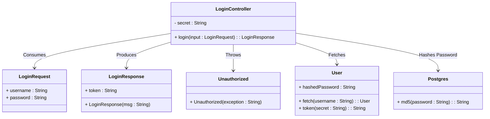
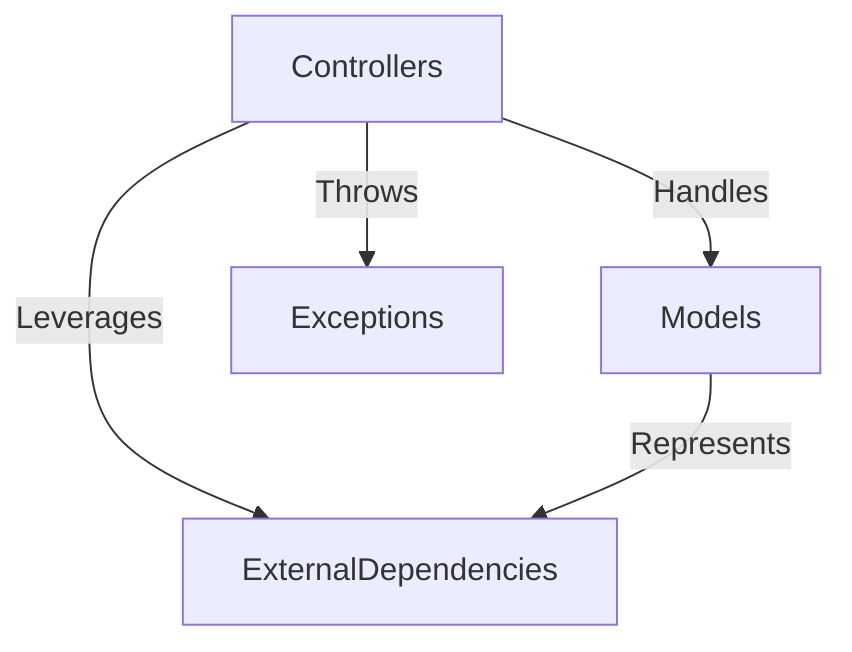
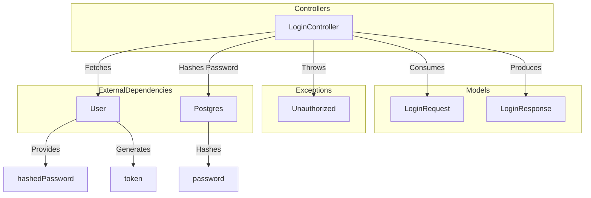
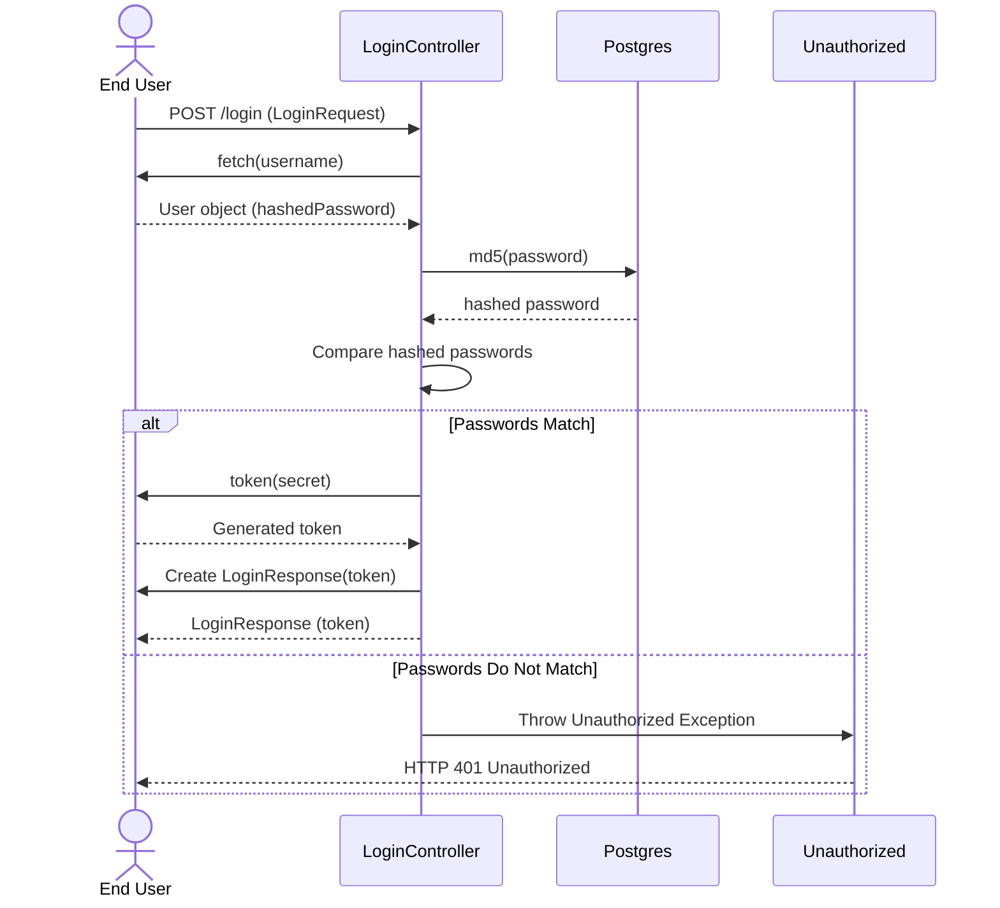

# Login System Architecture Overview

The provided code snippet represents a login system implemented in Java using the Spring Boot framework. The system is designed to handle user authentication by verifying credentials and generating tokens for authorized users. The architecture revolves around the `LoginController` and its supporting components, which interact to fulfill the authentication process. This document provides a high-level overview of the system's components, their responsibilities, and their interactions.

## Key Components

### Controllers
- **LoginController**: *Handles user login requests by verifying credentials and generating authentication tokens. It leverages the `User` and `Postgres` components for user data retrieval and password hashing, respectively.*

### Models
- **LoginRequest**: *Represents the incoming login request payload, containing the username and password provided by the user.*
- **LoginResponse**: *Represents the response payload for successful login attempts, containing the generated authentication token.*

### Exceptions
- **Unauthorized**: *Represents an exception thrown when user authentication fails due to invalid credentials. It maps to an HTTP 401 Unauthorized status.*

### External Dependencies
- **User**: *Responsible for fetching user data from the database. It is indirectly referenced in the `LoginController` for retrieving user information based on the provided username.*
- **Postgres**: *Handles password hashing using the MD5 algorithm. It is used in the `LoginController` to compare the hashed password with the stored hashed password.*

## Component Relationships

### Summary of Interactions
1. **LoginController** acts as the entry point for login requests. It consumes a `LoginRequest` object and produces a `LoginResponse` object upon successful authentication.
2. **User** is fetched using the username provided in the `LoginRequest`. It provides the hashed password and generates a token using the secret key.
3. **Postgres** hashes the password provided in the `LoginRequest` and compares it with the stored hashed password from the `User` object.
4. If authentication fails, an `Unauthorized` exception is thrown, resulting in an HTTP 401 response.

This architecture ensures a clear separation of concerns, with each component fulfilling a specific role in the authentication process. The use of Spring Boot annotations simplifies configuration and enables rapid development.
## Component Relationships

### Context Diagram

### Explanation of the Flowchart

- **Controllers → Models**: The `LoginController` handles user login requests by consuming the `LoginRequest` model, which represents the incoming payload, and producing the `LoginResponse` model, which represents the authentication result.

- **Controllers → Exceptions**: The `LoginController` throws the `Unauthorized` exception when authentication fails due to invalid credentials, ensuring proper error handling and mapping to an HTTP 401 status.

- **Controllers → ExternalDependencies**: The `LoginController` leverages external dependencies such as `User` and `Postgres` to fetch user data and hash passwords, respectively, enabling the authentication process.

- **Models → ExternalDependencies**: The `LoginRequest` and `LoginResponse` models indirectly interact with external dependencies. For example, the `LoginRequest` provides the username used by the `User` component to fetch user data, and the `LoginResponse` encapsulates the token generated by the `User` component.
## Component Relationships

### Detailed Vision

### Explanation of the Flowchart

- **LoginController → LoginRequest**: The `LoginController` consumes the `LoginRequest` object, which contains the username and password provided by the user during login.

- **LoginController → LoginResponse**: Upon successful authentication, the `LoginController` produces a `LoginResponse` object containing the generated authentication token.

- **LoginController → Unauthorized**: If the authentication fails due to invalid credentials, the `LoginController` throws an `Unauthorized` exception, which maps to an HTTP 401 status.

- **LoginController → User**: The `LoginController` fetches user data using the `User` component. The `User` component provides the stored hashed password and generates an authentication token using the secret key.

- **LoginController → Postgres**: The `LoginController` uses the `Postgres` component to hash the password provided in the `LoginRequest`. This hashed password is then compared with the stored hashed password from the `User` component.

- **User → hashedPassword**: The `User` component provides the stored hashed password, which is used for comparison during authentication.

- **User → token**: The `User` component generates an authentication token using the secret key, which is included in the `LoginResponse`.

- **Postgres → password**: The `Postgres` component hashes the password provided in the `LoginRequest` using the MD5 algorithm, enabling secure comparison with the stored hashed password.
## Integration Scenarios

### User Login Authentication Flow

This scenario describes the process of authenticating a user when they attempt to log in. The flow begins with the user submitting their credentials (username and password) and ends with either a successful authentication (returning a token) or a failure (throwing an unauthorized exception). This scenario highlights the interaction between the `LoginController`, `LoginRequest`, `LoginResponse`, `User`, `Postgres`, and `Unauthorized` components.

### Explanation of the Diagram

- **User → LoginController**: The process begins when the user submits their login credentials (username and password) via a POST request to the `/login` endpoint. This request is encapsulated in a `LoginRequest` object.

- **LoginController → User**: The `LoginController` fetches the user data from the `User` component using the provided username. The `User` component returns a user object containing the stored hashed password.

- **LoginController → Postgres**: The `LoginController` hashes the password provided in the `LoginRequest` using the `Postgres` component. The `Postgres` component returns the hashed password.

- **LoginController → LoginController**: The `LoginController` compares the hashed password from the `Postgres` component with the stored hashed password from the `User` component.

- **Passwords Match**:
  - If the passwords match, the `LoginController` requests the `User` component to generate an authentication token using the secret key.
  - The `User` component returns the generated token.
  - The `LoginController` creates a `LoginResponse` object containing the token and sends it back to the user.

- **Passwords Do Not Match**:
  - If the passwords do not match, the `LoginController` throws an `Unauthorized` exception.
  - The `Unauthorized` exception maps to an HTTP 401 response, which is sent back to the user, indicating that the login attempt failed.
