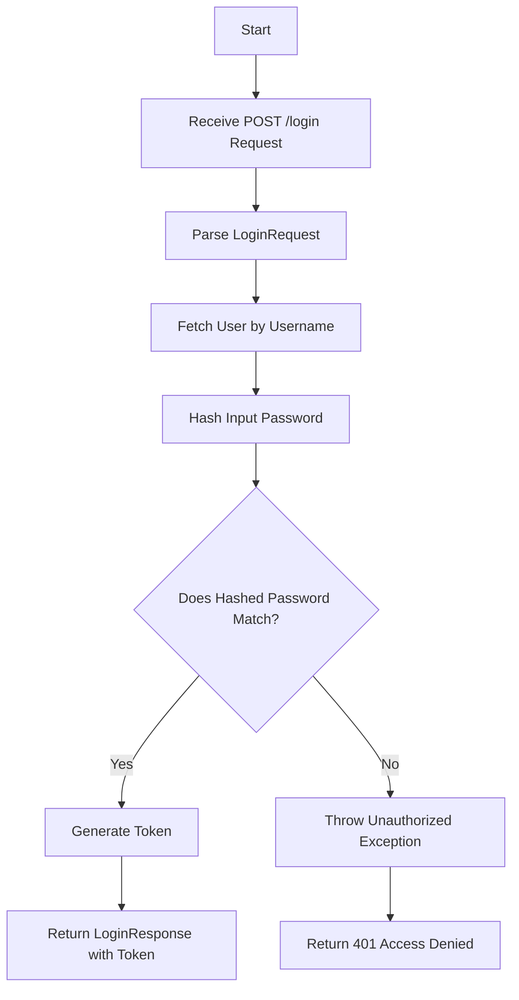
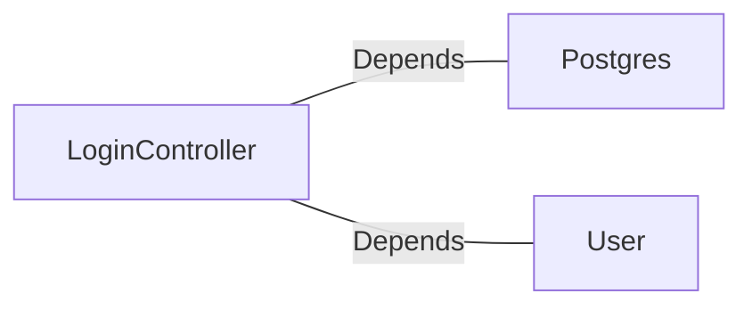

# LoginController.java: User Authentication Controller

## Overview

This file implements a RESTful controller for handling user login requests. It validates user credentials against stored data and generates a token upon successful authentication. The controller uses Spring Boot annotations and integrates with a database for user data retrieval and password validation.

## Process Flow

## Insights

- The `@CrossOrigin` annotation allows requests from any origin, which may expose the application to Cross-Origin Resource Sharing (CORS) vulnerabilities.
- The `secret` value is injected from application properties and is used to generate user tokens.
- The `Postgres.md5` method is used for password hashing, which is considered insecure for modern applications.
- The `Unauthorized` exception is thrown when authentication fails, returning a 401 HTTP status code.
- The `LoginRequest` and `LoginResponse` classes are simple data transfer objects (DTOs) for handling request and response payloads.

## Dependencies

- `Postgres`: Used for hashing the input password with the `md5` method.
- `User`: Fetches user data (e.g., username, hashed password) from the database.

### External References

- `Postgres`: Used for hashing the password. The nature of the relation is "Depends".
- `User`: Fetches user details based on the username. The nature of the relation is "Depends".

## Vulnerabilities

1. **CORS Misconfiguration**:
   - The `@CrossOrigin(origins = "*")` annotation allows requests from any origin, which can expose the application to malicious cross-origin requests.

2. **Weak Password Hashing**:
   - The use of `Postgres.md5` for password hashing is insecure. MD5 is considered cryptographically broken and unsuitable for further use.

3. **Hardcoded Secret**:
   - The `secret` value is injected from application properties but is not encrypted or secured, which could lead to token forgery if exposed.

4. **Potential User Enumeration**:
   - The application fetches the user by username before validating the password. This could allow attackers to determine valid usernames based on response times or error messages.

5. **Lack of Rate Limiting**:
   - The code does not implement rate limiting, making it susceptible to brute force attacks.

6. **No Input Validation**:
   - The `LoginRequest` object does not validate the `username` or `password` fields, which could lead to injection attacks or other vulnerabilities.
