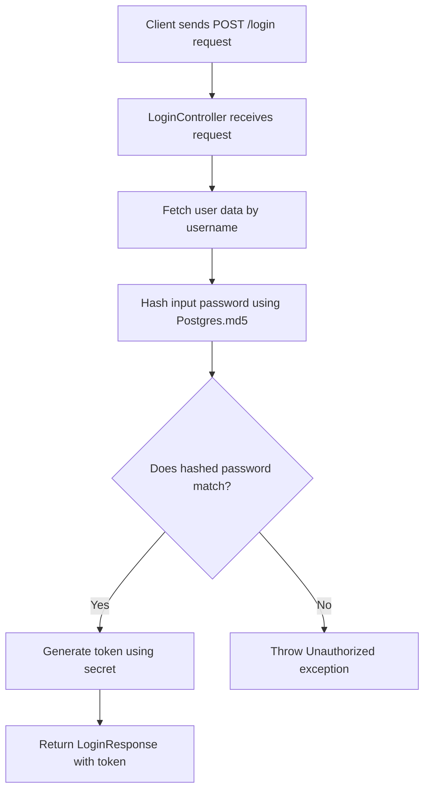
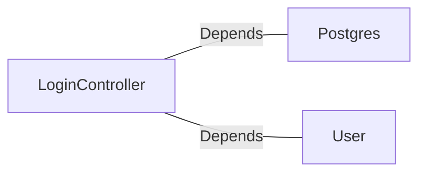

# LoginController.java: User Authentication Controller

## Overview

This file implements a RESTful controller for handling user login requests. It validates user credentials against stored data and generates a token upon successful authentication. The controller uses Spring Boot annotations and integrates with a database for user data retrieval and password validation.

## Process Flow

## Insights

- The `@CrossOrigin` annotation allows requests from any origin, which may expose the application to Cross-Origin Resource Sharing (CORS) vulnerabilities.
- The `@Value("${app.secret}")` annotation injects a secret key from the application's configuration, which is used for token generation.
- The `Postgres.md5` method is used for password hashing, but the security of this method depends on its implementation.
- The `Unauthorized` exception is thrown when authentication fails, returning an HTTP 401 status code.
- The `LoginRequest` and `LoginResponse` classes are simple data transfer objects (DTOs) for handling input and output.

## Dependencies

- `Postgres`: Used for hashing the input password with the `md5` method.
- `User`: Used to fetch user data by username and validate the hashed password.

### List of Identified External References

- `Postgres`: Provides the `md5` method for hashing passwords. The nature of the relation is "Depends".
- `User`: Fetches user data by username and provides the hashed password for comparison. The nature of the relation is "Depends".

## Vulnerabilities

1. **CORS Misconfiguration**:
   - The `@CrossOrigin(origins = "*")` annotation allows requests from any origin, which can expose the application to potential security risks, such as unauthorized access or data leakage.

2. **Password Hashing**:
   - The use of `Postgres.md5` for password hashing may not be secure if the hashing algorithm is outdated or lacks additional security measures like salting.

3. **Hardcoded Secret**:
   - The secret key is injected from the application's configuration. If not properly secured, it could be exposed, compromising token generation and validation.

4. **Error Handling**:
   - The application throws a generic `Unauthorized` exception without providing detailed error messages. While this is good for security, it may not provide sufficient feedback for debugging or user experience.

5. **SQL Injection Risk**:
   - If the `User.fetch` method directly interacts with the database without proper sanitization, it could be vulnerable to SQL injection attacks.
