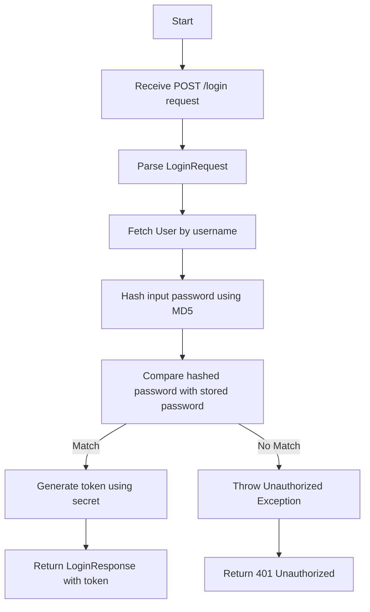
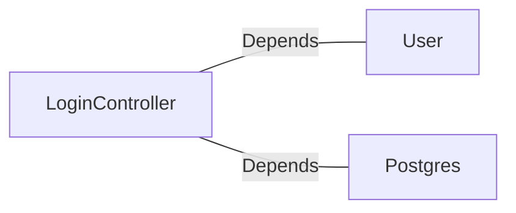

# LoginController.java: User Authentication Controller

## Overview

This file implements a RESTful controller for handling user login requests. It validates user credentials against stored data and generates a token upon successful authentication. The controller uses Spring Boot annotations and includes error handling for unauthorized access.

## Process Flow

## Insights

- The `@RestController` annotation indicates that this class is a RESTful web service.
- The `@CrossOrigin` annotation allows cross-origin requests from any domain.
- The `@RequestMapping` annotation maps the `/login` endpoint to the `login` method, which accepts and produces JSON.
- The `LoginRequest` and `LoginResponse` classes are simple data structures for handling input and output.
- The `Unauthorized` exception is used to handle unauthorized access with a 401 HTTP status code.
- The `secret` value is injected from the application's configuration using the `@Value` annotation.
- The password is hashed using MD5, which is considered insecure for password hashing.

## Dependencies

- `User`: Represents the user entity and provides a method to fetch user details by username.
- `Postgres`: Provides the `md5` method for hashing passwords.

### External References

- `User`: Used to fetch user details by username. The method `fetch` is called with the username as a parameter.
- `Postgres`: Used to hash the input password using the `md5` method.

## Vulnerabilities

1. **Insecure Password Hashing**:
   - The use of MD5 for password hashing is insecure and susceptible to collision attacks. A more secure hashing algorithm like bcrypt, Argon2, or PBKDF2 should be used.

2. **Hardcoded Cross-Origin Policy**:
   - The `@CrossOrigin(origins = "*")` annotation allows requests from any domain, which can lead to security risks such as Cross-Origin Resource Sharing (CORS) attacks. It is recommended to restrict origins to trusted domains.

3. **Potential Information Disclosure**:
   - The `Unauthorized` exception does not differentiate between invalid usernames and passwords, which is good for security. However, care should be taken to ensure no sensitive information is leaked in error messages.

4. **Lack of Rate Limiting**:
   - The endpoint does not implement rate limiting, making it vulnerable to brute force attacks.

5. **Secret Management**:
   - The `secret` is injected from the application's configuration, but the security of this value depends on how it is stored and managed. Ensure it is stored securely and not exposed in version control or logs.
