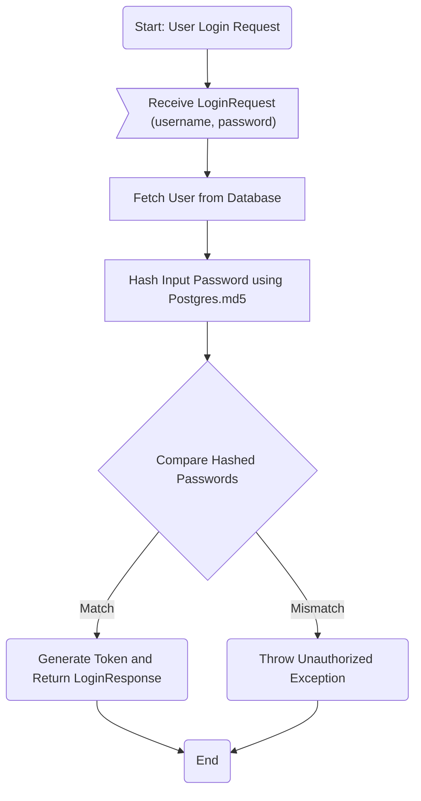
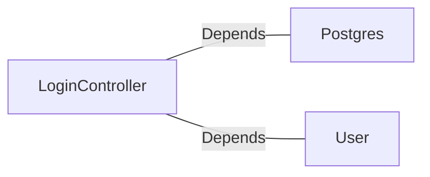

# LoginController.java: Login Authentication Controller

## Overview
The `LoginController` class is a REST API controller responsible for handling user login requests. It validates user credentials against stored data and generates a token for successful authentication. The controller uses Spring Boot annotations and integrates with external dependencies for user data fetching and password hashing.

## Process Flow

```mermaid
flowchart TD
    Start("Start: User Login Request")
    Input>"Receive LoginRequest (username, password)"]
    FetchUser["Fetch User from Database"]
    HashPassword["Hash Input Password using Postgres.md5"]
    Compare{"Compare Hashed Passwords"}
    Success("Generate Token and Return LoginResponse")
    Failure("Throw Unauthorized Exception")
    End("End")

    Start --> Input
    Input --> FetchUser
    FetchUser --> HashPassword
    HashPassword --> Compare
    Compare --> |"Match"| Success
    Compare --> |"Mismatch"| Failure
    Success --> End
    Failure --> End
```

## Insights
- **Cross-Origin Resource Sharing (CORS):** The `@CrossOrigin` annotation allows requests from any origin, which may pose security risks if not properly configured.
- **Hardcoded Password Hashing:** The use of `Postgres.md5` for password hashing is potentially insecure if the hashing algorithm is outdated or improperly implemented.
- **Exception Handling:** Unauthorized access is handled by throwing a custom `Unauthorized` exception with HTTP status `401`.
- **Token Generation:** The token is generated using a secret value (`app.secret`) injected via Spring's `@Value` annotation.
- **Serialization:** Both `LoginRequest` and `LoginResponse` classes implement `Serializable`, ensuring compatibility for data transfer.

## Dependencies

```mermaid
flowchart LR
    LoginController --- |"Depends"| Postgres
    LoginController --- |"Depends"| User
```

- `Postgres`: Used for hashing the input password (`Postgres.md5`).
- `User`: Fetches user data from the database (`User.fetch(input.username)`).

## Vulnerabilities
1. **CORS Misconfiguration:**
   - The `@CrossOrigin(origins = "*")` annotation allows requests from any origin, which can lead to security vulnerabilities such as Cross-Site Request Forgery (CSRF) attacks. It is recommended to restrict origins to trusted domains.

2. **Weak Password Hashing:**
   - The use of `Postgres.md5` for password hashing may be insecure if MD5 is used directly, as MD5 is considered cryptographically broken and unsuitable for further use. A stronger hashing algorithm like bcrypt or Argon2 should be used.

3. **Hardcoded Secret Management:**
   - The `secret` value is injected from application properties (`app.secret`). If not securely managed, it can be exposed, leading to token forgery. Consider using a secure vault for secret management.

4. **Error Disclosure:**
   - Throwing an `Unauthorized` exception with a generic message ("Access Denied") is acceptable, but care should be taken to avoid exposing sensitive information in error responses.

5. **Lack of Rate Limiting:**
   - The login endpoint does not implement rate limiting, making it susceptible to brute-force attacks.

6. **No Input Validation:**
   - The `LoginRequest` class does not validate `username` or `password`, which could lead to injection attacks or other vulnerabilities.

## Data Manipulation (SQL)
- **User.fetch(input.username):** Likely performs a SQL `SELECT` operation to retrieve user data based on the provided username. Ensure proper sanitization to prevent SQL injection.
