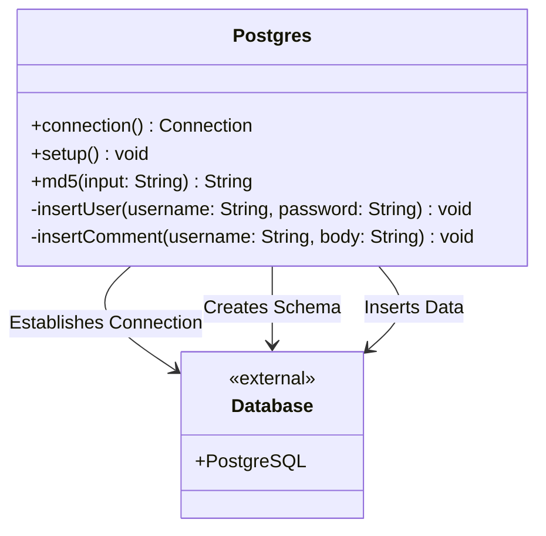
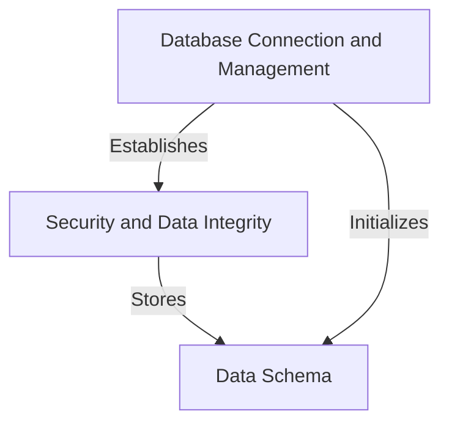
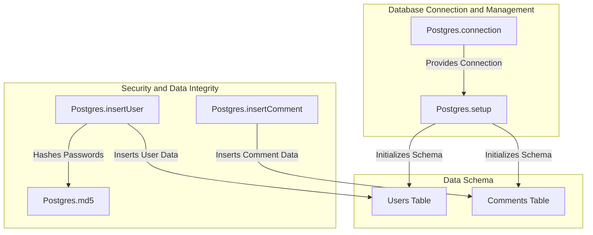
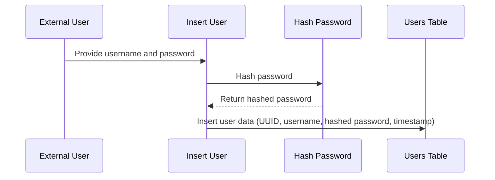
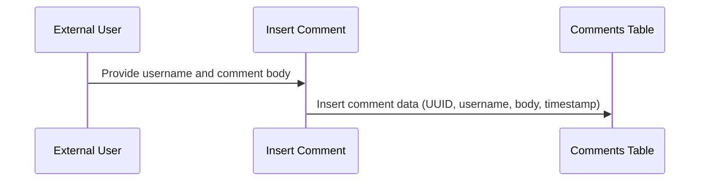
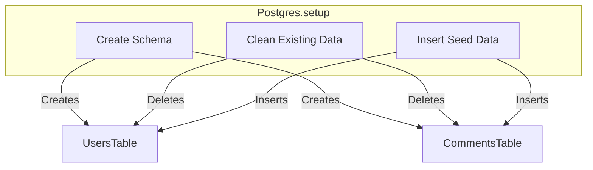

# Database Management and Security in the Postgres Component

The provided code centers around the `Postgres` class, which is responsible for managing database connections, schema setup, and data seeding for a PostgreSQL database. It also includes utility methods for hashing passwords using MD5 and inserting data into the database. This component plays a critical role in ensuring the application's data persistence and integrity while interacting with the database.

## Key Components

### Database Connection and Management
- **Postgres.connection**: *Establishes a connection to the PostgreSQL database using environment variables for configuration. This method ensures that the application can interact with the database securely and dynamically based on the deployment environment.*
- **Postgres.setup**: *Sets up the database schema, cleans up existing data, and seeds initial data for users and comments. This method is crucial for initializing the database state during application startup.*

### Security and Data Integrity
- **Postgres.md5**: *Generates an MD5 hash for a given input string, primarily used for hashing passwords before storing them in the database. This method ensures that sensitive data like passwords are not stored in plain text, although MD5 is considered outdated for secure password hashing.*
- **Postgres.insertUser**: *Inserts a new user into the database with a hashed password and a unique identifier. This method ensures data integrity by using UUIDs for user IDs and hashing passwords for security.*
- **Postgres.insertComment**: *Inserts a new comment into the database with a unique identifier. This method facilitates user interaction by allowing comments to be stored securely.*

### Data Schema
- **Users Table**: *Stores user information, including a unique user ID, username, hashed password, creation timestamp, and last login timestamp.*
- **Comments Table**: *Stores comments with a unique ID, username of the commenter, comment body, and creation timestamp.*

## Component Relationships

The `Postgres` class interacts with the PostgreSQL database directly through JDBC. It leverages environment variables for configuration, ensuring flexibility across different deployment environments. The methods within the class are interdependent:
- `connection` is a foundational method used by other methods like `setup`, `insertUser`, and `insertComment` to establish a database connection.
- `md5` is a utility method used by `insertUser` to hash passwords before storing them in the database.

## System Structure Diagram

This diagram illustrates the `Postgres` class's interaction with the external PostgreSQL database. It highlights the key methods responsible for database connection, schema setup, and data insertion.

## Summary

The `Postgres` component is a critical part of the application, responsible for managing database interactions, ensuring data integrity, and providing initial data for the application. While it includes basic security measures like password hashing, the use of MD5 for hashing is a potential vulnerability that should be addressed by adopting a more secure hashing algorithm like bcrypt or Argon2.
## Component Relationships

### Context Diagram

### Explanation

- **Database Connection and Management**: This category, represented by the `Postgres.connection` and `Postgres.setup` methods, is responsible for establishing a connection to the PostgreSQL database and initializing the database schema. It serves as the foundation for all interactions with the database.
  
- **Security and Data Integrity**: This category includes methods like `Postgres.md5`, `Postgres.insertUser`, and `Postgres.insertComment`. It ensures that sensitive data, such as passwords, is securely hashed and that data integrity is maintained when inserting records into the database.

- **Data Schema**: This category represents the structure of the database, including the `Users` and `Comments` tables. It is initialized by the `Database Connection and Management` category and populated securely by the `Security and Data Integrity` category. The schema defines how data is stored and organized within the application.
### Detailed Vision

### Explanation

- **Database Connection and Management**:
  - `Postgres.connection` establishes a connection to the PostgreSQL database, which is then used by `Postgres.setup` to initialize the database schema and seed data.
  - `Postgres.setup` interacts with the `Users Table` and `Comments Table` to create their structure and populate them with initial data.

- **Security and Data Integrity**:
  - `Postgres.md5` is used by `Postgres.insertUser` to hash passwords before storing them in the `Users Table`. This ensures that sensitive data is not stored in plain text.
  - `Postgres.insertUser` inserts user data, including hashed passwords, into the `Users Table`.
  - `Postgres.insertComment` inserts comment data into the `Comments Table`, ensuring that user interactions are securely stored.

- **Data Schema**:
  - The `Users Table` and `Comments Table` are initialized by `Postgres.setup` and populated by `Postgres.insertUser` and `Postgres.insertComment`, respectively. These tables define the structure and organization of user and comment data within the application.
## Integration Scenarios

### User Registration and Password Hashing

This scenario describes the process of registering a new user in the system. It involves hashing the user's password for security and storing the user data in the database. The integration highlights the collaboration between the `Postgres.insertUser` method, the `Postgres.md5` method, and the `Users Table`.

#### Explanation

- **User**: The external user initiates the process by providing their username and password to the system.
- **Postgres.insertUser**: This method is responsible for handling the user registration process. It first calls `Postgres.md5` to hash the provided password securely.
- **Postgres.md5**: This method generates an MD5 hash of the password and returns it to `Postgres.insertUser`. While MD5 is used here, it is recommended to replace it with a more secure hashing algorithm like bcrypt or Argon2.
- **Users Table**: After hashing the password, `Postgres.insertUser` inserts the user data, including a unique UUID, username, hashed password, and the current timestamp, into the `Users Table`. This ensures the data is securely stored and uniquely identified.

---

### Comment Creation and Storage

This scenario describes the process of creating a new comment and storing it in the database. It involves the `Postgres.insertComment` method and the `Comments Table`.

#### Explanation

- **User**: The external user initiates the process by providing their username and the comment body they wish to post.
- **Postgres.insertComment**: This method handles the creation of a new comment. It generates a unique UUID for the comment and prepares the data for insertion.
- **Comments Table**: The `Postgres.insertComment` method inserts the comment data, including the UUID, username, comment body, and the current timestamp, into the `Comments Table`. This ensures the comment is securely stored and uniquely identified.

---

### Database Initialization and Seeding

This scenario describes the process of initializing the database schema and seeding it with initial data. It involves the `Postgres.setup` method and its interaction with the `Users Table` and `Comments Table`.

#### Explanation

- **Postgres.setup**: This method is responsible for initializing the database schema and seeding it with initial data. It performs three main tasks:
  - **Create Schema**: Creates the structure of the `Users Table` and `Comments Table`.
  - **Clean Existing Data**: Deletes any existing data in the `Users Table` and `Comments Table` to ensure a clean slate.
  - **Insert Seed Data**: Inserts predefined user and comment data into the `Users Table` and `Comments Table` to provide initial content for the application.
- **Users Table**: The schema is created, existing data is deleted, and seed data is inserted into this table.
- **Comments Table**: Similarly, the schema is created, existing data is deleted, and seed data is inserted into this table.
