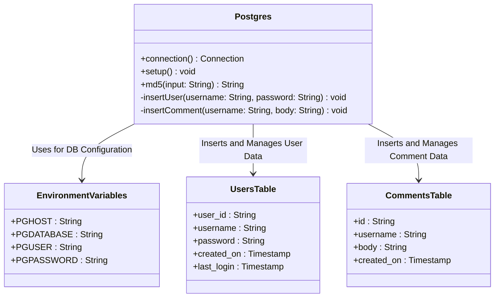
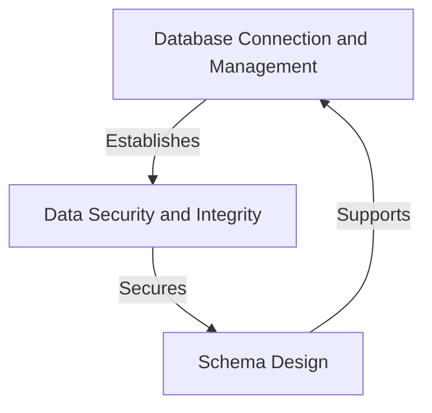
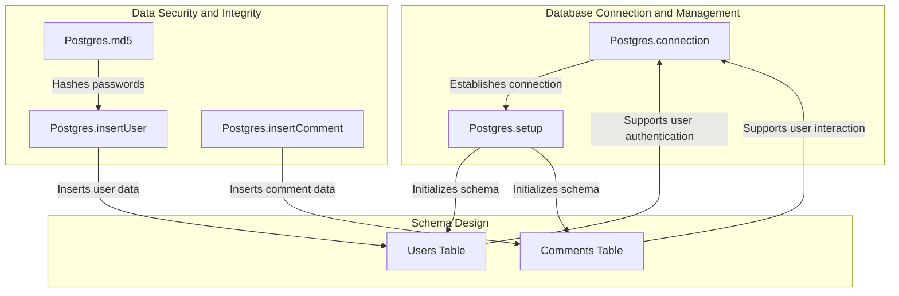
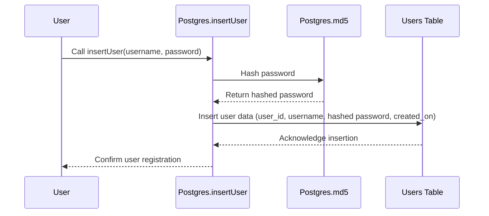
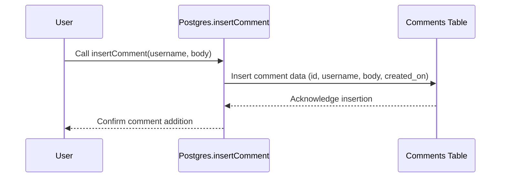

# Database Management and Security in the Postgres Component

The provided code centers around the `Postgres` class, which is responsible for managing database connections, schema setup, and data seeding for a PostgreSQL database. It also includes utility methods for hashing passwords using MD5 and inserting data into the database. This component plays a critical role in ensuring the application's data persistence and integrity while interacting with the database.

## Key Components

### Database Connection and Management
- **Postgres.connection**: *Establishes a connection to the PostgreSQL database using environment variables for configuration. This method ensures the application can interact with the database securely and dynamically.*
- **Postgres.setup**: *Sets up the database schema, cleans up existing data, and seeds initial data for users and comments. This method is crucial for initializing the database state during application startup.*

### Data Security and Integrity
- **Postgres.md5**: *Generates an MD5 hash for a given input string, primarily used for hashing passwords before storing them in the database. This method ensures that sensitive user data is stored securely.*
- **Postgres.insertUser**: *Inserts a new user into the `users` table with a hashed password. This method leverages the `md5` utility to enhance security and ensures proper data insertion.*
- **Postgres.insertComment**: *Inserts a new comment into the `comments` table, associating it with a username. This method ensures that comments are properly stored and linked to users.*

### Schema Design
- **Users Table**: *Stores user information, including a unique user ID, username, hashed password, and timestamps for account creation and last login. This schema supports user authentication and tracking.*
- **Comments Table**: *Stores comments with a unique ID, associated username, comment body, and timestamp for creation. This schema supports user-generated content and interaction.*

## Component Relationships

The `Postgres` class interacts with the following components:
- **Environment Variables**: *Used to configure database connection parameters dynamically, ensuring flexibility and security.*
- **Java SQL API**: *Utilized for database operations, including connection management, statement execution, and prepared statements for secure data insertion.*
- **Java Security API**: *Used for generating MD5 hashes to secure sensitive data like passwords.*

## System Structure Diagram

This diagram illustrates the relationships between the `Postgres` class, environment variables, and database tables. It highlights how the `Postgres` class serves as the central component for database interaction and management.
## Component Relationships

### Context Diagram

### Explanation

- **Database Connection and Management → Data Security and Integrity**: 
  - The `Postgres.connection` method establishes a secure connection to the database, enabling the application to interact with the database. This connection is foundational for all subsequent operations, including securing sensitive data like passwords.
  
- **Data Security and Integrity → Schema Design**: 
  - The `Postgres.md5` method ensures that sensitive data, such as user passwords, is hashed before being stored in the database. This security measure directly supports the schema design by ensuring that the `users` table stores hashed passwords instead of plaintext ones.

- **Schema Design → Database Connection and Management**: 
  - The schema design, including the `users` and `comments` tables, supports the database connection by providing a structured format for storing and retrieving data. The `Postgres.setup` method initializes the schema and seeds data, ensuring the database is ready for use during application startup.
### Detailed Vision

### Explanation

- **Database Connection and Management**:
  - `Postgres.connection` establishes a connection to the PostgreSQL database using environment variables. This connection is essential for all database operations.
  - `Postgres.setup` uses the established connection to initialize the database schema (`Users Table` and `Comments Table`) and seed initial data. This ensures the database is ready for application use.

- **Data Security and Integrity**:
  - `Postgres.md5` hashes passwords before they are stored in the database, ensuring sensitive user data is secured.
  - `Postgres.insertUser` uses the hashed password from `Postgres.md5` to insert user data into the `Users Table`. This ensures that user credentials are securely stored.
  - `Postgres.insertComment` inserts user-generated comments into the `Comments Table`, linking them to the respective user.

- **Schema Design**:
  - The `Users Table` is initialized by `Postgres.setup` and supports user authentication by storing user credentials and metadata.
  - The `Comments Table` is also initialized by `Postgres.setup` and supports user interaction by storing comments linked to specific users.
  - Both tables provide structured data storage that supports the operations performed by the `Database Connection and Management` and `Data Security and Integrity` components.
## Integration Scenarios

### User Registration and Data Insertion

This scenario describes the process of registering a new user in the system. It involves hashing the user's password, generating a unique user ID, and inserting the user data into the database. This integration scenario highlights the collaboration between the `Postgres` methods and the `Users Table` to securely store user information.

#### Explanation

- **User → Postgres.insertUser**:
  - The process begins when a user initiates a registration request by providing a username and password. This triggers the `Postgres.insertUser` method.

- **Postgres.insertUser → Postgres.md5**:
  - The `Postgres.insertUser` method calls `Postgres.md5` to hash the provided password. This ensures that sensitive user data is not stored in plaintext.

- **Postgres.md5 → Postgres.insertUser**:
  - The `Postgres.md5` method returns the hashed password to `Postgres.insertUser`, which will use it for secure storage.

- **Postgres.insertUser → Users Table**:
  - The `Postgres.insertUser` method generates a unique user ID and inserts the user data (user ID, username, hashed password, and creation timestamp) into the `Users Table`.

- **Users Table → Postgres.insertUser**:
  - The `Users Table` acknowledges the successful insertion of the user data, confirming that the operation was completed.

- **Postgres.insertUser → User**:
  - Finally, the `Postgres.insertUser` method confirms the successful registration to the user, completing the process.

---

### Adding a Comment to the System

This scenario describes the process of adding a comment to the system. It involves associating the comment with a username, generating a unique comment ID, and inserting the comment data into the database. This integration scenario demonstrates the interaction between the `Postgres` methods and the `Comments Table`.

#### Explanation

- **User → Postgres.insertComment**:
  - The process begins when a user submits a comment by providing their username and the comment body. This triggers the `Postgres.insertComment` method.

- **Postgres.insertComment → Comments Table**:
  - The `Postgres.insertComment` method generates a unique comment ID and inserts the comment data (comment ID, username, comment body, and creation timestamp) into the `Comments Table`.

- **Comments Table → Postgres.insertComment**:
  - The `Comments Table` acknowledges the successful insertion of the comment data, confirming that the operation was completed.

- **Postgres.insertComment → User**:
  - Finally, the `Postgres.insertComment` method confirms the successful addition of the comment to the user, completing the process.
