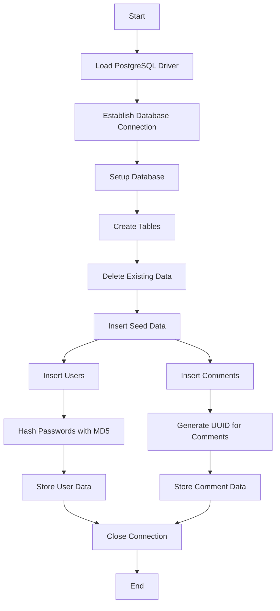
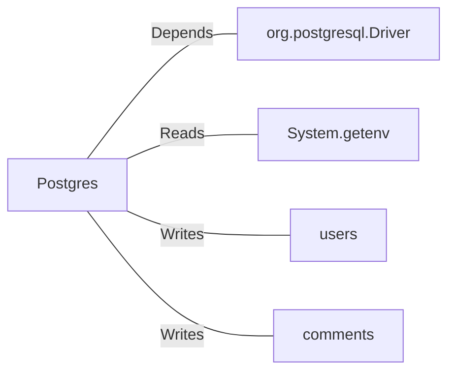

# Postgres.java: Database Setup and Interaction Utility

## Overview

This Java class provides utility methods to interact with a PostgreSQL database. It includes functionality for establishing a database connection, setting up database schemas, inserting seed data, and hashing passwords using the MD5 algorithm. The class is designed to initialize and manage two tables: `users` and `comments`.

## Process Flow

## Insights

- The class uses environment variables (`PGHOST`, `PGDATABASE`, `PGUSER`, `PGPASSWORD`) to configure the database connection.
- The `setup` method initializes the database by creating tables, clearing existing data, and inserting seed data.
- Passwords are hashed using the MD5 algorithm before being stored in the database.
- The `users` table stores user credentials and metadata, while the `comments` table stores user comments.
- UUIDs are generated for primary keys in both tables to ensure uniqueness.
- The use of `PreparedStatement` helps prevent SQL injection for the `insertUser` and `insertComment` methods.

## Dependencies

- `org.postgresql.Driver`: Required for connecting to the PostgreSQL database.
- `System.getenv`: Reads environment variables for database configuration.
- `users`: Table where user data is stored.
- `comments`: Table where comment data is stored.

### External References

- `org.postgresql.Driver`: Used to load the PostgreSQL JDBC driver.
- `System.getenv`: Reads the following environment variables:
  - `PGHOST`: Hostname of the PostgreSQL server.
  - `PGDATABASE`: Name of the database.
  - `PGUSER`: Username for database authentication.
  - `PGPASSWORD`: Password for database authentication.
- `users`: Table schema:
  - `user_id`: Primary key (UUID).
  - `username`: Unique username.
  - `password`: MD5-hashed password.
  - `created_on`: Timestamp of user creation.
  - `last_login`: Timestamp of the last login.
- `comments`: Table schema:
  - `id`: Primary key (UUID).
  - `username`: Username of the commenter.
  - `body`: Comment text.
  - `created_on`: Timestamp of comment creation.

## Data Manipulation (SQL)

### Table Structures

#### `users`
| Attribute    | Data Type      | Description                          |
|--------------|----------------|--------------------------------------|
| `user_id`    | `VARCHAR(36)`  | Primary key (UUID).                  |
| `username`   | `VARCHAR(50)`  | Unique username.                     |
| `password`   | `VARCHAR(50)`  | MD5-hashed password.                 |
| `created_on` | `TIMESTAMP`    | Timestamp of user creation.          |
| `last_login` | `TIMESTAMP`    | Timestamp of the last login.         |

#### `comments`
| Attribute    | Data Type      | Description                          |
|--------------|----------------|--------------------------------------|
| `id`         | `VARCHAR(36)`  | Primary key (UUID).                  |
| `username`   | `VARCHAR(36)`  | Username of the commenter.           |
| `body`       | `VARCHAR(500)` | Comment text.                        |
| `created_on` | `TIMESTAMP`    | Timestamp of comment creation.       |

### SQL Operations

- `CREATE TABLE`: Creates the `users` and `comments` tables if they do not exist.
- `DELETE`: Clears all existing data from the `users` and `comments` tables.
- `INSERT`: Adds seed data to the `users` and `comments` tables.

## Vulnerabilities

1. **MD5 for Password Hashing**:
   - MD5 is considered cryptographically insecure and should not be used for password hashing. A more secure algorithm like bcrypt, Argon2, or PBKDF2 should be used.

2. **Environment Variable Exposure**:
   - Sensitive information such as database credentials is retrieved from environment variables. Ensure these variables are securely managed and not exposed.

3. **Error Handling**:
   - Exceptions are printed to the console, which may expose sensitive information. Proper logging mechanisms should be implemented.

4. **Hardcoded Seed Data**:
   - The seed data includes hardcoded passwords, which could be a security risk if exposed. These should be securely managed or removed in production environments.
