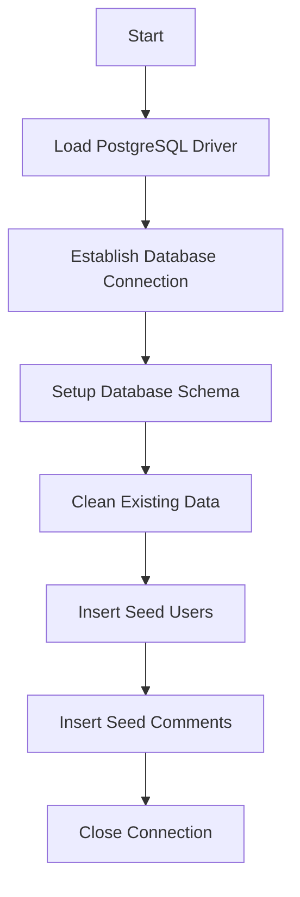
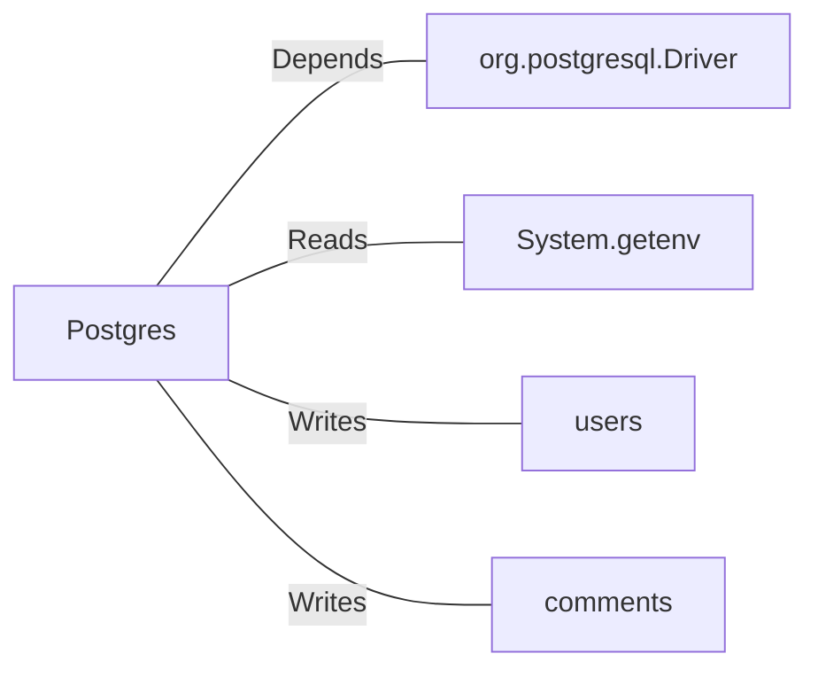

# Postgres.java: Database Setup and Interaction Utility

## Overview

This Java class provides utility methods for setting up and interacting with a PostgreSQL database. It includes functionality for establishing a database connection, creating schema tables, inserting seed data, and hashing passwords using the MD5 algorithm. The class is designed to initialize a database with predefined users and comments, and it uses environment variables for database connection details.

## Process Flow

## Insights

- **Database Connection**: The `connection()` method uses environment variables (`PGHOST`, `PGDATABASE`, `PGUSER`, `PGPASSWORD`) to establish a connection to the PostgreSQL database.
- **Schema Creation**: The `setup()` method creates two tables: `users` and `comments`, with predefined structures.
- **Data Initialization**: The `setup()` method inserts seed data into the `users` and `comments` tables.
- **Password Hashing**: The `md5()` method hashes passwords using the MD5 algorithm before storing them in the database.
- **Prepared Statements**: The `insertUser()` and `insertComment()` methods use prepared statements to prevent SQL injection.
- **UUIDs**: Unique identifiers for users and comments are generated using `UUID.randomUUID()`.

## Dependencies

- `org.postgresql.Driver`: Required for connecting to the PostgreSQL database.
- `System.getenv`: Reads environment variables for database connection details.
- `users`: Table where user data is stored.
- `comments`: Table where comment data is stored.

## Data Manipulation (SQL)

### Table: `users`

| Attribute    | Data Type      | Description                                      |
|--------------|----------------|--------------------------------------------------|
| `user_id`    | `VARCHAR(36)`  | Primary key, unique identifier for the user.    |
| `username`   | `VARCHAR(50)`  | Unique username, cannot be null.                |
| `password`   | `VARCHAR(50)`  | MD5-hashed password, cannot be null.            |
| `created_on` | `TIMESTAMP`    | Timestamp of user creation.                     |
| `last_login` | `TIMESTAMP`    | Timestamp of the last login.                    |

### Table: `comments`

| Attribute    | Data Type      | Description                                      |
|--------------|----------------|--------------------------------------------------|
| `id`         | `VARCHAR(36)`  | Primary key, unique identifier for the comment. |
| `username`   | `VARCHAR(36)`  | Username of the commenter.                      |
| `body`       | `VARCHAR(500)` | Content of the comment.                         |
| `created_on` | `TIMESTAMP`    | Timestamp of comment creation.                  |

### SQL Operations

- **Schema Creation**:
  - `CREATE TABLE IF NOT EXISTS users(...)`
  - `CREATE TABLE IF NOT EXISTS comments(...)`
- **Data Cleanup**:
  - `DELETE FROM users`
  - `DELETE FROM comments`
- **Data Insertion**:
  - `INSERT INTO users (user_id, username, password, created_on) VALUES (?, ?, ?, current_timestamp)`
  - `INSERT INTO comments (id, username, body, created_on) VALUES (?, ?, ?, current_timestamp)`

## Vulnerabilities

1. **MD5 for Password Hashing**:
   - MD5 is considered cryptographically insecure and should not be used for password hashing. A more secure algorithm like bcrypt or Argon2 is recommended.

2. **Environment Variable Exposure**:
   - Sensitive information such as database credentials is retrieved from environment variables. Ensure these variables are securely managed and not exposed.

3. **Error Handling**:
   - Exceptions are printed to the console, which may expose sensitive information. Proper logging mechanisms should be implemented.

4. **Hardcoded Seed Data**:
   - The seed data includes hardcoded usernames and passwords, which could be a security risk if used in production.

5. **Lack of Input Validation**:
   - The `insertUser()` and `insertComment()` methods do not validate input data, which could lead to unexpected behavior or vulnerabilities.
