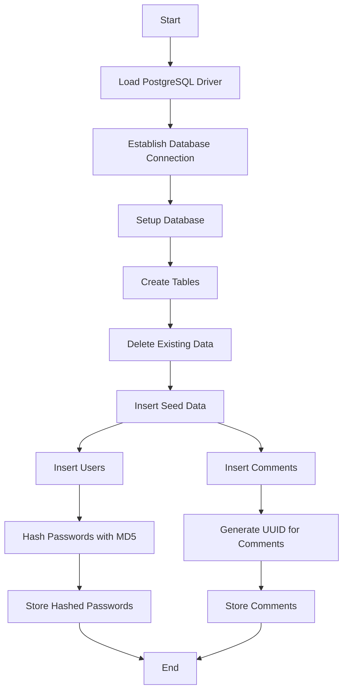
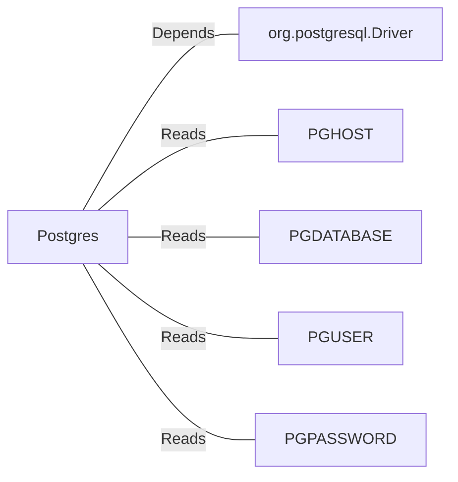

# Postgres.java: Database Setup and Interaction Utility

## Overview

This Java class provides utility methods to interact with a PostgreSQL database. It includes functionality for establishing a database connection, setting up database schemas, inserting seed data, and hashing passwords using the MD5 algorithm. The class is designed to initialize and manage two tables: `users` and `comments`.

## Process Flow

## Insights

- The class uses environment variables (`PGHOST`, `PGDATABASE`, `PGUSER`, `PGPASSWORD`) to configure the database connection.
- The `setup` method ensures the database schema is created and populated with seed data.
- Passwords are hashed using the MD5 algorithm before being stored in the database.
- The `users` table includes fields for user ID, username, password, creation timestamp, and last login timestamp.
- The `comments` table includes fields for comment ID, username, comment body, and creation timestamp.
- The use of `UUID` ensures unique identifiers for users and comments.
- The `PreparedStatement` is used to prevent SQL injection in the `insertUser` and `insertComment` methods.

## Dependencies

- `org.postgresql.Driver`: Required for connecting to the PostgreSQL database.
- `PGHOST`: Environment variable for the database host.
- `PGDATABASE`: Environment variable for the database name.
- `PGUSER`: Environment variable for the database user.
- `PGPASSWORD`: Environment variable for the database password.

## Data Manipulation (SQL)

### Table Structures

#### `users` Table
| Attribute    | Type         | Description                                      |
|--------------|--------------|--------------------------------------------------|
| `user_id`    | VARCHAR(36)  | Primary key, unique identifier for the user.     |
| `username`   | VARCHAR(50)  | Unique username for the user.                    |
| `password`   | VARCHAR(50)  | MD5-hashed password.                             |
| `created_on` | TIMESTAMP    | Timestamp of user creation.                      |
| `last_login` | TIMESTAMP    | Timestamp of the last login.                     |

#### `comments` Table
| Attribute    | Type         | Description                                      |
|--------------|--------------|--------------------------------------------------|
| `id`         | VARCHAR(36)  | Primary key, unique identifier for the comment.  |
| `username`   | VARCHAR(36)  | Username of the user who made the comment.       |
| `body`       | VARCHAR(500) | Content of the comment.                          |
| `created_on` | TIMESTAMP    | Timestamp of comment creation.                   |

### SQL Operations

- **CREATE TABLE**: Creates the `users` and `comments` tables if they do not exist.
- **DELETE**: Clears all existing data from the `users` and `comments` tables.
- **INSERT**: Adds seed data to the `users` and `comments` tables.

## Vulnerabilities

1. **MD5 for Password Hashing**:
   - MD5 is considered cryptographically insecure and vulnerable to collision attacks. It is not recommended for password hashing.
   - Use a stronger hashing algorithm like `bcrypt` or `PBKDF2` for secure password storage.

2. **Environment Variable Exposure**:
   - The database credentials are read from environment variables. If these variables are not securely managed, they could be exposed.

3. **Error Handling**:
   - Exceptions are printed to the console, which may expose sensitive information in production environments. Use proper logging mechanisms and avoid exposing stack traces.

4. **Hardcoded Seed Data**:
   - The seed data includes hardcoded usernames and passwords, which could be a security risk if used in production.

5. **Lack of Input Validation**:
   - The `insertUser` and `insertComment` methods do not validate input data, which could lead to unexpected behavior or vulnerabilities.
