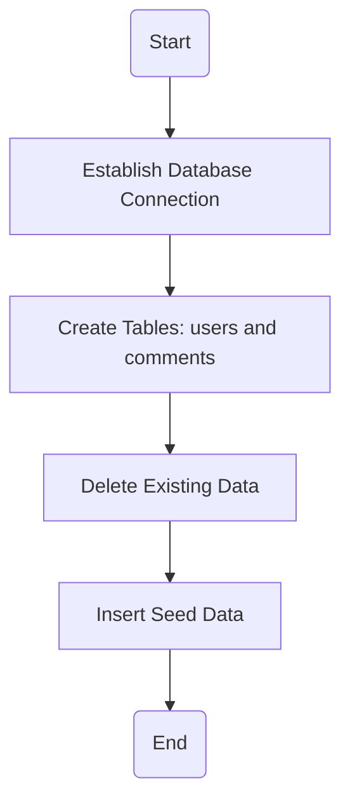
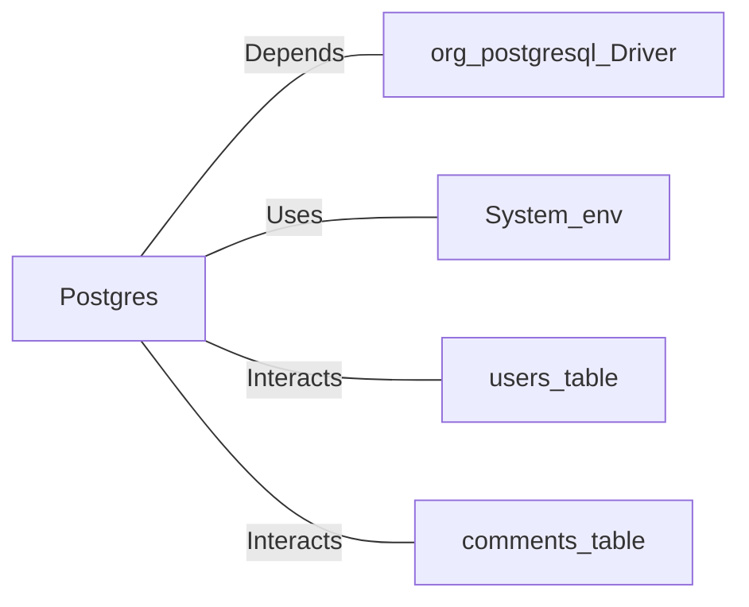

# Postgres.java: Database Setup and Interaction Utility

## Overview
This Java program provides utility methods for setting up and interacting with a PostgreSQL database. It includes functionality for establishing database connections, creating schemas, inserting seed data, and hashing passwords using MD5. The program is designed to initialize a database with predefined tables and seed data for users and comments.

## Process Flow

```mermaid
flowchart TD
    Start("Start")
    ConnectDB["Establish Database Connection"]
    CreateSchema["Create Tables: users and comments"]
    CleanData["Delete Existing Data"]
    InsertSeedData["Insert Seed Data"]
    End("End")

    Start --> ConnectDB
    ConnectDB --> CreateSchema
    CreateSchema --> CleanData
    CleanData --> InsertSeedData
    InsertSeedData --> End
```

## Insights
- **Database Connection**: The program dynamically constructs the database connection URL using environment variables (`PGHOST`, `PGDATABASE`, `PGUSER`, `PGPASSWORD`).
- **Schema Creation**: Two tables (`users` and `comments`) are created if they do not already exist.
- **Seed Data**: Predefined users and comments are inserted into the database for testing or initialization purposes.
- **Password Hashing**: User passwords are hashed using MD5 before being stored in the database.
- **Error Handling**: Exceptions are caught and printed, but the program exits on critical errors, such as connection failures.
- **UUID Usage**: Unique identifiers for users and comments are generated using `UUID.randomUUID()`.

## Vulnerabilities
1. **MD5 for Password Hashing**:
   - MD5 is considered cryptographically insecure and vulnerable to collision attacks. It should be replaced with a stronger hashing algorithm like bcrypt or Argon2 for password storage.
   
2. **Hardcoded Seed Data**:
   - The program inserts hardcoded usernames and passwords, which could lead to security risks if used in production environments.

3. **Environment Variable Exposure**:
   - Sensitive database credentials are retrieved from environment variables. Ensure these variables are securely managed and not exposed in logs or error messages.

4. **SQL Injection Risk**:
   - While `PreparedStatement` is used to prevent SQL injection, the program does not sanitize or validate user input for comments, which could lead to potential abuse.

5. **Error Handling**:
   - The program prints stack traces directly to the console, which could expose sensitive information in production environments.

## Dependencies

```mermaid
flowchart LR
    Postgres --- |"Depends"| org_postgresql_Driver
    Postgres --- |"Uses"| System_env
    Postgres --- |"Interacts"| users_table
    Postgres --- |"Interacts"| comments_table
```

- `org.postgresql.Driver`: Used for connecting to the PostgreSQL database.
- `System.env`: Retrieves environment variables for database connection details.
- `users_table`: Table for storing user information, including hashed passwords.
- `comments_table`: Table for storing user comments.

## Data Manipulation (SQL)
### Table Structures
#### `users`
| Attribute     | Type          | Description                                      |
|---------------|---------------|--------------------------------------------------|
| `user_id`     | VARCHAR(36)   | Primary key, unique identifier for the user.     |
| `username`    | VARCHAR(50)   | Unique username for the user.                   |
| `password`    | VARCHAR(50)   | MD5-hashed password.                            |
| `created_on`  | TIMESTAMP     | Timestamp of user creation.                     |
| `last_login`  | TIMESTAMP     | Timestamp of the last login.                    |

#### `comments`
| Attribute     | Type          | Description                                      |
|---------------|---------------|--------------------------------------------------|
| `id`          | VARCHAR(36)   | Primary key, unique identifier for the comment. |
| `username`    | VARCHAR(36)   | Username of the comment author.                 |
| `body`        | VARCHAR(500)  | Content of the comment.                         |
| `created_on`  | TIMESTAMP     | Timestamp of comment creation.                  |

### SQL Operations
- `CREATE TABLE`: Creates `users` and `comments` tables if they do not exist.
- `DELETE`: Removes all existing data from `users` and `comments` tables.
- `INSERT`: Adds seed data to `users` and `comments` tables.
