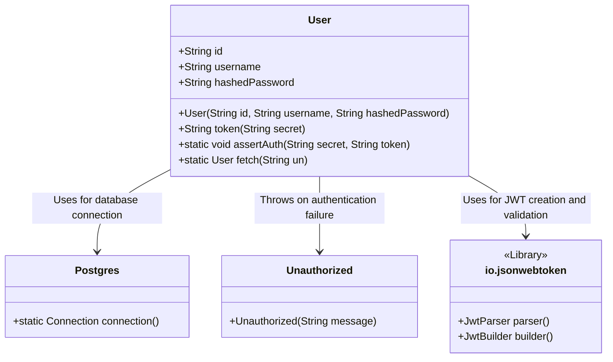
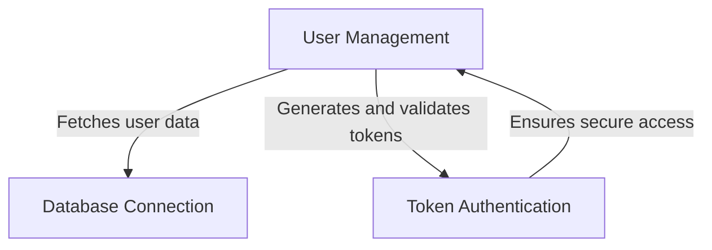
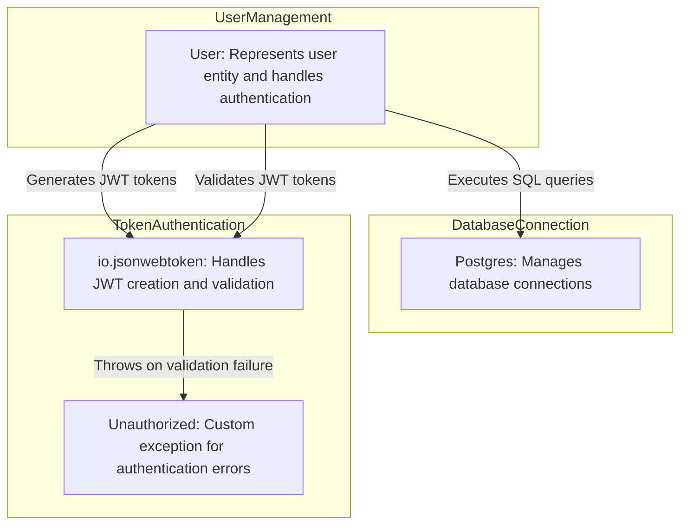
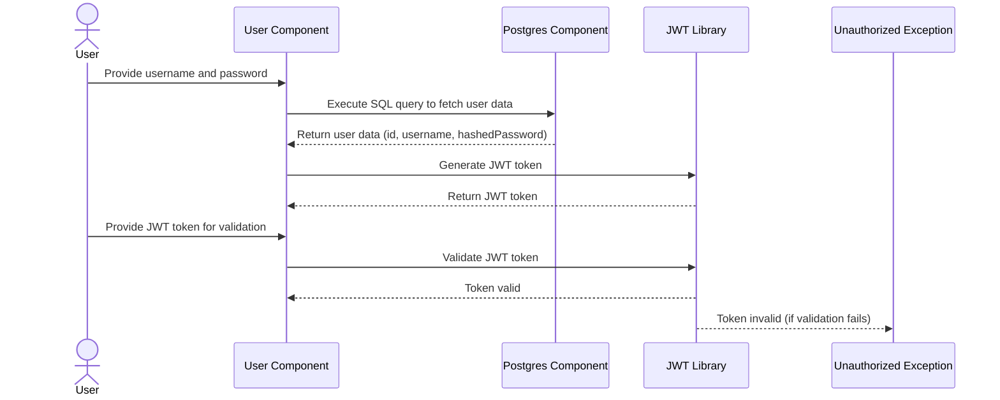

# User Authentication and Token Management Component

The provided code snippet represents a critical component of a system responsible for user authentication and token management. This component, named `User`, encapsulates functionalities for user data representation, token generation, token validation, and user data retrieval from a database. It plays a central role in ensuring secure access to the system by leveraging JSON Web Tokens (JWT) for authentication and interacting with a PostgreSQL database for user data storage.

## Key Components

### **User: User Authentication and Token Management**
- *Responsibility*: Represents a user entity with attributes such as `id`, `username`, and `hashedPassword`. It provides methods for generating JWT tokens (`token`), validating tokens (`assertAuth`), and fetching user data from a PostgreSQL database (`fetch`).
- *Relation to Other Components*: 
  - **Postgres**: The `fetch` method interacts with the `Postgres` component to establish a database connection and retrieve user data.
  - **io.jsonwebtoken**: The `token` and `assertAuth` methods utilize the `io.jsonwebtoken` library for JWT creation and validation, ensuring secure authentication mechanisms.

### **Postgres: Database Connection Management**
- *Responsibility*: Manages connections to the PostgreSQL database, enabling the `User` component to execute queries and retrieve user data.
- *Relation to Other Components*: Acts as a utility for the `User` component to interact with the database.

### **Unauthorized: Exception Handling**
- *Responsibility*: Represents a custom exception thrown when token validation fails in the `assertAuth` method.
- *Relation to Other Components*: Used by the `User` component to signal authentication errors.

## System Interaction Diagram

## Summary of Responsibilities

- **User**: Central component for user authentication and token management. It encapsulates user data, generates secure tokens, validates tokens, and retrieves user information from the database.
- **Postgres**: Provides database connectivity, enabling the `User` component to execute SQL queries.
- **Unauthorized**: Custom exception for handling authentication errors.
- **io.jsonwebtoken**: External library used for JWT operations, ensuring secure token-based authentication.

This architecture highlights the interaction between components, emphasizing the `User` component's pivotal role in authentication and token management within the system.
## Component Relationships

### Context Diagram

### Explanation of the Flowchart

- **User Management**:
  - Represents the core functionality of the `User` component, which encapsulates user data and provides methods for authentication and data retrieval.
  - Interacts with **Database Connection** to fetch user data from the PostgreSQL database using the `fetch` method.
  - Leverages **Token Authentication** to generate and validate JWT tokens, ensuring secure access to the system.

- **Database Connection**:
  - Represents the functionality provided by the `Postgres` component, which establishes connections to the database.
  - Enables **User Management** to execute SQL queries and retrieve user information.

- **Token Authentication**:
  - Represents the functionality provided by the `io.jsonwebtoken` library, which is used by the `User` component to create and validate JWT tokens.
  - Ensures secure access by validating tokens and preventing unauthorized access, fulfilling the authentication requirements of **User Management**.
### Detailed Vision

### Explanation of the Flowchart

- **User Management**:
  - The `User` component is the central entity in this category. It:
    - Interacts with **Database Connection** by calling the `Postgres` component to execute SQL queries and fetch user data from the database using the `fetch` method.
    - Leverages **Token Authentication** by using the `io.jsonwebtoken` library to generate JWT tokens via the `token` method and validate tokens via the `assertAuth` method.

- **Database Connection**:
  - The `Postgres` component provides the database connectivity required by the `User` component to retrieve user information. It ensures that the `fetch` method can execute SQL queries and return user data.

- **Token Authentication**:
  - The `io.jsonwebtoken` library is used by the `User` component to:
    - Generate JWT tokens in the `token` method, ensuring secure authentication.
    - Validate JWT tokens in the `assertAuth` method, ensuring that only authorized users can access the system.
  - The `Unauthorized` component is a custom exception that is thrown by the `User` component when token validation fails, signaling authentication errors and preventing unauthorized access.
## Integration Scenarios

### User Authentication and Token Validation

This scenario describes the process of authenticating a user and validating their token to ensure secure access to the system. It involves interactions between the `User` component, the `Postgres` component for database access, and the `io.jsonwebtoken` library for token validation. The flow starts with a user attempting to log in, followed by token generation and validation.

### Explanation of the Diagram

- **UserActor**:
  - Represents the external user interacting with the system. The user provides their username and password to initiate the authentication process and later provides the JWT token for validation.

- **User Component**:
  - Acts as the central entity in this scenario. It:
    - Receives the username and password from the user and interacts with the `Postgres` component to fetch user data using the `fetch` method.
    - Uses the `io.jsonwebtoken` library to generate a JWT token via the `token` method and returns it to the user.
    - Validates the JWT token provided by the user using the `assertAuth` method, ensuring secure access.

- **Postgres Component**:
  - Executes SQL queries to retrieve user data from the database. It returns the user data (id, username, hashedPassword) to the `User` component.

- **JWT Library (`io.jsonwebtoken`)**:
  - Handles the creation and validation of JWT tokens. It:
    - Generates a JWT token based on the user data provided by the `User` component.
    - Validates the JWT token provided by the user and returns the validation result to the `User` component.

- **Unauthorized Exception**:
  - Represents the custom exception thrown by the `User` component when token validation fails. It signals authentication errors and prevents unauthorized access.

This integration scenario highlights the collaboration between components to fulfill the authentication and token validation responsibilities, ensuring secure access to the system.
