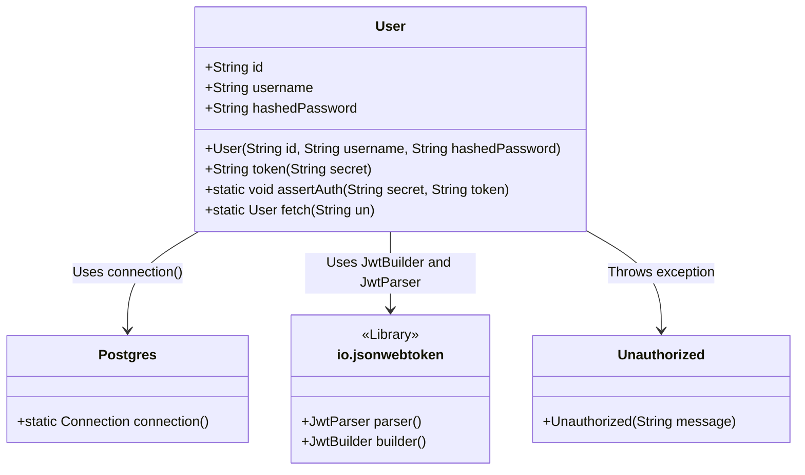
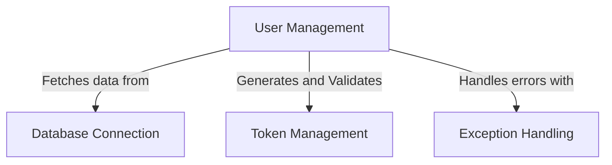
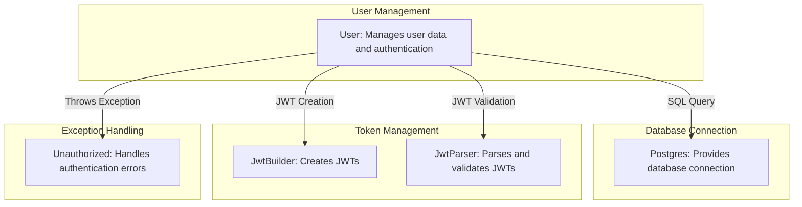
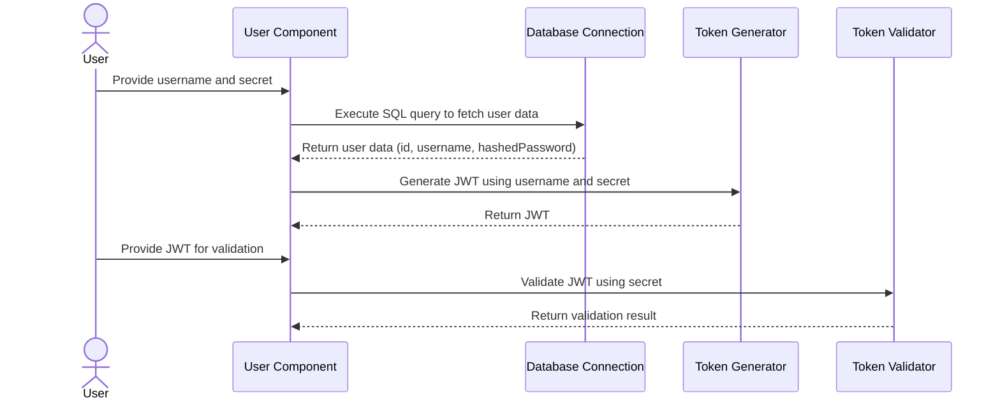

# User Authentication and Token Management Component

The provided code snippet represents a critical component of a system that handles user authentication and token management. The `User` class encapsulates user-related data and provides methods for generating and validating JSON Web Tokens (JWTs), as well as fetching user information from a database. This component plays a central role in ensuring secure access to the system by leveraging cryptographic techniques and database interactions.

## Key Components

### **User**: *Manages user data and authentication*
- **Responsibility**: The `User` class is responsible for encapsulating user-related data (`id`, `username`, `hashedPassword`) and providing methods for token generation (`token`) and validation (`assertAuth`). It also includes functionality to fetch user information from a database (`fetch`).
- **Relation to Other Components**:
  - **Postgres**: The `fetch` method interacts with the `Postgres` component to establish a database connection and retrieve user data.
  - **io.jsonwebtoken**: The `token` and `assertAuth` methods utilize the `io.jsonwebtoken` library for JWT creation and validation, ensuring secure authentication mechanisms.

### **Postgres**: *Database connection management*
- **Responsibility**: Provides a connection to the PostgreSQL database, enabling the `User` class to execute SQL queries and retrieve user information.
- **Relation to Other Components**:
  - Acts as a utility for the `User` class to interact with the database.

### **Unauthorized**: *Exception handling for authentication failures*
- **Responsibility**: Represents an exception that is thrown when authentication fails, ensuring proper error handling and feedback during token validation.
- **Relation to Other Components**:
  - Used by the `User` class to signal authentication errors during the `assertAuth` method execution.

## System Interaction Diagram

This diagram illustrates the relationships between the `User` class and its dependencies (`Postgres`, `Unauthorized`, and `io.jsonwebtoken`). The `User` class serves as the central component, leveraging external libraries and utilities to fulfill its responsibilities.
## Component Relationships

### Context Diagram

### Explanation of the Flowchart

- **User Management**:
  - Represents the `User` component, which encapsulates user-related data and provides methods for authentication and database interaction.
  - It fetches user data from the **Database Connection** (`Postgres`) to retrieve user information based on the username.
  - It generates and validates tokens using **Token Management** (`io.jsonwebtoken`) to ensure secure authentication.
  - It handles authentication errors by throwing exceptions through **Exception Handling** (`Unauthorized`).

- **Database Connection**:
  - Represents the `Postgres` component, which provides the necessary connection to the PostgreSQL database.
  - Enables the `User` component to execute SQL queries and retrieve user data securely.

- **Token Management**:
  - Represents the cryptographic operations performed by the `io.jsonwebtoken` library.
  - Used by the `User` component to generate JWTs for authenticated users and validate incoming tokens for secure access.

- **Exception Handling**:
  - Represents the `Unauthorized` component, which is used by the `User` class to signal authentication failures.
  - Ensures proper error handling and feedback during token validation processes.
### Detailed Vision

### Explanation of the Flowchart

- **User Management**:
  - The `User` component is central to the system, managing user data and authentication processes.
  - It interacts with the **Database Connection** (`Postgres`) by sending SQL queries to fetch user information based on the username.
  - It utilizes **Token Management** (`JwtBuilder` and `JwtParser`) to create and validate JSON Web Tokens (JWTs) for secure authentication.
  - It handles authentication errors by throwing exceptions through **Exception Handling** (`Unauthorized`).

- **Database Connection**:
  - The `Postgres` component provides the necessary connection to the PostgreSQL database.
  - It enables the `User` component to execute SQL queries and retrieve user data securely.

- **Token Management**:
  - The `JwtBuilder` component is used by the `User` class to create JWTs for authenticated users, ensuring secure token generation.
  - The `JwtParser` component is used by the `User` class to validate incoming tokens, ensuring that only authorized users can access the system.

- **Exception Handling**:
  - The `Unauthorized` component is used by the `User` class to signal authentication failures.
  - It ensures proper error handling and feedback during token validation processes, maintaining system security and reliability.
## Integration Scenarios

### User Authentication and Token Validation

This scenario describes the process of authenticating a user and validating their token. It involves fetching user data from the database, generating a JSON Web Token (JWT) for the authenticated user, and validating the token to ensure secure access. This integration scenario highlights the collaboration between the `User`, `Postgres`, `JwtBuilder`, and `JwtParser` components.

### Explanation of the Diagram

- **UserActor**:
  - Represents the external user interacting with the system. The user provides their username and secret for authentication and later submits their JWT for validation.

- **User Component**:
  - The `User` component orchestrates the authentication and token validation process.
  - It starts by fetching user data from the **Database Connection** (`Postgres`) using the provided username.
  - Once the user data is retrieved, it uses the **Token Generator** (`JwtBuilder`) to create a JWT based on the username and secret.
  - Later, it validates the provided JWT using the **Token Validator** (`JwtParser`) to ensure secure access.

- **Database Connection**:
  - The `Postgres` component executes the SQL query to fetch user data based on the username.
  - It returns the user data (`id`, `username`, `hashedPassword`) to the `User` component.

- **Token Generator**:
  - The `JwtBuilder` component generates a JWT using the username and secret provided by the user.
  - It returns the generated JWT to the `User` component.

- **Token Validator**:
  - The `JwtParser` component validates the JWT using the secret provided by the user.
  - It returns the validation result to the `User` component, indicating whether the token is valid or not.

This integration scenario demonstrates how the components collaborate to fulfill the responsibilities of user authentication and token validation, ensuring secure access to the system.
