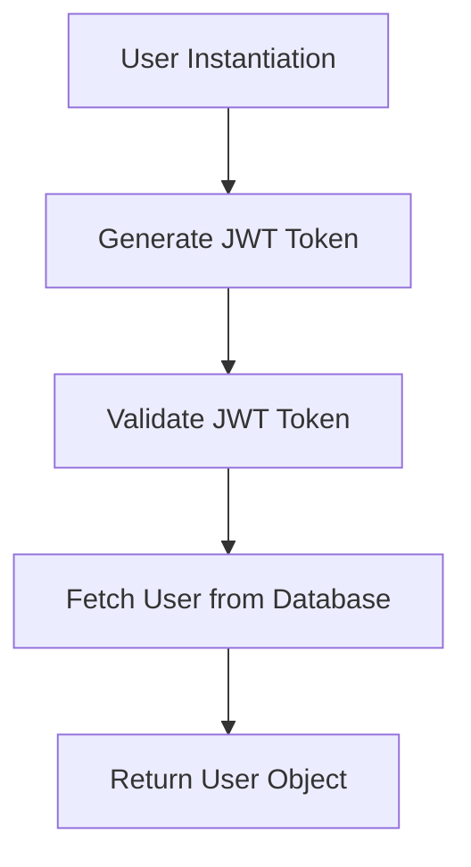
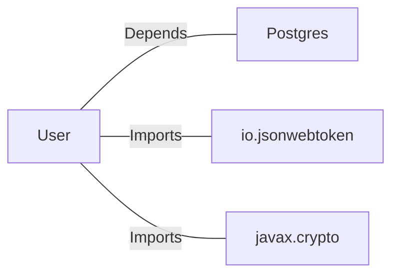

# User.java: User Management and Authentication

## Overview

This class represents a `User` entity and provides functionalities for user authentication and retrieval from a database. It includes methods for generating JSON Web Tokens (JWT), validating tokens, and fetching user details from a PostgreSQL database.

## Process Flow



## Insights

- The `User` class encapsulates user-related data (`id`, `username`, `hashedPassword`) and provides methods for token generation and validation.
- The `token` method generates a JWT for the user using a secret key.
- The `assertAuth` method validates a given JWT token using the provided secret key.
- The `fetch` method retrieves a user from the database based on the username.

## Dependencies



- `Postgres`: Used to establish a database connection for fetching user details.
- `io.jsonwebtoken`: Used for generating and validating JWT tokens.
- `javax.crypto`: Used for cryptographic operations, specifically for generating the secret key.

### External References

- `Postgres`: Provides a `connection()` method to establish a connection to the PostgreSQL database.
- `io.jsonwebtoken`: Used for JWT operations such as `Jwts.builder()` and `Jwts.parser()`.
- `javax.crypto`: Used for creating a `SecretKey` with `Keys.hmacShaKeyFor()`.

## Data Manipulation (SQL)

### Table: `users`

| Attribute   | Data Type | Description                          |
|-------------|-----------|--------------------------------------|
| `user_id`   | String    | Unique identifier for the user.     |
| `username`  | String    | Username of the user.               |
| `password`  | String    | Hashed password of the user.        |

- **SQL Query**: The `fetch` method executes the following query:
  ```sql
  SELECT * FROM users WHERE username = '<username>' LIMIT 1;
  ```
  - **Operation**: SELECT
  - **Purpose**: Retrieves a single user record based on the provided username.

## Vulnerabilities

1. **SQL Injection**:
   - The `fetch` method constructs the SQL query by directly concatenating the `username` parameter, making it vulnerable to SQL injection attacks.
   - **Mitigation**: Use prepared statements with parameterized queries to prevent SQL injection.

2. **Hardcoded Secret Key**:
   - The `token` and `assertAuth` methods rely on a secret key passed as a string. If the secret is not securely managed, it could lead to token forgery.
   - **Mitigation**: Use a secure key management system to store and retrieve the secret key.

3. **Improper Exception Handling**:
   - The `assertAuth` method catches all exceptions and rethrows them as `Unauthorized`. This could expose sensitive information in stack traces.
   - **Mitigation**: Log minimal information and avoid exposing stack traces in production environments.

4. **Resource Management**:
   - The `fetch` method does not properly close the `Statement` object, which could lead to resource leaks.
   - **Mitigation**: Use a `try-with-resources` block to ensure proper resource management.

5. **Weak Password Storage**:
   - The `password` field is stored as a hashed password, but the hashing algorithm is not specified. If a weak algorithm is used, it could compromise security.
   - **Mitigation**: Use a strong hashing algorithm like bcrypt or Argon2 for password storage.
