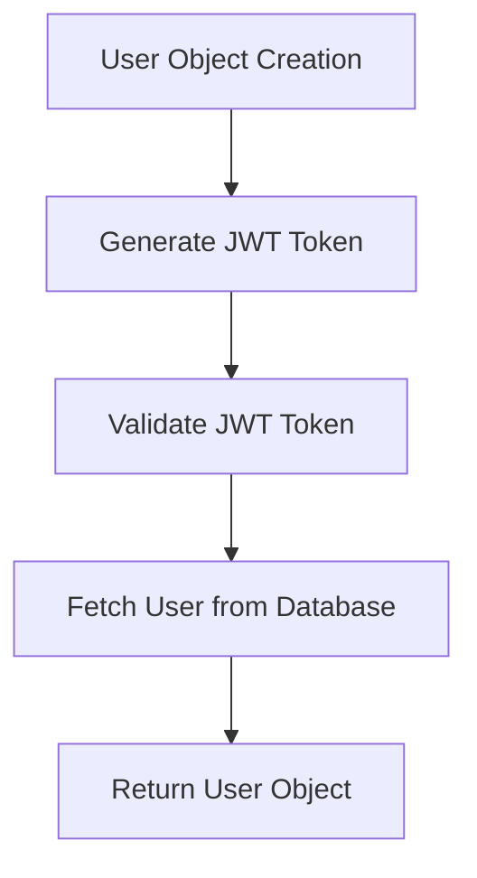
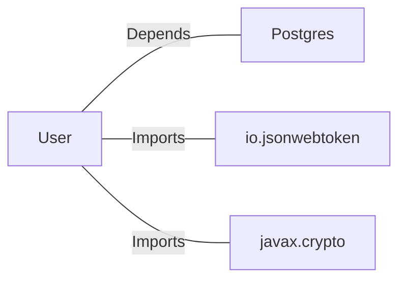

# User.java: User Management and Authentication

## Overview

This class represents a `User` entity and provides functionalities for user authentication and retrieval from a database. It includes methods for generating JSON Web Tokens (JWTs), validating tokens, and fetching user details from a PostgreSQL database.

## Process Flow

## Insights

- The `User` class encapsulates user-related data (`id`, `username`, `hashedPassword`) and provides methods for token generation and validation.
- The `token` method generates a JWT for the user using a secret key.
- The `assertAuth` method validates a given JWT token using the provided secret key.
- The `fetch` method retrieves a user from the database based on the username.

## Dependencies

- `Postgres`: Used to establish a database connection for fetching user details.
- `io.jsonwebtoken`: Library for creating and parsing JWTs.
- `javax.crypto`: Used for cryptographic operations, specifically for generating secret keys.

### List of Identified External References

- `Postgres`: Provides a `connection()` method to establish a connection to the PostgreSQL database.
- `io.jsonwebtoken`: Used for JWT creation (`Jwts.builder()`) and validation (`Jwts.parser()`).
- `javax.crypto`: Used for generating HMAC secret keys (`Keys.hmacShaKeyFor()`).

## Data Manipulation (SQL)

### Table: `users`

| Attribute   | Data Type | Description                          |
|-------------|-----------|--------------------------------------|
| `user_id`   | String    | Unique identifier for the user.     |
| `username`  | String    | Username of the user.               |
| `password`  | String    | Hashed password of the user.        |

### SQL Operation

- **Query**: `SELECT * FROM users WHERE username = '<username>' LIMIT 1`
  - Retrieves a single user record based on the provided username.

## Vulnerabilities

1. **SQL Injection**:
   - The `fetch` method constructs SQL queries using string concatenation, making it vulnerable to SQL injection attacks.
   - Example: If `un` contains malicious SQL code, it could compromise the database.

2. **Hardcoded Secret Key**:
   - The `token` and `assertAuth` methods rely on a secret key passed as a string. If this key is not securely managed, it could lead to token forgery or unauthorized access.

3. **Improper Exception Handling**:
   - The `assertAuth` method catches all exceptions and rethrows them as `Unauthorized`. This could expose sensitive information in stack traces.

4. **Resource Management**:
   - The `fetch` method does not properly close the `Statement` object, which could lead to resource leaks.

5. **Weak Password Storage**:
   - The `fetch` method retrieves the `password` field directly from the database. If this field is not hashed securely, it could lead to password exposure.
