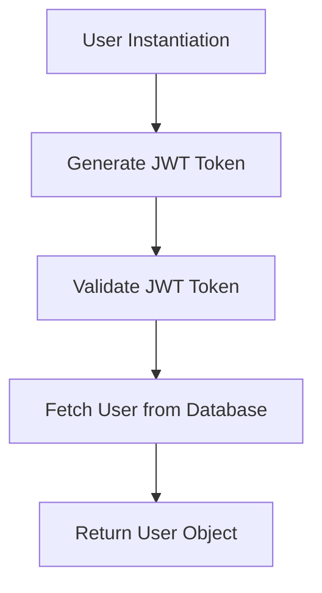
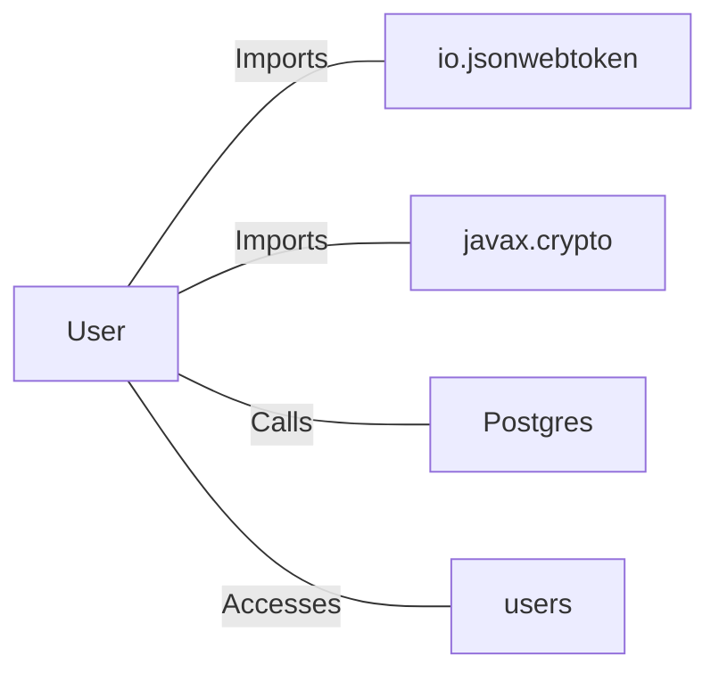

# User.java: User Management and Authentication

## Overview

This class represents a `User` entity and provides functionalities for user authentication and retrieval from a database. It includes methods for generating JSON Web Tokens (JWTs), validating tokens, and fetching user details from a PostgreSQL database.

## Process Flow

## Insights

- The `User` class encapsulates user-related data (`id`, `username`, `hashedPassword`) and provides methods for token generation and validation.
- The `token` method generates a JWT for the user using a secret key.
- The `assertAuth` method validates a given JWT token using the provided secret key.
- The `fetch` method retrieves a user from the database based on the username.

## Dependencies

- `io.jsonwebtoken`: Used for creating and parsing JWT tokens.
- `javax.crypto`: Used for generating the secret key for signing JWTs.
- `Postgres`: Provides the database connection for fetching user data.
- `users`: Database table accessed to retrieve user information.

### External References

- `io.jsonwebtoken`: Library for JWT creation and validation.
- `javax.crypto`: Library for cryptographic operations.
- `Postgres`: Provides a `connection()` method to establish a database connection.
- `users`: Database table containing user details.

## Data Manipulation (SQL)

### Table: `users`

| Attribute   | Type   | Description                          |
|-------------|--------|--------------------------------------|
| user_id     | String | Unique identifier for the user.      |
| username    | String | Username of the user.                |
| password    | String | Hashed password of the user.         |

### SQL Operation

- **SELECT**: Retrieves user details from the `users` table based on the provided username.

## Vulnerabilities

1. **SQL Injection**:
   - The `fetch` method constructs SQL queries by directly concatenating user input (`un`) into the query string. This makes the application vulnerable to SQL injection attacks.
   - **Mitigation**: Use prepared statements or parameterized queries to prevent SQL injection.

2. **Weak Secret Key Handling**:
   - The `token` and `assertAuth` methods use a secret key derived from a string without proper validation or secure storage.
   - **Mitigation**: Use a securely stored and sufficiently complex secret key.

3. **Improper Exception Handling**:
   - The `assertAuth` method catches all exceptions and rethrows them as `Unauthorized`, potentially exposing sensitive information in stack traces.
   - **Mitigation**: Log minimal information and avoid exposing stack traces to the client.

4. **Resource Management**:
   - The `fetch` method does not properly close the `Statement` object, which could lead to resource leaks.
   - **Mitigation**: Use a `try-with-resources` block to ensure proper resource management.

5. **Hardcoded SQL Query**:
   - The SQL query in the `fetch` method is hardcoded, making it less flexible and harder to maintain.
   - **Mitigation**: Use a query builder or externalize queries to configuration files.
